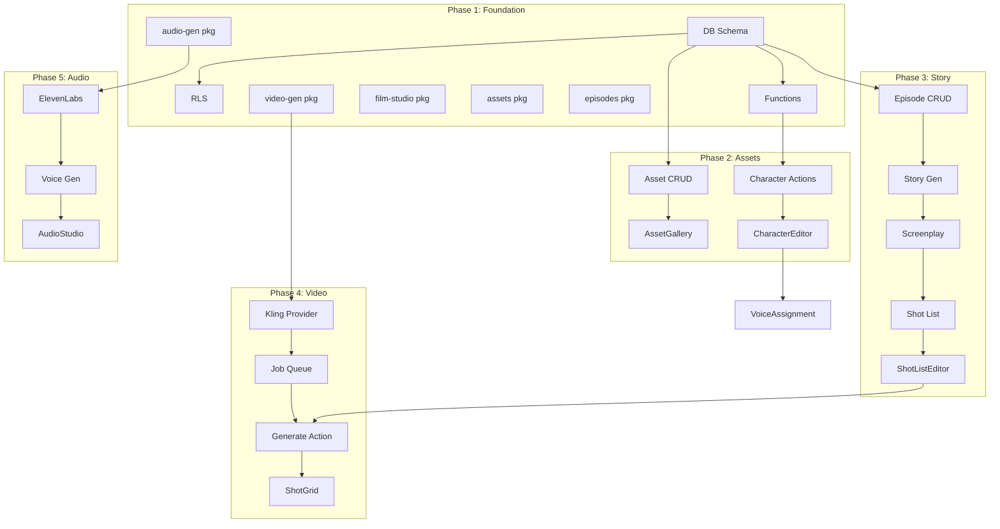

# Engineering Design Document
# AI Cinematic Film Studio (Storybook)

**Version:** 2.1 (Revised)
**Date:** December 2025
**Status:** Ready for Review

### Revision Notes (v2.1)
This revision addresses the following critique points:
- ✅ Added Design Principles & Error Handling Strategy
- ✅ Added Transaction Handling patterns for multi-table operations
- ✅ Added Rate Limiting & Retry Strategy for external APIs
- ✅ Added Webhook Security with signature verification
- ✅ Added missing database indexes and soft delete columns
- ✅ Added Concurrency Control for episode editing
- ✅ Added File Upload Validation
- ✅ Added Idempotency Keys for generation requests
- ✅ Added complete RLS policies (not abbreviated)
- ✅ Added Design System Integration section
- ✅ Added Task IDs, Effort Estimates, and Dependencies
- ✅ Added Observability & Monitoring strategy
- ✅ Added OAuth Token Refresh strategy
- ✅ Added Cost Tracking integration with billing
- ✅ Added Accessibility considerations

---

## Executive Summary

Build an end-to-end AI Cinematic Film Studio on top of the existing Storybook SaaS platform. The codebase provides ~60-70% reusable infrastructure (auth, billing, projects, LLM, database patterns). This document covers the remaining ~30-40% new development.

### What We're Building
An AI-powered platform that enables creators to produce cinematic content through:
- **Story Studio**: AI-generated stories, screenplays, and shot lists
- **Visual Studio**: Video generation using Kling, Runway, Hailuo APIs
- **Audio Studio**: Voice (ElevenLabs) and music (Suno) generation
- **Edit Suite**: Timeline-based video composition with auto-stitch
- **Publish Hub**: Multi-platform distribution (YouTube, TikTok, Instagram, Facebook)
- **Analytics Dashboard**: Cross-platform performance tracking

### Project Types Supported
1. **Series**: Multi-episode shows with seasons (primary focus for MVP)
2. **Film**: Single long-form content
3. **Shorts Collection**: Short-form content for TikTok/Reels

### Existing Infrastructure to Reuse
| Package | Reuse | What It Provides |
|---------|-------|------------------|
| @kit/auth | 100% | Authentication, OAuth, sessions |
| @kit/billing | 80% | Stripe subscriptions, usage tracking |
| @kit/projects | 90% | Project CRUD, settings, permissions |
| @kit/llm | 100% | OpenAI, Anthropic, Gemini integrations |
| @kit/prompt-engine | 100% | JSON-based prompt management |
| @kit/cache | 100% | Redis caching layer |
| @kit/ui | 70% | 82 Shadcn components |
| @kit/notifications | 100% | In-app + email notifications |

---

## 1. Architecture Overview

### System Diagram
```
┌─────────────────────────────────────────────────────────────────┐
│                         EXISTING (Reuse)                        │
├─────────────────────────────────────────────────────────────────┤
│ Auth (@kit/auth) │ Billing (@kit/billing) │ LLM (@kit/llm)     │
│ Projects (@kit/projects) │ Cache (@kit/cache) │ UI (@kit/ui)   │
└─────────────────────────────────────────────────────────────────┘
                              │
                              ▼
┌─────────────────────────────────────────────────────────────────┐
│                    NEW PACKAGES TO CREATE                       │
├─────────────────────────────────────────────────────────────────┤
│ @kit/film-studio     │ Core film studio logic                  │
│ @kit/assets          │ Asset library (characters, locations)   │
│ @kit/video-gen       │ Video generation API integrations       │
│ @kit/audio-gen       │ Audio/voice generation integrations     │
│ @kit/publishing      │ Multi-platform publishing               │
│ @kit/content-analytics│ Cross-platform analytics               │
└─────────────────────────────────────────────────────────────────┘
```

---

## 1.1 Design Principles

### 1.1.1 Provider Abstraction Pattern
All external services (video, audio, publishing) implement a common interface. Adding a new provider requires:
- One new file in `/providers`
- One config entry in provider registry
- Zero changes to calling code

```typescript
// Provider interface contract
interface VideoGenerationProvider {
  name: string;
  generateVideo(input: VideoInput): Promise<string>; // returns taskId
  getStatus(taskId: string): Promise<VideoResult>;
  estimateCost(input: VideoInput): number; // cents
  getRateLimits(): RateLimitConfig;
}
```

### 1.1.2 Fail-Safe Generation
Generation jobs are expensive. Core principles:
- **Persist before calling**: Save user intent to DB before triggering external API
- **Idempotency**: Every generation request includes an idempotency key
- **Recoverable**: Jobs can be retried from any failure state
- **Cost-aware**: Track spend before committing to generation

### 1.1.3 Optimistic UI with Conflict Resolution
- **Local-first editing**: Optimistic updates with server reconciliation
- **Conflict detection**: Use `updated_at` for optimistic locking
- **Last-write-wins with history**: Maintain edit history for recovery

### 1.1.4 Progressive Enhancement
Core flows work without JavaScript. Enhanced with:
- Real-time updates (WebSocket for job status)
- Optimistic UI (immediate feedback)
- Background sync (queue operations when offline)

---

## 1.2 Error Handling Strategy

### Error Categories & Responses

| Category | Example | Response |
|----------|---------|----------|
| **Validation** | Invalid prompt length | 400 + specific field errors |
| **Auth** | Expired token | 401 + redirect to re-auth |
| **Rate Limit** | Provider throttled | 429 + retry-after header |
| **Provider Error** | Kling API down | 502 + queue for retry |
| **Cost Limit** | Credits exhausted | 402 + upsell prompt |
| **Internal** | DB connection failed | 500 + generic message (log details) |

### Retry Strategy by Job Type

```typescript
const RETRY_CONFIG = {
  video: { maxRetries: 3, backoff: 'exponential', initialDelay: 30000 },
  voice: { maxRetries: 5, backoff: 'exponential', initialDelay: 5000 },
  music: { maxRetries: 3, backoff: 'exponential', initialDelay: 30000 },
  story: { maxRetries: 2, backoff: 'linear', initialDelay: 1000 },
};
```

### Dead Letter Queue
Jobs that exceed max retries are moved to `generation_jobs_dlq` table for:
- Manual investigation
- Refund processing
- User notification

---

## 1.3 Rate Limiting Strategy

### Per-Provider Rate Limits

| Provider | Requests/min | Concurrent | Daily Limit |
|----------|-------------|------------|-------------|
| Kling (PiAPI) | 10 | 5 | 100 |
| Runway | 5 | 2 | 50 |
| Hailuo | 10 | 3 | 100 |
| ElevenLabs | 60 | 10 | 1000 |
| Suno | 5 | 2 | 50 |

### Implementation
```typescript
// Redis-based rate limiter
interface RateLimiter {
  checkLimit(accountId: string, provider: string): Promise<boolean>;
  consumeToken(accountId: string, provider: string): Promise<void>;
  getRemainingTokens(accountId: string, provider: string): Promise<number>;
}

// Queue throttling - use BullMQ with rate limiting
const videoQueue = new Queue('video-generation', {
  limiter: {
    max: 5,           // max jobs per duration
    duration: 60000,  // 1 minute
    groupKey: 'provider', // per provider
  },
});
```

### User-Level Quotas
- Quotas defined per subscription tier in `@kit/billing`
- Enforced before job creation, not at provider call
- Soft limits with warnings at 80%

---

## 1.4 Observability & Monitoring

### Structured Logging
```typescript
// Log format for all generation operations
interface GenerationLog {
  timestamp: string;
  level: 'info' | 'warn' | 'error';
  traceId: string;          // Distributed trace ID
  accountId: string;
  projectId: string;
  jobId: string;
  provider: string;
  action: string;           // 'submit' | 'poll' | 'complete' | 'fail'
  durationMs?: number;
  costCents?: number;
  error?: {
    code: string;
    message: string;
    stack?: string;
  };
}
```

### Key Metrics to Expose

| Metric | Type | Labels |
|--------|------|--------|
| `generation_requests_total` | Counter | provider, job_type, status |
| `generation_duration_seconds` | Histogram | provider, job_type |
| `generation_cost_cents` | Counter | provider, job_type |
| `generation_queue_depth` | Gauge | provider |
| `provider_availability` | Gauge | provider |
| `api_latency_seconds` | Histogram | endpoint, method |

### Alerting Thresholds
- Queue depth > 100: Warning
- Provider error rate > 10%: Critical
- Generation P95 latency > 5min: Warning
- Daily spend > 80% budget: Warning

---

## 1.5 State Management Approach

### Server State (React Query / TanStack Query)
- All server data fetched via React Query
- Automatic background refetching
- Optimistic updates for mutations
- Cache invalidation on job completion

### Client State (Zustand)
- UI state only (modals, selections, drag state)
- No server data duplication
- Persisted where needed (user preferences)

```typescript
// Example: Timeline editor local state
const useTimelineStore = create<TimelineState>((set) => ({
  selectedClipIds: [],
  playheadPosition: 0,
  zoomLevel: 1,
  setSelectedClips: (ids) => set({ selectedClipIds: ids }),
  setPlayhead: (pos) => set({ playheadPosition: pos }),
}));
```

---

## 2. Database Schema Design

### 2.1 New Tables Required

**File: `apps/web/supabase/schemas/30-film-studio.sql`**

```sql
-- Project Type Extension (extends existing projects table via metadata)
-- No new table needed - use projects.settings JSONB

-- Seasons (for Series projects)
CREATE TABLE seasons (
  id UUID PRIMARY KEY DEFAULT gen_random_uuid(),
  project_id UUID NOT NULL REFERENCES projects(id) ON DELETE CASCADE,
  number INTEGER NOT NULL,
  name VARCHAR(255),
  description TEXT,
  created_at TIMESTAMPTZ DEFAULT NOW(),
  updated_at TIMESTAMPTZ DEFAULT NOW(),
  UNIQUE(project_id, number)
);

-- Episodes (with soft delete & optimistic locking)
CREATE TABLE episodes (
  id UUID PRIMARY KEY DEFAULT gen_random_uuid(),
  project_id UUID NOT NULL REFERENCES projects(id) ON DELETE CASCADE,
  season_id UUID REFERENCES seasons(id) ON DELETE SET NULL,
  number INTEGER NOT NULL,
  title VARCHAR(255) NOT NULL,
  description TEXT,
  status VARCHAR(50) DEFAULT 'draft', -- draft, story, storyboard, generating, editing, ready, published
  duration_seconds INTEGER,
  thumbnail_url TEXT,
  final_video_url TEXT,
  story_data JSONB,        -- { premise, fullStory, approvedAt }
  screenplay_data JSONB,   -- { scenes[], dialogue[], approvedAt }
  shot_list JSONB,         -- { shots[], approvedAt }
  metadata JSONB DEFAULT '{}',
  version INTEGER DEFAULT 1,          -- Optimistic locking version
  created_at TIMESTAMPTZ DEFAULT NOW(),
  updated_at TIMESTAMPTZ DEFAULT NOW(),
  deleted_at TIMESTAMPTZ DEFAULT NULL -- Soft delete
);
CREATE INDEX idx_episodes_project_status ON episodes(project_id, status) WHERE deleted_at IS NULL;
CREATE INDEX idx_episodes_season ON episodes(season_id) WHERE deleted_at IS NULL;

-- Shots (individual video clips)
CREATE TABLE shots (
  id UUID PRIMARY KEY DEFAULT gen_random_uuid(),
  episode_id UUID NOT NULL REFERENCES episodes(id) ON DELETE CASCADE,
  sequence_number INTEGER NOT NULL,
  duration_seconds INTEGER DEFAULT 10,
  scene_description TEXT,
  action_description TEXT,
  prompt TEXT,
  camera_direction VARCHAR(100),
  status VARCHAR(50) DEFAULT 'pending', -- pending, queued, generating, completed, failed, approved
  video_url TEXT,
  thumbnail_url TEXT,
  generation_job_id UUID,
  generation_metadata JSONB,
  created_at TIMESTAMPTZ DEFAULT NOW(),
  updated_at TIMESTAMPTZ DEFAULT NOW()
);

-- Assets (Characters, Locations, Props, Voices, Music)
CREATE TABLE assets (
  id UUID PRIMARY KEY DEFAULT gen_random_uuid(),
  project_id UUID NOT NULL REFERENCES projects(id) ON DELETE CASCADE,
  type VARCHAR(50) NOT NULL, -- character, location, prop, voice, music, sfx
  name VARCHAR(255) NOT NULL,
  description TEXT,
  file_url TEXT,
  thumbnail_url TEXT,
  metadata JSONB DEFAULT '{}',
  created_at TIMESTAMPTZ DEFAULT NOW(),
  updated_at TIMESTAMPTZ DEFAULT NOW(),
  UNIQUE(project_id, type, name)
);

-- Character Details (extends assets)
CREATE TABLE character_details (
  asset_id UUID PRIMARY KEY REFERENCES assets(id) ON DELETE CASCADE,
  physical_attributes JSONB,  -- { age, height, hair, eyes, skin, outfit }
  personality TEXT,
  element_prompt TEXT,        -- Kling-ready prompt
  reference_images TEXT[],    -- Array of image URLs
  voice_asset_id UUID REFERENCES assets(id)
);

-- Voice Profiles (extends assets)
CREATE TABLE voice_profiles (
  asset_id UUID PRIMARY KEY REFERENCES assets(id) ON DELETE CASCADE,
  provider VARCHAR(50),       -- elevenlabs, playht
  provider_voice_id VARCHAR(255),
  settings JSONB DEFAULT '{}' -- { stability, similarity, speed }
);

-- Dialogue Lines
CREATE TABLE dialogue_lines (
  id UUID PRIMARY KEY DEFAULT gen_random_uuid(),
  episode_id UUID NOT NULL REFERENCES episodes(id) ON DELETE CASCADE,
  shot_id UUID REFERENCES shots(id) ON DELETE SET NULL,
  character_asset_id UUID REFERENCES assets(id),
  text TEXT NOT NULL,
  sequence_number INTEGER NOT NULL,
  audio_url TEXT,
  status VARCHAR(50) DEFAULT 'pending', -- pending, generating, completed, failed
  generation_metadata JSONB,
  created_at TIMESTAMPTZ DEFAULT NOW()
);

-- Audio Tracks (music, sfx)
CREATE TABLE audio_tracks (
  id UUID PRIMARY KEY DEFAULT gen_random_uuid(),
  episode_id UUID NOT NULL REFERENCES episodes(id) ON DELETE CASCADE,
  type VARCHAR(50) NOT NULL,  -- music, sfx, dialogue_composite
  name VARCHAR(255),
  file_url TEXT,
  duration_seconds DECIMAL,
  timeline_start_seconds DECIMAL DEFAULT 0,
  volume DECIMAL DEFAULT 1.0,
  metadata JSONB,
  created_at TIMESTAMPTZ DEFAULT NOW()
);

-- Generation Jobs (video, audio, story) - with retry & idempotency
CREATE TABLE generation_jobs (
  id UUID PRIMARY KEY DEFAULT gen_random_uuid(),
  idempotency_key VARCHAR(255) UNIQUE, -- Prevent duplicate submissions
  account_id UUID NOT NULL,
  project_id UUID NOT NULL REFERENCES projects(id) ON DELETE CASCADE,
  job_type VARCHAR(50) NOT NULL, -- video, voice, music, sfx, story, screenplay
  reference_type VARCHAR(50),    -- shot, dialogue, episode
  reference_id UUID,
  provider VARCHAR(50),
  provider_job_id VARCHAR(255),
  status VARCHAR(50) DEFAULT 'queued', -- queued, processing, completed, failed, cancelled, dead_letter
  priority INTEGER DEFAULT 0,    -- Higher = more urgent
  input_data JSONB,
  output_data JSONB,
  error_message TEXT,
  error_code VARCHAR(100),       -- Structured error code
  retry_count INTEGER DEFAULT 0,
  max_retries INTEGER DEFAULT 3,
  next_retry_at TIMESTAMPTZ,     -- For exponential backoff
  timeout_seconds INTEGER DEFAULT 300,
  cost_cents INTEGER,
  estimated_cost_cents INTEGER,  -- Pre-computed estimate
  started_at TIMESTAMPTZ,
  completed_at TIMESTAMPTZ,
  created_at TIMESTAMPTZ DEFAULT NOW()
);

-- Platform Connections (OAuth tokens for publishing)
CREATE TABLE platform_connections (
  id UUID PRIMARY KEY DEFAULT gen_random_uuid(),
  account_id UUID NOT NULL,
  platform VARCHAR(50) NOT NULL, -- youtube, tiktok, instagram, facebook, twitter
  platform_account_id VARCHAR(255),
  platform_account_name VARCHAR(255),
  access_token_encrypted TEXT,
  refresh_token_encrypted TEXT,
  token_expires_at TIMESTAMPTZ,
  scopes TEXT[],
  is_active BOOLEAN DEFAULT TRUE,
  created_at TIMESTAMPTZ DEFAULT NOW(),
  updated_at TIMESTAMPTZ DEFAULT NOW(),
  UNIQUE(account_id, platform, platform_account_id)
);

-- Publishes
CREATE TABLE publishes (
  id UUID PRIMARY KEY DEFAULT gen_random_uuid(),
  episode_id UUID NOT NULL REFERENCES episodes(id) ON DELETE CASCADE,
  platform_connection_id UUID NOT NULL REFERENCES platform_connections(id),
  platform VARCHAR(50) NOT NULL,
  content_type VARCHAR(50) DEFAULT 'full', -- full, short
  platform_content_id VARCHAR(255),
  platform_url TEXT,
  title VARCHAR(500),
  description TEXT,
  tags TEXT[],
  thumbnail_url TEXT,
  status VARCHAR(50) DEFAULT 'draft', -- draft, scheduled, publishing, published, failed
  scheduled_at TIMESTAMPTZ,
  published_at TIMESTAMPTZ,
  metadata JSONB,
  created_at TIMESTAMPTZ DEFAULT NOW()
);

-- Content Analytics Snapshots
CREATE TABLE content_analytics (
  id UUID PRIMARY KEY DEFAULT gen_random_uuid(),
  publish_id UUID NOT NULL REFERENCES publishes(id) ON DELETE CASCADE,
  snapshot_date DATE NOT NULL,
  views BIGINT DEFAULT 0,
  likes BIGINT DEFAULT 0,
  comments BIGINT DEFAULT 0,
  shares BIGINT DEFAULT 0,
  watch_time_seconds BIGINT DEFAULT 0,
  subscribers_gained INTEGER DEFAULT 0,
  revenue_cents INTEGER DEFAULT 0,
  retention_data JSONB,
  raw_data JSONB,
  created_at TIMESTAMPTZ DEFAULT NOW(),
  UNIQUE(publish_id, snapshot_date)
);

-- Shared Resources (org-level SFX, music templates)
CREATE TABLE shared_resources (
  id UUID PRIMARY KEY DEFAULT gen_random_uuid(),
  account_id UUID NOT NULL,
  type VARCHAR(50) NOT NULL, -- sfx, music_template
  name VARCHAR(255) NOT NULL,
  description TEXT,
  file_url TEXT,
  tags TEXT[],
  is_system BOOLEAN DEFAULT FALSE,
  created_at TIMESTAMPTZ DEFAULT NOW()
);

-- API Keys (user's own keys for external services)
CREATE TABLE external_api_keys (
  id UUID PRIMARY KEY DEFAULT gen_random_uuid(),
  account_id UUID NOT NULL,
  provider VARCHAR(50) NOT NULL, -- kling, runway, elevenlabs, suno, claude, openai
  encrypted_key TEXT NOT NULL,
  is_active BOOLEAN DEFAULT TRUE,
  last_used_at TIMESTAMPTZ,
  created_at TIMESTAMPTZ DEFAULT NOW(),
  UNIQUE(account_id, provider)
);
```

### 2.2 RLS Policies (add to same file)

```sql
-- Enable RLS on all tables
ALTER TABLE seasons ENABLE ROW LEVEL SECURITY;
ALTER TABLE episodes ENABLE ROW LEVEL SECURITY;
ALTER TABLE shots ENABLE ROW LEVEL SECURITY;
ALTER TABLE assets ENABLE ROW LEVEL SECURITY;
-- ... (similar for all tables)

-- Example policy pattern (repeat for each table)
CREATE POLICY "Users can access their project's episodes"
ON episodes FOR ALL
TO authenticated
USING (
  project_id IN (
    SELECT id FROM projects WHERE account_id IN (
      SELECT account_id FROM accounts_memberships WHERE user_id = auth.uid()
    )
  )
);
```

---

## 3. Package Structure

### 3.1 New Packages to Create

```
packages/
├── features/
│   ├── film-studio/           # Core film studio orchestration
│   │   ├── src/
│   │   │   ├── components/    # UI components
│   │   │   ├── server/        # Server actions & queries
│   │   │   ├── lib/           # Utilities
│   │   │   └── index.ts
│   │   └── package.json
│   │
│   ├── assets/                # Asset library management
│   │   ├── src/
│   │   │   ├── components/    # AssetGallery, CharacterEditor, etc.
│   │   │   ├── server/        # Asset CRUD operations
│   │   │   └── hooks/         # useAssets, useCharacter
│   │   └── package.json
│   │
│   ├── episodes/              # Episode & shot management
│   │   ├── src/
│   │   │   ├── components/    # EpisodeList, ShotGrid, StoryEditor
│   │   │   ├── server/        # Episode/Shot CRUD
│   │   │   └── hooks/         # useEpisode, useShots
│   │   └── package.json
│   │
│   ├── video-generation/      # Video generation integrations
│   │   ├── src/
│   │   │   ├── providers/     # Kling, Runway, Hailuo adapters
│   │   │   ├── server/        # Generation actions
│   │   │   ├── queue/         # Job queue management
│   │   │   └── types.ts
│   │   └── package.json
│   │
│   ├── audio-generation/      # Audio generation integrations
│   │   ├── src/
│   │   │   ├── providers/     # ElevenLabs, Suno adapters
│   │   │   ├── server/        # Voice generation actions
│   │   │   └── types.ts
│   │   └── package.json
│   │
│   ├── publishing/            # Multi-platform publishing
│   │   ├── src/
│   │   │   ├── providers/     # YouTube, TikTok, Instagram, Facebook
│   │   │   ├── components/    # PublishHub, PlatformConnector
│   │   │   ├── server/        # Publishing actions
│   │   │   └── hooks/
│   │   └── package.json
│   │
│   └── content-analytics/     # Cross-platform analytics
│       ├── src/
│       │   ├── components/    # AnalyticsDashboard, MetricCards
│       │   ├── server/        # Analytics sync & queries
│       │   └── hooks/
│       └── package.json
```

### 3.2 Extend Existing Packages

**`@kit/prompt-engine`** - Add new prompt templates:
```
packages/features/prompt-engine/src/prompts/
├── story/
│   ├── story-ideation.json
│   ├── story-generation.json
│   ├── screenplay-conversion.json
│   └── shot-list-generation.json
├── character/
│   ├── character-design.json
│   └── element-prompt.json
└── content/
    ├── thumbnail-prompt.json
    └── metadata-generation.json
```

---

## 3.3 Design System Integration

### 3.3.1 Component Inventory

#### Reusable from @kit/ui (70% coverage)
| Component | Usage in Film Studio |
|-----------|---------------------|
| Card, CardHeader, CardContent | Asset cards, episode cards |
| Button, IconButton | All actions |
| Dialog, Sheet | Modals, side panels |
| Tabs, TabsList, TabsTrigger | Studio workspace tabs |
| Form, Input, Textarea | All forms |
| Select, Combobox | Provider selection, camera direction |
| Progress | Generation progress |
| Badge | Status indicators |
| Table | Analytics data |
| Tooltip | Help text |
| Skeleton | Loading states |
| Alert | Notifications, warnings |

#### New Components Required

**High Complexity (dedicated design needed):**

| Component | Purpose | Effort |
|-----------|---------|--------|
| `TimelineEditor` | Multi-track video/audio timeline with scrubbing, clip manipulation | L |
| `ShotGrid` | Draggable grid with generation status overlays, batch selection | M |
| `WaveformVisualizer` | Audio waveform display with playhead sync | M |
| `VideoPlayer` | Custom player with frame-accurate seeking, preview mode | M |
| `CharacterCard` | Reference images gallery + element prompt preview | S |

**Medium Complexity (extend existing):**

| Component | Base Component | Extension |
|-----------|---------------|-----------|
| `GenerationStatusBadge` | Badge | Animated states, progress ring |
| `ProgressRing` | - | Circular progress for generation jobs |
| `AssetPicker` | Dialog + Combobox | Modal with filtering, search, preview |
| `PromptEditor` | Textarea | Token counter, variable highlighting |

**Low Complexity (compose existing):**

| Component | Composition |
|-----------|-------------|
| `StudioSidebar` | Nav + Badge |
| `EpisodeCard` | Card + Badge + Progress |
| `PipelineProgress` | Steps + Progress |

### 3.3.2 Design Tokens

```typescript
// packages/features/film-studio/src/lib/design-tokens.ts

export const studioTokens = {
  // Generation status colors
  status: {
    pending: { bg: 'bg-slate-100', text: 'text-slate-600', border: 'border-slate-200' },
    queued: { bg: 'bg-amber-100', text: 'text-amber-700', border: 'border-amber-200' },
    generating: { bg: 'bg-blue-100', text: 'text-blue-700', border: 'border-blue-200' },
    completed: { bg: 'bg-green-100', text: 'text-green-700', border: 'border-green-200' },
    failed: { bg: 'bg-red-100', text: 'text-red-700', border: 'border-red-200' },
    approved: { bg: 'bg-purple-100', text: 'text-purple-700', border: 'border-purple-200' },
  },

  // Asset type colors
  assetType: {
    character: { bg: 'bg-pink-500', icon: 'User' },
    location: { bg: 'bg-emerald-500', icon: 'MapPin' },
    prop: { bg: 'bg-orange-500', icon: 'Box' },
    voice: { bg: 'bg-violet-500', icon: 'Mic' },
    music: { bg: 'bg-amber-500', icon: 'Music' },
    sfx: { bg: 'bg-cyan-500', icon: 'Volume2' },
  },

  // Timeline track colors
  timeline: {
    video: { bg: 'bg-blue-600', border: 'border-blue-700' },
    dialogue: { bg: 'bg-green-600', border: 'border-green-700' },
    music: { bg: 'bg-purple-600', border: 'border-purple-700' },
    sfx: { bg: 'bg-amber-600', border: 'border-amber-700' },
    ambient: { bg: 'bg-slate-600', border: 'border-slate-700' },
  },

  // Episode status workflow
  episodeStatus: {
    draft: { label: 'Draft', color: 'slate' },
    story: { label: 'Story', color: 'blue' },
    storyboard: { label: 'Storyboard', color: 'indigo' },
    generating: { label: 'Generating', color: 'amber' },
    editing: { label: 'Editing', color: 'purple' },
    ready: { label: 'Ready', color: 'green' },
    published: { label: 'Published', color: 'emerald' },
  },
} as const;
```

### 3.3.3 Interaction Patterns

#### Drag and Drop
- **Shot Grid**: Reorder shots with drag handles
- **Timeline**: Move clips horizontally, resize from edges
- **Asset Picker**: Drag assets to assign to shots

#### Keyboard Navigation
| Context | Keys | Action |
|---------|------|--------|
| Shot Grid | `←` `→` `↑` `↓` | Navigate shots |
| Shot Grid | `Space` | Play/pause preview |
| Shot Grid | `Enter` | Open shot editor |
| Shot Grid | `Delete` | Remove shot |
| Shot Grid | `Shift+Click` | Multi-select range |
| Timeline | `Space` | Play/pause |
| Timeline | `←` `→` | Scrub playhead |
| Timeline | `[` `]` | Set in/out points |

#### Loading States

```tsx
// Skeleton pattern for shot grid
<ShotGridSkeleton count={12} /> // Shows 12 skeleton cards

// Individual shot loading
<ShotCard loading={true} />

// Generation in progress
<ShotCard
  status="generating"
  progress={45}
  progressLabel="Generating video..."
/>
```

#### Empty States

```tsx
// No episodes yet
<EmptyState
  icon={<Film className="h-12 w-12" />}
  title="No episodes yet"
  description="Create your first episode to start generating content"
  action={<Button>Create Episode</Button>}
/>

// No assets
<EmptyState
  icon={<Users className="h-12 w-12" />}
  title="No characters defined"
  description="Add characters to maintain visual consistency across shots"
  action={<Button>Add Character</Button>}
/>
```

#### Error States

```tsx
// Generation failed
<ShotCard
  status="failed"
  error={{
    code: 'PROVIDER_ERROR',
    message: 'Video generation failed after 3 retries',
    retryable: true,
  }}
  onRetry={() => retryGeneration(shotId)}
/>

// API unavailable
<Alert variant="destructive">
  <AlertTitle>Provider Unavailable</AlertTitle>
  <AlertDescription>
    Kling API is currently experiencing issues. Your job has been queued
    and will retry automatically.
  </AlertDescription>
</Alert>
```

### 3.3.4 Accessibility Requirements

| Component | ARIA Requirements |
|-----------|------------------|
| ShotGrid | `role="grid"`, `aria-label`, arrow key navigation |
| Timeline | `role="slider"` for playhead, keyboard scrubbing |
| VideoPlayer | Standard video controls, captions support |
| StatusBadge | `aria-live="polite"` for status changes |
| ProgressRing | `role="progressbar"`, `aria-valuenow` |
| AssetPicker | Focus trap, `aria-modal`, escape to close |

### 3.3.5 Responsive Strategy

| Breakpoint | Layout Adaptation |
|------------|-------------------|
| Desktop (≥1280px) | Full studio layout with sidebar |
| Tablet (768-1279px) | Collapsible sidebar, stacked tabs |
| Mobile (<768px) | Bottom navigation, sheet-based editors |

**Mobile-specific considerations:**
- Timeline editor: Simplified view, pinch-to-zoom
- Shot grid: Single column, swipe gestures
- Asset picker: Full-screen modal

### 3.3.6 Component Composition Example

```tsx
// Episode Workspace Layout
export function EpisodeWorkspace({ episode, projectId }: Props) {
  return (
    <StudioLayout>
      <StudioSidebar
        projectId={projectId}
        activeSection="episodes"
      />
      <main className="flex-1 overflow-hidden">
        <EpisodeHeader episode={episode} />

        <Tabs defaultValue="story" className="h-full">
          <StudioTabsList>
            <StudioTab value="story" icon={BookOpen} label="Story" />
            <StudioTab value="visual" icon={Video} label="Visual" />
            <StudioTab value="audio" icon={Music} label="Audio" />
            <StudioTab value="edit" icon={Scissors} label="Edit" />
            <StudioTab value="publish" icon={Share2} label="Publish" />
          </StudioTabsList>

          <TabsContent value="story" className="h-full">
            <StoryStudio episode={episode} projectId={projectId} />
          </TabsContent>

          <TabsContent value="visual" className="h-full">
            <VisualStudio episode={episode}>
              <ShotGrid
                shots={episode.shots}
                onReorder={handleReorder}
                onGenerate={handleGenerate}
                renderItem={(shot) => (
                  <ShotCard
                    shot={shot}
                    status={shot.status}
                    progress={shot.generationProgress}
                  />
                )}
              />
            </VisualStudio>
          </TabsContent>

          {/* ... other tabs */}
        </Tabs>
      </main>

      <GenerationQueuePanel position="right" />
    </StudioLayout>
  );
}
```

---

## 4. API Routes Structure

### 4.1 New Routes

```
apps/web/app/
├── api/
│   ├── projects/[projectId]/
│   │   ├── episodes/
│   │   │   ├── route.ts              # GET list, POST create
│   │   │   └── [episodeId]/
│   │   │       ├── route.ts          # GET, PUT, DELETE
│   │   │       ├── generate-story/route.ts
│   │   │       ├── generate-screenplay/route.ts
│   │   │       ├── generate-shots/route.ts
│   │   │       └── shots/
│   │   │           ├── route.ts      # GET list, POST create
│   │   │           └── [shotId]/
│   │   │               ├── route.ts
│   │   │               └── generate/route.ts
│   │   ├── assets/
│   │   │   ├── route.ts              # GET list, POST create
│   │   │   ├── upload/route.ts       # File upload
│   │   │   └── [assetId]/route.ts    # GET, PUT, DELETE
│   │   └── publish/
│   │       ├── route.ts              # POST publish
│   │       └── schedule/route.ts     # POST schedule
│   ├── generation/
│   │   ├── video/
│   │   │   ├── route.ts              # POST trigger generation
│   │   │   └── status/route.ts       # GET job status
│   │   ├── audio/
│   │   │   ├── voice/route.ts
│   │   │   └── music/route.ts
│   │   └── webhooks/
│   │       ├── kling/route.ts        # Video ready callback
│   │       └── elevenlabs/route.ts   # Audio ready callback
│   ├── platforms/
│   │   ├── connect/
│   │   │   ├── youtube/route.ts      # OAuth flow
│   │   │   ├── tiktok/route.ts
│   │   │   └── instagram/route.ts
│   │   └── callback/
│   │       ├── youtube/route.ts      # OAuth callback
│   │       └── [platform]/route.ts
│   └── analytics/
│       ├── sync/route.ts             # Trigger analytics sync
│       └── summary/route.ts          # Get aggregated metrics
```

### 4.2 New Pages

```
apps/web/app/home/[account]/
├── studio/                           # Film Studio Dashboard
│   ├── page.tsx                      # Projects overview
│   ├── layout.tsx
│   └── [projectId]/
│       ├── page.tsx                  # Project dashboard
│       ├── layout.tsx
│       ├── episodes/
│       │   ├── page.tsx              # Episode list
│       │   └── [episodeId]/
│       │       ├── page.tsx          # Episode workspace
│       │       ├── story/page.tsx    # Story Studio tab
│       │       ├── visual/page.tsx   # Visual Studio tab
│       │       ├── audio/page.tsx    # Audio Studio tab
│       │       ├── edit/page.tsx     # Edit Suite tab
│       │       └── publish/page.tsx  # Publish Hub tab
│       ├── assets/
│       │   ├── page.tsx              # Asset library
│       │   ├── characters/page.tsx
│       │   ├── locations/page.tsx
│       │   └── voices/page.tsx
│       ├── analytics/page.tsx
│       └── settings/page.tsx
├── publish/page.tsx                  # Global publish queue
├── analytics/page.tsx                # Cross-project analytics
└── settings/
    └── platforms/page.tsx            # Platform connections
```

---

## 5. Implementation Phases & Extremely Detailed Task Breakdown

---

## PHASE 1: Foundation & Database (Priority: P0)

### 1.1 Database Schema - Core Tables

**File:** `apps/web/supabase/schemas/30-film-studio.sql`

#### Task 1.1.1: Create Seasons Table
```sql
CREATE TABLE seasons (
  id UUID PRIMARY KEY DEFAULT gen_random_uuid(),
  project_id UUID NOT NULL REFERENCES projects(id) ON DELETE CASCADE,
  number INTEGER NOT NULL,
  name VARCHAR(255),
  description TEXT,
  created_at TIMESTAMPTZ DEFAULT NOW(),
  updated_at TIMESTAMPTZ DEFAULT NOW(),
  UNIQUE(project_id, number)
);
```
**Acceptance Criteria:**
- [ ] Foreign key to projects with CASCADE delete
- [ ] Unique constraint on (project_id, number)
- [ ] Timestamps auto-populate

#### Task 1.1.2: Create Episodes Table
```sql
CREATE TABLE episodes (
  id UUID PRIMARY KEY DEFAULT gen_random_uuid(),
  project_id UUID NOT NULL REFERENCES projects(id) ON DELETE CASCADE,
  season_id UUID REFERENCES seasons(id) ON DELETE SET NULL,
  number INTEGER NOT NULL,
  title VARCHAR(255) NOT NULL,
  description TEXT,
  status VARCHAR(50) DEFAULT 'draft',
  duration_seconds INTEGER,
  thumbnail_url TEXT,
  final_video_url TEXT,
  story_data JSONB,
  screenplay_data JSONB,
  shot_list JSONB,
  metadata JSONB DEFAULT '{}',
  created_at TIMESTAMPTZ DEFAULT NOW(),
  updated_at TIMESTAMPTZ DEFAULT NOW()
);
```
**Status Enum Values:** `draft`, `story`, `storyboard`, `generating`, `editing`, `ready`, `published`

**Acceptance Criteria:**
- [ ] JSONB columns for story_data, screenplay_data, shot_list
- [ ] Optional season_id (for films/shorts without seasons)
- [ ] Status workflow enforced in application layer

#### Task 1.1.3: Create Shots Table
```sql
CREATE TABLE shots (
  id UUID PRIMARY KEY DEFAULT gen_random_uuid(),
  episode_id UUID NOT NULL REFERENCES episodes(id) ON DELETE CASCADE,
  sequence_number INTEGER NOT NULL,
  duration_seconds INTEGER DEFAULT 10,
  scene_description TEXT,
  action_description TEXT,
  prompt TEXT,
  camera_direction VARCHAR(100),
  status VARCHAR(50) DEFAULT 'pending',
  video_url TEXT,
  thumbnail_url TEXT,
  generation_job_id UUID,
  generation_metadata JSONB,
  created_at TIMESTAMPTZ DEFAULT NOW(),
  updated_at TIMESTAMPTZ DEFAULT NOW()
);
CREATE INDEX idx_shots_episode_seq ON shots(episode_id, sequence_number);
```
**Camera Direction Values:** `wide`, `medium`, `close-up`, `extreme-close-up`, `pan-left`, `pan-right`, `tilt-up`, `tilt-down`, `zoom-in`, `zoom-out`, `tracking`, `static`

#### Task 1.1.4: Create Assets Table
```sql
CREATE TABLE assets (
  id UUID PRIMARY KEY DEFAULT gen_random_uuid(),
  project_id UUID NOT NULL REFERENCES projects(id) ON DELETE CASCADE,
  type VARCHAR(50) NOT NULL,
  name VARCHAR(255) NOT NULL,
  description TEXT,
  file_url TEXT,
  thumbnail_url TEXT,
  metadata JSONB DEFAULT '{}',
  created_at TIMESTAMPTZ DEFAULT NOW(),
  updated_at TIMESTAMPTZ DEFAULT NOW(),
  UNIQUE(project_id, type, name)
);
CREATE INDEX idx_assets_project_type ON assets(project_id, type);
```
**Asset Types:** `character`, `location`, `prop`, `voice`, `music`, `sfx`

#### Task 1.1.5: Create Character Details Table
```sql
CREATE TABLE character_details (
  asset_id UUID PRIMARY KEY REFERENCES assets(id) ON DELETE CASCADE,
  physical_attributes JSONB,
  personality TEXT,
  element_prompt TEXT,
  reference_images TEXT[],
  voice_asset_id UUID REFERENCES assets(id)
);
```
**Physical Attributes Schema:**
```typescript
interface PhysicalAttributes {
  age?: string;           // "young adult", "middle-aged", etc.
  gender?: string;
  height?: string;
  build?: string;
  hairColor?: string;
  hairStyle?: string;
  eyeColor?: string;
  skinTone?: string;
  clothing?: string;
  distinguishingFeatures?: string;
}
```

#### Task 1.1.6: Create Voice Profiles Table
```sql
CREATE TABLE voice_profiles (
  asset_id UUID PRIMARY KEY REFERENCES assets(id) ON DELETE CASCADE,
  provider VARCHAR(50),
  provider_voice_id VARCHAR(255),
  settings JSONB DEFAULT '{}'
);
```
**Settings Schema:**
```typescript
interface VoiceSettings {
  stability?: number;     // 0-1, ElevenLabs
  similarity_boost?: number;
  style?: number;
  speed?: number;         // 0.5-2.0
}
```

#### Task 1.1.7: Create Dialogue Lines Table
```sql
CREATE TABLE dialogue_lines (
  id UUID PRIMARY KEY DEFAULT gen_random_uuid(),
  episode_id UUID NOT NULL REFERENCES episodes(id) ON DELETE CASCADE,
  shot_id UUID REFERENCES shots(id) ON DELETE SET NULL,
  character_asset_id UUID REFERENCES assets(id),
  text TEXT NOT NULL,
  sequence_number INTEGER NOT NULL,
  audio_url TEXT,
  status VARCHAR(50) DEFAULT 'pending',
  generation_metadata JSONB,
  created_at TIMESTAMPTZ DEFAULT NOW()
);
CREATE INDEX idx_dialogue_episode_seq ON dialogue_lines(episode_id, sequence_number);
```

#### Task 1.1.8: Create Audio Tracks Table
```sql
CREATE TABLE audio_tracks (
  id UUID PRIMARY KEY DEFAULT gen_random_uuid(),
  episode_id UUID NOT NULL REFERENCES episodes(id) ON DELETE CASCADE,
  type VARCHAR(50) NOT NULL,
  name VARCHAR(255),
  file_url TEXT,
  duration_seconds DECIMAL,
  timeline_start_seconds DECIMAL DEFAULT 0,
  volume DECIMAL DEFAULT 1.0,
  metadata JSONB,
  created_at TIMESTAMPTZ DEFAULT NOW()
);
```
**Track Types:** `music`, `sfx`, `dialogue_composite`, `ambient`

#### Task 1.1.9: Create Generation Jobs Table
```sql
CREATE TABLE generation_jobs (
  id UUID PRIMARY KEY DEFAULT gen_random_uuid(),
  account_id UUID NOT NULL,
  project_id UUID NOT NULL REFERENCES projects(id) ON DELETE CASCADE,
  job_type VARCHAR(50) NOT NULL,
  reference_type VARCHAR(50),
  reference_id UUID,
  provider VARCHAR(50),
  provider_job_id VARCHAR(255),
  status VARCHAR(50) DEFAULT 'queued',
  input_data JSONB,
  output_data JSONB,
  error_message TEXT,
  cost_cents INTEGER,
  started_at TIMESTAMPTZ,
  completed_at TIMESTAMPTZ,
  created_at TIMESTAMPTZ DEFAULT NOW()
);
CREATE INDEX idx_jobs_status ON generation_jobs(status);
CREATE INDEX idx_jobs_account ON generation_jobs(account_id);
CREATE INDEX idx_jobs_reference ON generation_jobs(reference_type, reference_id);
CREATE INDEX idx_jobs_status_provider ON generation_jobs(status, provider);
CREATE INDEX idx_jobs_retry ON generation_jobs(status, next_retry_at) WHERE status = 'failed' AND retry_count < max_retries;
CREATE INDEX idx_jobs_priority ON generation_jobs(priority DESC, created_at) WHERE status = 'queued';

-- Dead Letter Queue for failed jobs
CREATE TABLE generation_jobs_dlq (
  id UUID PRIMARY KEY DEFAULT gen_random_uuid(),
  original_job_id UUID NOT NULL,
  account_id UUID NOT NULL,
  project_id UUID NOT NULL,
  job_type VARCHAR(50) NOT NULL,
  provider VARCHAR(50),
  final_error_message TEXT,
  final_error_code VARCHAR(100),
  total_retry_count INTEGER,
  total_cost_cents INTEGER,
  input_data JSONB,
  failure_reason VARCHAR(100), -- 'max_retries', 'timeout', 'unrecoverable'
  requires_refund BOOLEAN DEFAULT FALSE,
  refund_processed BOOLEAN DEFAULT FALSE,
  created_at TIMESTAMPTZ DEFAULT NOW()
);
CREATE INDEX idx_dlq_account ON generation_jobs_dlq(account_id);
CREATE INDEX idx_dlq_refund ON generation_jobs_dlq(requires_refund, refund_processed) WHERE requires_refund = TRUE;
```
**Job Types:** `video`, `voice`, `music`, `sfx`, `story`, `screenplay`, `shot_list`
**Reference Types:** `shot`, `dialogue`, `episode`, `asset`

#### Task 1.1.10: Create Platform Connections Table
```sql
CREATE TABLE platform_connections (
  id UUID PRIMARY KEY DEFAULT gen_random_uuid(),
  account_id UUID NOT NULL,
  platform VARCHAR(50) NOT NULL,
  platform_account_id VARCHAR(255),
  platform_account_name VARCHAR(255),
  access_token_encrypted TEXT,
  refresh_token_encrypted TEXT,
  token_expires_at TIMESTAMPTZ,
  scopes TEXT[],
  is_active BOOLEAN DEFAULT TRUE,
  created_at TIMESTAMPTZ DEFAULT NOW(),
  updated_at TIMESTAMPTZ DEFAULT NOW(),
  UNIQUE(account_id, platform, platform_account_id)
);
```
**Platforms:** `youtube`, `tiktok`, `instagram`, `facebook`, `twitter`

#### Task 1.1.11: Create Publishes Table
```sql
CREATE TABLE publishes (
  id UUID PRIMARY KEY DEFAULT gen_random_uuid(),
  episode_id UUID NOT NULL REFERENCES episodes(id) ON DELETE CASCADE,
  platform_connection_id UUID NOT NULL REFERENCES platform_connections(id),
  platform VARCHAR(50) NOT NULL,
  content_type VARCHAR(50) DEFAULT 'full',
  platform_content_id VARCHAR(255),
  platform_url TEXT,
  title VARCHAR(500),
  description TEXT,
  tags TEXT[],
  thumbnail_url TEXT,
  status VARCHAR(50) DEFAULT 'draft',
  scheduled_at TIMESTAMPTZ,
  published_at TIMESTAMPTZ,
  metadata JSONB,
  created_at TIMESTAMPTZ DEFAULT NOW()
);
CREATE INDEX idx_publishes_episode ON publishes(episode_id);
CREATE INDEX idx_publishes_status ON publishes(status);
```
**Content Types:** `full`, `short`, `trailer`
**Publish Status:** `draft`, `scheduled`, `publishing`, `published`, `failed`

#### Task 1.1.12: Create Content Analytics Table
```sql
CREATE TABLE content_analytics (
  id UUID PRIMARY KEY DEFAULT gen_random_uuid(),
  publish_id UUID NOT NULL REFERENCES publishes(id) ON DELETE CASCADE,
  snapshot_date DATE NOT NULL,
  views BIGINT DEFAULT 0,
  likes BIGINT DEFAULT 0,
  comments BIGINT DEFAULT 0,
  shares BIGINT DEFAULT 0,
  watch_time_seconds BIGINT DEFAULT 0,
  subscribers_gained INTEGER DEFAULT 0,
  revenue_cents INTEGER DEFAULT 0,
  retention_data JSONB,
  raw_data JSONB,
  created_at TIMESTAMPTZ DEFAULT NOW(),
  UNIQUE(publish_id, snapshot_date)
);
CREATE INDEX idx_analytics_date ON content_analytics(snapshot_date);
```

#### Task 1.1.13: Create Shared Resources Table
```sql
CREATE TABLE shared_resources (
  id UUID PRIMARY KEY DEFAULT gen_random_uuid(),
  account_id UUID NOT NULL,
  type VARCHAR(50) NOT NULL,
  name VARCHAR(255) NOT NULL,
  description TEXT,
  file_url TEXT,
  tags TEXT[],
  is_system BOOLEAN DEFAULT FALSE,
  created_at TIMESTAMPTZ DEFAULT NOW()
);
CREATE INDEX idx_shared_account_type ON shared_resources(account_id, type);
```

#### Task 1.1.14: Create External API Keys Table
```sql
CREATE TABLE external_api_keys (
  id UUID PRIMARY KEY DEFAULT gen_random_uuid(),
  account_id UUID NOT NULL,
  provider VARCHAR(50) NOT NULL,
  encrypted_key TEXT NOT NULL,
  is_active BOOLEAN DEFAULT TRUE,
  last_used_at TIMESTAMPTZ,
  created_at TIMESTAMPTZ DEFAULT NOW(),
  UNIQUE(account_id, provider)
);
```
**Providers:** `kling`, `piapi`, `runway`, `hailuo`, `elevenlabs`, `suno`, `claude`, `openai`

---

### 1.2 Database Schema - RLS Policies

**File:** `apps/web/supabase/schemas/31-film-studio-rls.sql`

#### Task 1.2.1: Enable RLS on All Tables
```sql
ALTER TABLE seasons ENABLE ROW LEVEL SECURITY;
ALTER TABLE episodes ENABLE ROW LEVEL SECURITY;
ALTER TABLE shots ENABLE ROW LEVEL SECURITY;
ALTER TABLE assets ENABLE ROW LEVEL SECURITY;
ALTER TABLE character_details ENABLE ROW LEVEL SECURITY;
ALTER TABLE voice_profiles ENABLE ROW LEVEL SECURITY;
ALTER TABLE dialogue_lines ENABLE ROW LEVEL SECURITY;
ALTER TABLE audio_tracks ENABLE ROW LEVEL SECURITY;
ALTER TABLE generation_jobs ENABLE ROW LEVEL SECURITY;
ALTER TABLE platform_connections ENABLE ROW LEVEL SECURITY;
ALTER TABLE publishes ENABLE ROW LEVEL SECURITY;
ALTER TABLE content_analytics ENABLE ROW LEVEL SECURITY;
ALTER TABLE shared_resources ENABLE ROW LEVEL SECURITY;
ALTER TABLE external_api_keys ENABLE ROW LEVEL SECURITY;
```

#### Task 1.2.2: Create Project-Based Access Policies
```sql
-- Helper function to check project access
CREATE OR REPLACE FUNCTION user_has_project_access(p_project_id UUID)
RETURNS BOOLEAN AS $$
BEGIN
  RETURN EXISTS (
    SELECT 1 FROM projects p
    JOIN accounts_memberships am ON p.account_id = am.account_id
    WHERE p.id = p_project_id AND am.user_id = auth.uid()
  );
END;
$$ LANGUAGE plpgsql SECURITY DEFINER;

-- Seasons policy
CREATE POLICY "Project members can access seasons"
ON seasons FOR ALL TO authenticated
USING (user_has_project_access(project_id));

-- Episodes policy
CREATE POLICY "Project members can access episodes"
ON episodes FOR ALL TO authenticated
USING (user_has_project_access(project_id));

-- Shots policy (via episode -> project)
CREATE POLICY "Project members can access shots"
ON shots FOR ALL TO authenticated
USING (EXISTS (
  SELECT 1 FROM episodes e WHERE e.id = shots.episode_id
  AND user_has_project_access(e.project_id)
));

-- Assets policy
CREATE POLICY "Project members can access assets"
ON assets FOR ALL TO authenticated
USING (user_has_project_access(project_id));

-- Character details policy (via asset)
CREATE POLICY "Project members can access character_details"
ON character_details FOR ALL TO authenticated
USING (EXISTS (
  SELECT 1 FROM assets a WHERE a.id = character_details.asset_id
  AND user_has_project_access(a.project_id)
));

-- Voice profiles policy (via asset)
CREATE POLICY "Project members can access voice_profiles"
ON voice_profiles FOR ALL TO authenticated
USING (EXISTS (
  SELECT 1 FROM assets a WHERE a.id = voice_profiles.asset_id
  AND user_has_project_access(a.project_id)
));

-- Dialogue lines policy (via episode)
CREATE POLICY "Project members can access dialogue_lines"
ON dialogue_lines FOR ALL TO authenticated
USING (EXISTS (
  SELECT 1 FROM episodes e WHERE e.id = dialogue_lines.episode_id
  AND user_has_project_access(e.project_id)
));

-- Audio tracks policy (via episode)
CREATE POLICY "Project members can access audio_tracks"
ON audio_tracks FOR ALL TO authenticated
USING (EXISTS (
  SELECT 1 FROM episodes e WHERE e.id = audio_tracks.episode_id
  AND user_has_project_access(e.project_id)
));

-- Generation jobs policy
CREATE POLICY "Project members can access generation_jobs"
ON generation_jobs FOR ALL TO authenticated
USING (user_has_project_access(project_id));

-- Publishes policy (via episode)
CREATE POLICY "Project members can access publishes"
ON publishes FOR ALL TO authenticated
USING (EXISTS (
  SELECT 1 FROM episodes e WHERE e.id = publishes.episode_id
  AND user_has_project_access(e.project_id)
));

-- Content analytics policy (via publish -> episode)
CREATE POLICY "Project members can access content_analytics"
ON content_analytics FOR ALL TO authenticated
USING (EXISTS (
  SELECT 1 FROM publishes p
  JOIN episodes e ON e.id = p.episode_id
  WHERE p.id = content_analytics.publish_id
  AND user_has_project_access(e.project_id)
));
```

#### Task 1.2.3: Create Account-Based Access Policies
```sql
-- Helper function for account access
CREATE OR REPLACE FUNCTION user_has_account_access(p_account_id UUID)
RETURNS BOOLEAN AS $$
BEGIN
  RETURN EXISTS (
    SELECT 1 FROM accounts_memberships
    WHERE account_id = p_account_id AND user_id = auth.uid()
  );
END;
$$ LANGUAGE plpgsql SECURITY DEFINER;

-- Platform connections policy
CREATE POLICY "Account members can access platform_connections"
ON platform_connections FOR ALL TO authenticated
USING (user_has_account_access(account_id));

-- Shared resources policy
CREATE POLICY "Account members can access shared_resources"
ON shared_resources FOR ALL TO authenticated
USING (user_has_account_access(account_id) OR is_system = TRUE);

-- External API keys policy
CREATE POLICY "Account members can access external_api_keys"
ON external_api_keys FOR ALL TO authenticated
USING (user_has_account_access(account_id));

-- Dead letter queue policy
CREATE POLICY "Account members can access generation_jobs_dlq"
ON generation_jobs_dlq FOR ALL TO authenticated
USING (user_has_account_access(account_id));
```

---

### 2.3 Database Functions (Transactions & Helpers)

**File:** `apps/web/supabase/schemas/32-film-studio-functions.sql`

#### Transaction Functions for Multi-Table Operations

```sql
-- Create character with details (atomic transaction)
CREATE OR REPLACE FUNCTION create_character_with_details(
  p_project_id UUID,
  p_name VARCHAR(255),
  p_description TEXT,
  p_physical_attributes JSONB,
  p_personality TEXT,
  p_element_prompt TEXT,
  p_reference_images TEXT[],
  p_voice_asset_id UUID DEFAULT NULL
) RETURNS UUID AS $$
DECLARE
  v_asset_id UUID;
BEGIN
  -- Create asset
  INSERT INTO assets (project_id, type, name, description)
  VALUES (p_project_id, 'character', p_name, p_description)
  RETURNING id INTO v_asset_id;

  -- Create character details
  INSERT INTO character_details (
    asset_id, physical_attributes, personality,
    element_prompt, reference_images, voice_asset_id
  ) VALUES (
    v_asset_id, p_physical_attributes, p_personality,
    p_element_prompt, p_reference_images, p_voice_asset_id
  );

  RETURN v_asset_id;
EXCEPTION
  WHEN OTHERS THEN
    RAISE EXCEPTION 'Failed to create character: %', SQLERRM;
END;
$$ LANGUAGE plpgsql SECURITY DEFINER;

-- Optimistic locking update for episodes
CREATE OR REPLACE FUNCTION update_episode_with_lock(
  p_episode_id UUID,
  p_expected_version INTEGER,
  p_updates JSONB
) RETURNS TABLE(success BOOLEAN, new_version INTEGER, conflict_data JSONB) AS $$
DECLARE
  v_current_version INTEGER;
  v_current_data JSONB;
BEGIN
  -- Get current version with lock
  SELECT version, to_jsonb(e.*) INTO v_current_version, v_current_data
  FROM episodes e
  WHERE id = p_episode_id
  FOR UPDATE;

  IF v_current_version != p_expected_version THEN
    -- Conflict detected
    RETURN QUERY SELECT FALSE, v_current_version, v_current_data;
    RETURN;
  END IF;

  -- Apply updates
  UPDATE episodes SET
    title = COALESCE(p_updates->>'title', title),
    description = COALESCE(p_updates->>'description', description),
    status = COALESCE(p_updates->>'status', status),
    story_data = COALESCE(p_updates->'story_data', story_data),
    screenplay_data = COALESCE(p_updates->'screenplay_data', screenplay_data),
    shot_list = COALESCE(p_updates->'shot_list', shot_list),
    version = version + 1,
    updated_at = NOW()
  WHERE id = p_episode_id;

  RETURN QUERY SELECT TRUE, v_current_version + 1, NULL::JSONB;
END;
$$ LANGUAGE plpgsql SECURITY DEFINER;

-- Batch create shots from shot list (atomic)
CREATE OR REPLACE FUNCTION batch_create_shots(
  p_episode_id UUID,
  p_shots JSONB -- Array of shot objects
) RETURNS SETOF UUID AS $$
DECLARE
  v_shot JSONB;
  v_shot_id UUID;
  v_sequence INTEGER := 1;
BEGIN
  -- Delete existing shots for this episode
  DELETE FROM shots WHERE episode_id = p_episode_id;

  -- Insert new shots
  FOR v_shot IN SELECT * FROM jsonb_array_elements(p_shots)
  LOOP
    INSERT INTO shots (
      episode_id, sequence_number, duration_seconds,
      scene_description, action_description, prompt,
      camera_direction, status
    ) VALUES (
      p_episode_id, v_sequence,
      COALESCE((v_shot->>'duration_seconds')::INTEGER, 10),
      v_shot->>'scene_description',
      v_shot->>'action_description',
      v_shot->>'prompt',
      v_shot->>'camera_direction',
      'pending'
    ) RETURNING id INTO v_shot_id;

    v_sequence := v_sequence + 1;
    RETURN NEXT v_shot_id;
  END LOOP;
END;
$$ LANGUAGE plpgsql SECURITY DEFINER;
```

---

### 2.4 Webhook Security

#### Signature Verification Pattern

```typescript
// packages/features/video-generation/src/webhooks/verify.ts
import crypto from 'crypto';

interface WebhookVerifier {
  verify(payload: string, signature: string): boolean;
}

// Kling/PiAPI webhook verification
export class KlingWebhookVerifier implements WebhookVerifier {
  constructor(private secret: string) {}

  verify(payload: string, signature: string): boolean {
    const expectedSignature = crypto
      .createHmac('sha256', this.secret)
      .update(payload)
      .digest('hex');

    return crypto.timingSafeEqual(
      Buffer.from(signature),
      Buffer.from(expectedSignature)
    );
  }
}

// ElevenLabs webhook verification
export class ElevenLabsWebhookVerifier implements WebhookVerifier {
  constructor(private secret: string) {}

  verify(payload: string, signature: string): boolean {
    const expectedSignature = crypto
      .createHmac('sha256', this.secret)
      .update(payload)
      .digest('hex');

    return crypto.timingSafeEqual(
      Buffer.from(`sha256=${signature}`),
      Buffer.from(`sha256=${expectedSignature}`)
    );
  }
}
```

#### Webhook Route with Verification

```typescript
// apps/web/app/api/generation/webhooks/kling/route.ts
import { NextRequest, NextResponse } from 'next/server';
import { KlingWebhookVerifier } from '@kit/video-generation/webhooks';

export async function POST(request: NextRequest) {
  const signature = request.headers.get('x-kling-signature');
  const payload = await request.text();

  if (!signature) {
    return NextResponse.json({ error: 'Missing signature' }, { status: 401 });
  }

  const verifier = new KlingWebhookVerifier(process.env.KLING_WEBHOOK_SECRET!);

  if (!verifier.verify(payload, signature)) {
    console.error('Webhook signature verification failed');
    return NextResponse.json({ error: 'Invalid signature' }, { status: 401 });
  }

  // Process verified webhook...
  const body = JSON.parse(payload);
  // ... rest of handler
}
```

---

### 2.5 File Upload Validation

```typescript
// packages/features/assets/src/lib/upload-validation.ts
import { z } from 'zod';

// File type and size constraints
export const UPLOAD_CONSTRAINTS = {
  image: {
    maxSize: 10 * 1024 * 1024, // 10MB
    allowedTypes: ['image/jpeg', 'image/png', 'image/webp', 'image/gif'],
    allowedExtensions: ['.jpg', '.jpeg', '.png', '.webp', '.gif'],
  },
  video: {
    maxSize: 500 * 1024 * 1024, // 500MB
    allowedTypes: ['video/mp4', 'video/webm', 'video/quicktime'],
    allowedExtensions: ['.mp4', '.webm', '.mov'],
  },
  audio: {
    maxSize: 50 * 1024 * 1024, // 50MB
    allowedTypes: ['audio/mpeg', 'audio/wav', 'audio/ogg'],
    allowedExtensions: ['.mp3', '.wav', '.ogg'],
  },
} as const;

// Validation function
export function validateUpload(
  file: File,
  type: keyof typeof UPLOAD_CONSTRAINTS
): { valid: boolean; error?: string } {
  const constraints = UPLOAD_CONSTRAINTS[type];

  if (file.size > constraints.maxSize) {
    const maxMB = constraints.maxSize / (1024 * 1024);
    return { valid: false, error: `File too large. Maximum size is ${maxMB}MB` };
  }

  if (!constraints.allowedTypes.includes(file.type as any)) {
    return { valid: false, error: `Invalid file type. Allowed: ${constraints.allowedTypes.join(', ')}` };
  }

  const ext = file.name.toLowerCase().split('.').pop();
  if (!constraints.allowedExtensions.includes(`.${ext}` as any)) {
    return { valid: false, error: `Invalid file extension. Allowed: ${constraints.allowedExtensions.join(', ')}` };
  }

  return { valid: true };
}

// Zod schema for upload metadata
export const UploadMetadataSchema = z.object({
  assetId: z.string().uuid(),
  fieldType: z.enum(['thumbnail', 'file', 'reference']),
  projectId: z.string().uuid(),
});
```

---

### 2.6 OAuth Token Refresh Strategy

```typescript
// packages/features/publishing/src/lib/token-refresh.ts
import { getSupabaseServerClient } from '@kit/supabase/server-client';

interface TokenRefreshResult {
  accessToken: string;
  refreshToken?: string;
  expiresAt: Date;
}

// Check and refresh tokens before use
export async function ensureValidToken(
  connectionId: string
): Promise<{ valid: boolean; accessToken?: string; error?: string }> {
  const client = getSupabaseServerClient();

  const { data: connection } = await client
    .from('platform_connections')
    .select('*')
    .eq('id', connectionId)
    .single();

  if (!connection) {
    return { valid: false, error: 'Connection not found' };
  }

  // Check if token expires within 5 minutes
  const expiresAt = new Date(connection.token_expires_at);
  const buffer = 5 * 60 * 1000; // 5 minutes

  if (expiresAt.getTime() - Date.now() > buffer) {
    // Token still valid
    return { valid: true, accessToken: decrypt(connection.access_token_encrypted) };
  }

  // Need to refresh
  try {
    const refreshed = await refreshToken(connection.platform, connection.refresh_token_encrypted);

    // Update stored tokens
    await client
      .from('platform_connections')
      .update({
        access_token_encrypted: encrypt(refreshed.accessToken),
        refresh_token_encrypted: refreshed.refreshToken
          ? encrypt(refreshed.refreshToken)
          : connection.refresh_token_encrypted,
        token_expires_at: refreshed.expiresAt.toISOString(),
        updated_at: new Date().toISOString(),
      })
      .eq('id', connectionId);

    return { valid: true, accessToken: refreshed.accessToken };
  } catch (error) {
    // Mark connection as needing re-auth
    await client
      .from('platform_connections')
      .update({ is_active: false })
      .eq('id', connectionId);

    // Notify user
    await sendNotification(connection.account_id, {
      type: 'platform_reauth_required',
      title: `${connection.platform} connection expired`,
      body: 'Please reconnect your account to continue publishing.',
    });

    return { valid: false, error: 'Token refresh failed. Please reconnect.' };
  }
}

// Background job to proactively refresh expiring tokens
export async function refreshExpiringTokens() {
  const client = getSupabaseServerClient();
  const oneHourFromNow = new Date(Date.now() + 60 * 60 * 1000);

  const { data: expiringConnections } = await client
    .from('platform_connections')
    .select('id')
    .eq('is_active', true)
    .lt('token_expires_at', oneHourFromNow.toISOString());

  for (const conn of expiringConnections || []) {
    await ensureValidToken(conn.id);
  }
}
```

---

### 2.7 Cost Tracking Integration with Billing

```typescript
// packages/features/video-generation/src/lib/cost-tracking.ts
import { getSupabaseServerClient } from '@kit/supabase/server-client';

// Cost per provider per operation (in cents)
const COST_TABLE = {
  kling: { video_std: 50, video_pro: 150 },
  runway: { video_gen3: 100 },
  hailuo: { video: 40 },
  elevenlabs: { voice_per_char: 0.003 }, // per character
  suno: { music: 50 },
};

export async function checkAndReserveBudget(
  accountId: string,
  estimatedCostCents: number
): Promise<{ allowed: boolean; reason?: string }> {
  const client = getSupabaseServerClient();

  // Get current billing period usage
  const { data: account } = await client
    .from('accounts')
    .select('billing_period_start, monthly_credit_limit')
    .eq('id', accountId)
    .single();

  // Sum costs this billing period
  const { data: usage } = await client
    .from('generation_jobs')
    .select('cost_cents')
    .eq('account_id', accountId)
    .gte('created_at', account.billing_period_start)
    .eq('status', 'completed');

  const totalUsed = usage?.reduce((sum, job) => sum + (job.cost_cents || 0), 0) || 0;
  const remaining = account.monthly_credit_limit - totalUsed;

  if (estimatedCostCents > remaining) {
    return {
      allowed: false,
      reason: `Insufficient credits. Need ${estimatedCostCents}¢, have ${remaining}¢ remaining.`
    };
  }

  // Check for soft limit warning (80%)
  if (totalUsed + estimatedCostCents > account.monthly_credit_limit * 0.8) {
    // Send warning but allow
    await sendNotification(accountId, {
      type: 'budget_warning',
      title: 'Approaching credit limit',
      body: `You've used ${Math.round((totalUsed / account.monthly_credit_limit) * 100)}% of your monthly credits.`,
    });
  }

  return { allowed: true };
}

// Record actual cost after job completion
export async function recordJobCost(
  jobId: string,
  actualCostCents: number
): Promise<void> {
  const client = getSupabaseServerClient();

  await client
    .from('generation_jobs')
    .update({ cost_cents: actualCostCents })
    .eq('id', jobId);
}
```

---

### 1.3 Package Setup

#### Task 1.3.1: Create @kit/film-studio Package
**Files to create:**
- `packages/features/film-studio/package.json`
- `packages/features/film-studio/tsconfig.json`
- `packages/features/film-studio/src/index.ts`
- `packages/features/film-studio/src/components/index.ts`
- `packages/features/film-studio/src/server/index.ts`
- `packages/features/film-studio/src/lib/index.ts`

**package.json:**
```json
{
  "name": "@kit/film-studio",
  "version": "0.0.1",
  "private": true,
  "sideEffects": false,
  "exports": {
    ".": "./src/index.ts",
    "./components": "./src/components/index.ts",
    "./server": "./src/server/index.ts"
  },
  "dependencies": {
    "@kit/supabase": "workspace:*",
    "@kit/ui": "workspace:*",
    "@kit/shared": "workspace:*"
  }
}
```

#### Task 1.3.2: Create @kit/assets Package
**Files to create:**
- `packages/features/assets/package.json`
- `packages/features/assets/tsconfig.json`
- `packages/features/assets/src/index.ts`
- `packages/features/assets/src/components/index.ts`
- `packages/features/assets/src/server/index.ts`
- `packages/features/assets/src/lib/schemas.ts`

#### Task 1.3.3: Create @kit/episodes Package
**Files to create:**
- `packages/features/episodes/package.json`
- `packages/features/episodes/tsconfig.json`
- `packages/features/episodes/src/index.ts`
- `packages/features/episodes/src/components/index.ts`
- `packages/features/episodes/src/server/index.ts`
- `packages/features/episodes/src/lib/schemas.ts`

#### Task 1.3.4: Create @kit/video-generation Package
**Files to create:**
- `packages/features/video-generation/package.json`
- `packages/features/video-generation/src/index.ts`
- `packages/features/video-generation/src/providers/index.ts`
- `packages/features/video-generation/src/server/index.ts`
- `packages/features/video-generation/src/types.ts`

#### Task 1.3.5: Create @kit/audio-generation Package
**Files to create:**
- `packages/features/audio-generation/package.json`
- `packages/features/audio-generation/src/index.ts`
- `packages/features/audio-generation/src/providers/index.ts`
- `packages/features/audio-generation/src/server/index.ts`
- `packages/features/audio-generation/src/types.ts`

#### Task 1.3.6: Create @kit/publishing Package
**Files to create:**
- `packages/features/publishing/package.json`
- `packages/features/publishing/src/index.ts`
- `packages/features/publishing/src/providers/index.ts`
- `packages/features/publishing/src/components/index.ts`
- `packages/features/publishing/src/server/index.ts`

#### Task 1.3.7: Create @kit/content-analytics Package
**Files to create:**
- `packages/features/content-analytics/package.json`
- `packages/features/content-analytics/src/index.ts`
- `packages/features/content-analytics/src/components/index.ts`
- `packages/features/content-analytics/src/server/index.ts`

---

### 1.4 TypeScript Schema Definitions

**File:** `packages/features/episodes/src/lib/schemas.ts`

#### Task 1.4.1: Define Core Zod Schemas
```typescript
import { z } from 'zod';

// Episode Status Enum
export const EpisodeStatusSchema = z.enum([
  'draft',
  'story',
  'storyboard',
  'generating',
  'editing',
  'ready',
  'published'
]);

// Shot Status Enum
export const ShotStatusSchema = z.enum([
  'pending',
  'queued',
  'generating',
  'completed',
  'failed',
  'approved'
]);

// Camera Direction Enum
export const CameraDirectionSchema = z.enum([
  'wide',
  'medium',
  'close-up',
  'extreme-close-up',
  'pan-left',
  'pan-right',
  'tilt-up',
  'tilt-down',
  'zoom-in',
  'zoom-out',
  'tracking',
  'static'
]);

// Create Episode Schema
export const CreateEpisodeSchema = z.object({
  projectId: z.string().uuid(),
  seasonId: z.string().uuid().optional(),
  number: z.number().int().positive(),
  title: z.string().min(1).max(255),
  description: z.string().optional(),
});

// Update Episode Schema
export const UpdateEpisodeSchema = z.object({
  episodeId: z.string().uuid(),
  title: z.string().min(1).max(255).optional(),
  description: z.string().optional(),
  status: EpisodeStatusSchema.optional(),
  storyData: z.any().optional(),
  screenplayData: z.any().optional(),
  shotList: z.any().optional(),
});

// Create Shot Schema
export const CreateShotSchema = z.object({
  episodeId: z.string().uuid(),
  sequenceNumber: z.number().int().min(1),
  durationSeconds: z.number().int().min(5).max(60).default(10),
  sceneDescription: z.string().optional(),
  actionDescription: z.string().optional(),
  prompt: z.string().optional(),
  cameraDirection: CameraDirectionSchema.optional(),
});

// Update Shot Schema
export const UpdateShotSchema = z.object({
  shotId: z.string().uuid(),
  durationSeconds: z.number().int().min(5).max(60).optional(),
  sceneDescription: z.string().optional(),
  actionDescription: z.string().optional(),
  prompt: z.string().optional(),
  cameraDirection: CameraDirectionSchema.optional(),
  status: ShotStatusSchema.optional(),
});

// Generate Video Schema
export const GenerateVideoSchema = z.object({
  shotId: z.string().uuid(),
  provider: z.enum(['kling', 'runway', 'hailuo']).default('kling'),
  options: z.object({
    quality: z.enum(['standard', 'pro']).default('standard'),
    aspectRatio: z.enum(['16:9', '9:16', '1:1']).default('16:9'),
    motion: z.number().min(1).max(10).default(5),
  }).optional(),
});
```

**File:** `packages/features/assets/src/lib/schemas.ts`

#### Task 1.4.2: Define Asset Schemas
```typescript
import { z } from 'zod';

// Asset Type Enum
export const AssetTypeSchema = z.enum([
  'character',
  'location',
  'prop',
  'voice',
  'music',
  'sfx'
]);

// Physical Attributes Schema
export const PhysicalAttributesSchema = z.object({
  age: z.string().optional(),
  gender: z.string().optional(),
  height: z.string().optional(),
  build: z.string().optional(),
  hairColor: z.string().optional(),
  hairStyle: z.string().optional(),
  eyeColor: z.string().optional(),
  skinTone: z.string().optional(),
  clothing: z.string().optional(),
  distinguishingFeatures: z.string().optional(),
});

// Voice Settings Schema
export const VoiceSettingsSchema = z.object({
  stability: z.number().min(0).max(1).optional(),
  similarityBoost: z.number().min(0).max(1).optional(),
  style: z.number().min(0).max(1).optional(),
  speed: z.number().min(0.5).max(2).optional(),
});

// Create Asset Schema
export const CreateAssetSchema = z.object({
  projectId: z.string().uuid(),
  type: AssetTypeSchema,
  name: z.string().min(1).max(255),
  description: z.string().optional(),
});

// Create Character Schema (extends Asset)
export const CreateCharacterSchema = CreateAssetSchema.extend({
  type: z.literal('character'),
  physicalAttributes: PhysicalAttributesSchema.optional(),
  personality: z.string().optional(),
  elementPrompt: z.string().optional(),
  referenceImages: z.array(z.string().url()).optional(),
  voiceAssetId: z.string().uuid().optional(),
});

// Create Voice Profile Schema
export const CreateVoiceProfileSchema = z.object({
  assetId: z.string().uuid(),
  provider: z.enum(['elevenlabs', 'playht']),
  providerVoiceId: z.string(),
  settings: VoiceSettingsSchema.optional(),
});

// Update Character Schema
export const UpdateCharacterSchema = z.object({
  assetId: z.string().uuid(),
  name: z.string().min(1).max(255).optional(),
  description: z.string().optional(),
  physicalAttributes: PhysicalAttributesSchema.optional(),
  personality: z.string().optional(),
  elementPrompt: z.string().optional(),
  referenceImages: z.array(z.string().url()).optional(),
  voiceAssetId: z.string().uuid().optional(),
});
```

---

### 1.5 Project Type Extension

#### Task 1.5.1: Update Project Creation Form
**File:** `packages/features/projects/src/components/create-project-form.tsx`

**Changes needed:**
1. Add `projectType` field with options: `series`, `film`, `shorts`
2. Add `targetPlatforms` multi-select field
3. Add `videoStyle` field for AI generation preferences
4. Store these in `projects.settings` JSONB column

**Project Settings Schema:**
```typescript
interface StudioProjectSettings {
  projectType: 'series' | 'film' | 'shorts';
  targetPlatforms: ('youtube' | 'tiktok' | 'instagram' | 'facebook')[];
  videoStyle: {
    aspectRatio: '16:9' | '9:16' | '1:1';
    defaultDuration: number; // seconds per shot
    quality: 'standard' | 'pro';
  };
  defaultVoiceProvider: 'elevenlabs' | 'playht';
  defaultVideoProvider: 'kling' | 'runway' | 'hailuo';
}
```

#### Task 1.5.2: Create Studio Dashboard Page
**File:** `apps/web/app/home/[account]/studio/page.tsx`

**Component structure:**
```tsx
// Studio Dashboard showing all film studio projects
export default async function StudioDashboardPage({ params }) {
  // Fetch projects where settings.projectType exists
  // Display project cards with:
  // - Thumbnail
  // - Title
  // - Project type badge
  // - Episode count (for series)
  // - Last updated
  // - Quick actions (View, Edit, Publish)
}
```

#### Task 1.5.3: Create Studio Layout
**File:** `apps/web/app/home/[account]/studio/layout.tsx`

**Features:**
- Studio-specific sidebar navigation
- Breadcrumb navigation
- Quick access to generation queue
- Notification badge for completed jobs

---

## PHASE 2: Asset Library (Priority: P0)

### 2.1 Asset Server Actions

**File:** `packages/features/assets/src/server/actions.ts`

#### Task 2.1.1: Create Asset Actions
```typescript
'use server';

import { enhanceAction } from '@kit/next/actions';
import { getSupabaseServerClient } from '@kit/supabase/server-client';
import { CreateAssetSchema, UpdateAssetSchema } from '../lib/schemas';

// Create Asset
export const createAssetAction = enhanceAction(
  async (data, user) => {
    const client = getSupabaseServerClient();

    const { data: asset, error } = await client
      .from('assets')
      .insert({
        project_id: data.projectId,
        type: data.type,
        name: data.name,
        description: data.description,
        metadata: data.metadata || {},
      })
      .select()
      .single();

    if (error) throw error;
    return asset;
  },
  { schema: CreateAssetSchema, auth: true }
);

// Get Assets by Project
export const getProjectAssetsAction = enhanceAction(
  async ({ projectId, type }) => {
    const client = getSupabaseServerClient();

    let query = client
      .from('assets')
      .select('*')
      .eq('project_id', projectId)
      .order('created_at', { ascending: false });

    if (type) {
      query = query.eq('type', type);
    }

    const { data, error } = await query;
    if (error) throw error;
    return data;
  },
  { schema: z.object({ projectId: z.string().uuid(), type: AssetTypeSchema.optional() }), auth: true }
);

// Update Asset
export const updateAssetAction = enhanceAction(
  async (data, user) => {
    const client = getSupabaseServerClient();

    const { data: asset, error } = await client
      .from('assets')
      .update({
        name: data.name,
        description: data.description,
        metadata: data.metadata,
        updated_at: new Date().toISOString(),
      })
      .eq('id', data.assetId)
      .select()
      .single();

    if (error) throw error;
    return asset;
  },
  { schema: UpdateAssetSchema, auth: true }
);

// Delete Asset
export const deleteAssetAction = enhanceAction(
  async ({ assetId }) => {
    const client = getSupabaseServerClient();

    const { error } = await client
      .from('assets')
      .delete()
      .eq('id', assetId);

    if (error) throw error;
    return { success: true };
  },
  { schema: z.object({ assetId: z.string().uuid() }), auth: true }
);
```

#### Task 2.1.2: Create Character Actions
```typescript
// Create Character with Details
export const createCharacterAction = enhanceAction(
  async (data, user) => {
    const client = getSupabaseServerClient();

    // Create asset first
    const { data: asset, error: assetError } = await client
      .from('assets')
      .insert({
        project_id: data.projectId,
        type: 'character',
        name: data.name,
        description: data.description,
      })
      .select()
      .single();

    if (assetError) throw assetError;

    // Create character details
    const { error: detailsError } = await client
      .from('character_details')
      .insert({
        asset_id: asset.id,
        physical_attributes: data.physicalAttributes,
        personality: data.personality,
        element_prompt: data.elementPrompt,
        reference_images: data.referenceImages,
        voice_asset_id: data.voiceAssetId,
      });

    if (detailsError) throw detailsError;

    return asset;
  },
  { schema: CreateCharacterSchema, auth: true }
);

// Get Character with Details
export const getCharacterAction = enhanceAction(
  async ({ assetId }) => {
    const client = getSupabaseServerClient();

    const { data, error } = await client
      .from('assets')
      .select(`
        *,
        character_details (*),
        voice_profile:assets!character_details_voice_asset_id_fkey (
          id, name, voice_profiles (*)
        )
      `)
      .eq('id', assetId)
      .eq('type', 'character')
      .single();

    if (error) throw error;
    return data;
  },
  { schema: z.object({ assetId: z.string().uuid() }), auth: true }
);

// Generate Element Prompt from Character
export const generateElementPromptAction = enhanceAction(
  async ({ assetId }, user) => {
    const client = getSupabaseServerClient();

    // Get character details
    const { data: character } = await client
      .from('assets')
      .select('*, character_details(*)')
      .eq('id', assetId)
      .single();

    // Use LLM to generate Kling-compatible element prompt
    const llmClient = createLLMClient();
    const prompt = await generatePrompt('character/element-prompt', {
      name: character.name,
      physicalAttributes: character.character_details?.physical_attributes,
      personality: character.character_details?.personality,
    });

    const response = await llmClient.chat.completions.create({
      model: 'claude-3-5-sonnet-20241022',
      messages: [{ role: 'user', content: prompt }],
    });

    const elementPrompt = response.choices[0].message.content;

    // Update character with element prompt
    await client
      .from('character_details')
      .update({ element_prompt: elementPrompt })
      .eq('asset_id', assetId);

    return { elementPrompt };
  },
  { schema: z.object({ assetId: z.string().uuid() }), auth: true }
);
```

#### Task 2.1.3: Create Asset Upload Action
**File:** `apps/web/app/api/projects/[projectId]/assets/upload/route.ts`

```typescript
import { NextRequest, NextResponse } from 'next/server';
import { getSupabaseServerClient } from '@kit/supabase/server-client';
import { enhanceRouteHandler } from '@kit/next/routes';

export const POST = enhanceRouteHandler(
  async ({ request, params }) => {
    const client = getSupabaseServerClient();
    const formData = await request.formData();
    const file = formData.get('file') as File;
    const assetId = formData.get('assetId') as string;
    const fieldType = formData.get('fieldType') as 'thumbnail' | 'file' | 'reference';

    if (!file) {
      return NextResponse.json({ error: 'No file provided' }, { status: 400 });
    }

    // Generate unique filename
    const ext = file.name.split('.').pop();
    const filename = `${params.projectId}/${assetId}/${fieldType}-${Date.now()}.${ext}`;

    // Upload to Supabase Storage
    const { data, error } = await client.storage
      .from('assets')
      .upload(filename, file, {
        contentType: file.type,
        upsert: true,
      });

    if (error) throw error;

    // Get public URL
    const { data: { publicUrl } } = client.storage
      .from('assets')
      .getPublicUrl(filename);

    // Update asset with URL
    if (fieldType === 'thumbnail') {
      await client
        .from('assets')
        .update({ thumbnail_url: publicUrl })
        .eq('id', assetId);
    } else if (fieldType === 'file') {
      await client
        .from('assets')
        .update({ file_url: publicUrl })
        .eq('id', assetId);
    } else if (fieldType === 'reference') {
      // Add to reference_images array
      const { data: character } = await client
        .from('character_details')
        .select('reference_images')
        .eq('asset_id', assetId)
        .single();

      const currentImages = character?.reference_images || [];
      await client
        .from('character_details')
        .update({ reference_images: [...currentImages, publicUrl] })
        .eq('asset_id', assetId);
    }

    return NextResponse.json({ url: publicUrl });
  },
  { auth: true }
);
```

---

### 2.2 Asset UI Components

#### Task 2.2.1: Create AssetGallery Component
**File:** `packages/features/assets/src/components/asset-gallery.tsx`

```typescript
'use client';

import { useState } from 'react';
import { useQuery } from '@tanstack/react-query';
import { Card, CardContent, CardHeader, CardTitle } from '@kit/ui/card';
import { Tabs, TabsContent, TabsList, TabsTrigger } from '@kit/ui/tabs';
import { Button } from '@kit/ui/button';
import { Plus, User, MapPin, Volume2 } from 'lucide-react';

interface AssetGalleryProps {
  projectId: string;
  onSelect?: (asset: Asset) => void;
  selectable?: boolean;
  filterType?: AssetType;
}

export function AssetGallery({
  projectId,
  onSelect,
  selectable = false,
  filterType
}: AssetGalleryProps) {
  const [activeTab, setActiveTab] = useState<AssetType>(filterType || 'character');

  const { data: assets, isLoading } = useQuery({
    queryKey: ['assets', projectId, activeTab],
    queryFn: () => getProjectAssetsAction({ projectId, type: activeTab }),
  });

  return (
    <div className="space-y-4">
      {!filterType && (
        <Tabs value={activeTab} onValueChange={setActiveTab}>
          <TabsList>
            <TabsTrigger value="character">
              <User className="h-4 w-4 mr-2" />
              Characters
            </TabsTrigger>
            <TabsTrigger value="location">
              <MapPin className="h-4 w-4 mr-2" />
              Locations
            </TabsTrigger>
            <TabsTrigger value="voice">
              <Volume2 className="h-4 w-4 mr-2" />
              Voices
            </TabsTrigger>
          </TabsList>
        </Tabs>
      )}

      <div className="grid grid-cols-2 md:grid-cols-3 lg:grid-cols-4 gap-4">
        {/* New Asset Card */}
        <Card className="cursor-pointer hover:border-primary transition-colors">
          <CardContent className="flex items-center justify-center h-40">
            <Button variant="ghost">
              <Plus className="h-8 w-8" />
              <span>Add {activeTab}</span>
            </Button>
          </CardContent>
        </Card>

        {/* Asset Cards */}
        {assets?.map((asset) => (
          <AssetCard
            key={asset.id}
            asset={asset}
            selectable={selectable}
            onSelect={onSelect}
          />
        ))}
      </div>
    </div>
  );
}
```

#### Task 2.2.2: Create CharacterEditor Component
**File:** `packages/features/assets/src/components/character-editor.tsx`

```typescript
'use client';

import { useForm } from 'react-hook-form';
import { zodResolver } from '@hookform/resolvers/zod';
import { Form, FormField, FormItem, FormLabel, FormControl, FormMessage } from '@kit/ui/form';
import { Input } from '@kit/ui/input';
import { Textarea } from '@kit/ui/textarea';
import { Button } from '@kit/ui/button';
import { Card, CardContent, CardHeader, CardTitle } from '@kit/ui/card';
import { ImageUploader } from './image-uploader';
import { CreateCharacterSchema } from '../lib/schemas';

interface CharacterEditorProps {
  projectId: string;
  character?: Character;
  onSave: (data: CharacterFormData) => Promise<void>;
}

export function CharacterEditor({ projectId, character, onSave }: CharacterEditorProps) {
  const form = useForm({
    resolver: zodResolver(CreateCharacterSchema),
    defaultValues: {
      projectId,
      type: 'character',
      name: character?.name || '',
      description: character?.description || '',
      physicalAttributes: character?.character_details?.physical_attributes || {},
      personality: character?.character_details?.personality || '',
      referenceImages: character?.character_details?.reference_images || [],
    },
  });

  return (
    <Form {...form}>
      <form onSubmit={form.handleSubmit(onSave)} className="space-y-6">
        {/* Basic Info */}
        <Card>
          <CardHeader>
            <CardTitle>Basic Information</CardTitle>
          </CardHeader>
          <CardContent className="space-y-4">
            <FormField
              control={form.control}
              name="name"
              render={({ field }) => (
                <FormItem>
                  <FormLabel>Character Name</FormLabel>
                  <FormControl>
                    <Input placeholder="e.g., Detective Sarah Chen" {...field} />
                  </FormControl>
                  <FormMessage />
                </FormItem>
              )}
            />
            <FormField
              control={form.control}
              name="description"
              render={({ field }) => (
                <FormItem>
                  <FormLabel>Description</FormLabel>
                  <FormControl>
                    <Textarea
                      placeholder="Brief description of the character's role..."
                      {...field}
                    />
                  </FormControl>
                  <FormMessage />
                </FormItem>
              )}
            />
          </CardContent>
        </Card>

        {/* Physical Attributes */}
        <Card>
          <CardHeader>
            <CardTitle>Physical Attributes</CardTitle>
          </CardHeader>
          <CardContent className="grid grid-cols-2 gap-4">
            <FormField
              control={form.control}
              name="physicalAttributes.age"
              render={({ field }) => (
                <FormItem>
                  <FormLabel>Age</FormLabel>
                  <FormControl>
                    <Input placeholder="e.g., mid-30s" {...field} />
                  </FormControl>
                </FormItem>
              )}
            />
            <FormField
              control={form.control}
              name="physicalAttributes.gender"
              render={({ field }) => (
                <FormItem>
                  <FormLabel>Gender</FormLabel>
                  <FormControl>
                    <Input placeholder="e.g., female" {...field} />
                  </FormControl>
                </FormItem>
              )}
            />
            <FormField
              control={form.control}
              name="physicalAttributes.hairColor"
              render={({ field }) => (
                <FormItem>
                  <FormLabel>Hair Color</FormLabel>
                  <FormControl>
                    <Input placeholder="e.g., black" {...field} />
                  </FormControl>
                </FormItem>
              )}
            />
            <FormField
              control={form.control}
              name="physicalAttributes.eyeColor"
              render={({ field }) => (
                <FormItem>
                  <FormLabel>Eye Color</FormLabel>
                  <FormControl>
                    <Input placeholder="e.g., brown" {...field} />
                  </FormControl>
                </FormItem>
              )}
            />
            <FormField
              control={form.control}
              name="physicalAttributes.clothing"
              render={({ field }) => (
                <FormItem className="col-span-2">
                  <FormLabel>Typical Clothing</FormLabel>
                  <FormControl>
                    <Input placeholder="e.g., dark trench coat, professional attire" {...field} />
                  </FormControl>
                </FormItem>
              )}
            />
          </CardContent>
        </Card>

        {/* Reference Images */}
        <Card>
          <CardHeader>
            <CardTitle>Reference Images</CardTitle>
            <p className="text-sm text-muted-foreground">
              Upload 1-3 reference images to maintain character consistency
            </p>
          </CardHeader>
          <CardContent>
            <ImageUploader
              assetId={character?.id}
              fieldType="reference"
              maxImages={3}
              value={form.watch('referenceImages')}
              onChange={(urls) => form.setValue('referenceImages', urls)}
            />
          </CardContent>
        </Card>

        {/* Personality */}
        <Card>
          <CardHeader>
            <CardTitle>Personality & Traits</CardTitle>
          </CardHeader>
          <CardContent>
            <FormField
              control={form.control}
              name="personality"
              render={({ field }) => (
                <FormItem>
                  <FormControl>
                    <Textarea
                      placeholder="Describe the character's personality, mannerisms, speaking style..."
                      rows={4}
                      {...field}
                    />
                  </FormControl>
                  <FormMessage />
                </FormItem>
              )}
            />
          </CardContent>
        </Card>

        <div className="flex justify-end gap-4">
          <Button type="button" variant="outline">Cancel</Button>
          <Button type="submit">Save Character</Button>
        </div>
      </form>
    </Form>
  );
}
```

#### Task 2.2.3: Create VoiceProfileEditor Component
**File:** `packages/features/assets/src/components/voice-profile-editor.tsx`

#### Task 2.2.4: Create LocationEditor Component
**File:** `packages/features/assets/src/components/location-editor.tsx`

#### Task 2.2.5: Create ImageUploader Component
**File:** `packages/features/assets/src/components/image-uploader.tsx`

---

### 2.3 Asset Pages

#### Task 2.3.1: Create Asset Library Page
**File:** `apps/web/app/home/[account]/studio/[projectId]/assets/page.tsx`

#### Task 2.3.2: Create Character Detail Page
**File:** `apps/web/app/home/[account]/studio/[projectId]/assets/characters/[assetId]/page.tsx`

#### Task 2.3.3: Create Voice Profiles Page
**File:** `apps/web/app/home/[account]/studio/[projectId]/assets/voices/page.tsx`

---

## PHASE 3: Episode & Story Management (Priority: P0)

### 3.1 Episode Server Actions

**File:** `packages/features/episodes/src/server/episode-actions.ts`

#### Task 3.1.1: Create Episode CRUD Actions
```typescript
'use server';

import { enhanceAction } from '@kit/next/actions';
import { getSupabaseServerClient } from '@kit/supabase/server-client';
import { CreateEpisodeSchema, UpdateEpisodeSchema } from '../lib/schemas';

// Create Episode
export const createEpisodeAction = enhanceAction(
  async (data, user) => {
    const client = getSupabaseServerClient();

    const { data: episode, error } = await client
      .from('episodes')
      .insert({
        project_id: data.projectId,
        season_id: data.seasonId,
        number: data.number,
        title: data.title,
        description: data.description,
        status: 'draft',
      })
      .select()
      .single();

    if (error) throw error;
    return episode;
  },
  { schema: CreateEpisodeSchema, auth: true }
);

// Get Episode with Shots
export const getEpisodeWithShotsAction = enhanceAction(
  async ({ episodeId }) => {
    const client = getSupabaseServerClient();

    const { data, error } = await client
      .from('episodes')
      .select(`
        *,
        shots (*)
      `)
      .eq('id', episodeId)
      .order('sequence_number', { foreignTable: 'shots', ascending: true })
      .single();

    if (error) throw error;
    return data;
  },
  { schema: z.object({ episodeId: z.string().uuid() }), auth: true }
);

// Update Episode Status
export const updateEpisodeStatusAction = enhanceAction(
  async ({ episodeId, status }) => {
    const client = getSupabaseServerClient();

    const { data, error } = await client
      .from('episodes')
      .update({ status, updated_at: new Date().toISOString() })
      .eq('id', episodeId)
      .select()
      .single();

    if (error) throw error;
    return data;
  },
  { schema: z.object({ episodeId: z.string().uuid(), status: EpisodeStatusSchema }), auth: true }
);

// List Episodes by Project
export const listProjectEpisodesAction = enhanceAction(
  async ({ projectId, seasonId }) => {
    const client = getSupabaseServerClient();

    let query = client
      .from('episodes')
      .select('*')
      .eq('project_id', projectId)
      .order('number', { ascending: true });

    if (seasonId) {
      query = query.eq('season_id', seasonId);
    }

    const { data, error } = await query;
    if (error) throw error;
    return data;
  },
  { schema: z.object({ projectId: z.string().uuid(), seasonId: z.string().uuid().optional() }), auth: true }
);
```

#### Task 3.1.2: Create Season CRUD Actions
**File:** `packages/features/episodes/src/server/season-actions.ts`

```typescript
// Create Season
export const createSeasonAction = enhanceAction(
  async ({ projectId, number, name, description }) => {
    const client = getSupabaseServerClient();

    const { data, error } = await client
      .from('seasons')
      .insert({ project_id: projectId, number, name, description })
      .select()
      .single();

    if (error) throw error;
    return data;
  },
  { schema: CreateSeasonSchema, auth: true }
);

// Get Seasons with Episode Count
export const getProjectSeasonsAction = enhanceAction(
  async ({ projectId }) => {
    const client = getSupabaseServerClient();

    const { data, error } = await client
      .from('seasons')
      .select(`
        *,
        episodes:episodes(count)
      `)
      .eq('project_id', projectId)
      .order('number', { ascending: true });

    if (error) throw error;
    return data;
  },
  { schema: z.object({ projectId: z.string().uuid() }), auth: true }
);
```

#### Task 3.1.3: Create Shot CRUD Actions
**File:** `packages/features/episodes/src/server/shot-actions.ts`

```typescript
// Create Shot
export const createShotAction = enhanceAction(
  async (data, user) => {
    const client = getSupabaseServerClient();

    const { data: shot, error } = await client
      .from('shots')
      .insert({
        episode_id: data.episodeId,
        sequence_number: data.sequenceNumber,
        duration_seconds: data.durationSeconds,
        scene_description: data.sceneDescription,
        action_description: data.actionDescription,
        prompt: data.prompt,
        camera_direction: data.cameraDirection,
        status: 'pending',
      })
      .select()
      .single();

    if (error) throw error;
    return shot;
  },
  { schema: CreateShotSchema, auth: true }
);

// Batch Create Shots from Shot List
export const batchCreateShotsAction = enhanceAction(
  async ({ episodeId, shots }) => {
    const client = getSupabaseServerClient();

    const shotsToInsert = shots.map((shot, index) => ({
      episode_id: episodeId,
      sequence_number: index + 1,
      duration_seconds: shot.durationSeconds || 10,
      scene_description: shot.sceneDescription,
      action_description: shot.actionDescription,
      prompt: shot.prompt,
      camera_direction: shot.cameraDirection,
      status: 'pending',
    }));

    const { data, error } = await client
      .from('shots')
      .insert(shotsToInsert)
      .select();

    if (error) throw error;
    return data;
  },
  { schema: z.object({ episodeId: z.string().uuid(), shots: z.array(CreateShotSchema.omit({ episodeId: true, sequenceNumber: true })) }), auth: true }
);

// Reorder Shots
export const reorderShotsAction = enhanceAction(
  async ({ shotIds }) => {
    const client = getSupabaseServerClient();

    const updates = shotIds.map((id, index) =>
      client
        .from('shots')
        .update({ sequence_number: index + 1 })
        .eq('id', id)
    );

    await Promise.all(updates);
    return { success: true };
  },
  { schema: z.object({ shotIds: z.array(z.string().uuid()) }), auth: true }
);
```

---

### 3.2 Story Generation Actions

**File:** `packages/features/episodes/src/server/story-actions.ts`

#### Task 3.2.1: Generate Story Ideas
```typescript
export const generateStoryIdeasAction = enhanceAction(
  async ({ projectId, episodeId, premise, count = 5 }) => {
    const client = getSupabaseServerClient();
    const llmClient = createLLMClient();

    // Get project context (characters, locations)
    const { data: characters } = await client
      .from('assets')
      .select('name, description, character_details(personality)')
      .eq('project_id', projectId)
      .eq('type', 'character');

    const { data: locations } = await client
      .from('assets')
      .select('name, description')
      .eq('project_id', projectId)
      .eq('type', 'location');

    // Load prompt template
    const prompt = await generatePrompt('story/story-ideation', {
      premise,
      characters,
      locations,
      count,
    });

    // Generate ideas
    const response = await llmClient.chat.completions.create({
      model: 'claude-3-5-sonnet-20241022',
      messages: [{ role: 'user', content: prompt }],
    });

    const ideas = JSON.parse(response.choices[0].message.content);
    return ideas;
  },
  { schema: GenerateStoryIdeasSchema, auth: true }
);
```

#### Task 3.2.2: Generate Full Story
```typescript
export const generateFullStoryAction = enhanceAction(
  async ({ episodeId, premise, targetDurationMinutes = 5 }) => {
    const client = getSupabaseServerClient();
    const llmClient = createLLMClient();

    // Get episode and project context
    const { data: episode } = await client
      .from('episodes')
      .select('*, projects(*, assets(*))')
      .eq('id', episodeId)
      .single();

    const prompt = await generatePrompt('story/story-generation', {
      premise,
      targetDurationMinutes,
      characters: episode.projects.assets.filter(a => a.type === 'character'),
      locations: episode.projects.assets.filter(a => a.type === 'location'),
      projectStyle: episode.projects.settings?.videoStyle,
    });

    const response = await llmClient.chat.completions.create({
      model: 'claude-3-5-sonnet-20241022',
      messages: [{ role: 'user', content: prompt }],
    });

    const story = JSON.parse(response.choices[0].message.content);

    // Save story to episode
    await client
      .from('episodes')
      .update({
        story_data: { premise, fullStory: story, generatedAt: new Date().toISOString() },
        status: 'story',
        updated_at: new Date().toISOString(),
      })
      .eq('id', episodeId);

    return story;
  },
  { schema: GenerateFullStorySchema, auth: true }
);
```

#### Task 3.2.3: Convert Story to Screenplay
```typescript
export const convertToScreenplayAction = enhanceAction(
  async ({ episodeId }) => {
    const client = getSupabaseServerClient();
    const llmClient = createLLMClient();

    // Get episode with story
    const { data: episode } = await client
      .from('episodes')
      .select('*, projects(assets(*))')
      .eq('id', episodeId)
      .single();

    if (!episode.story_data?.fullStory) {
      throw new Error('Story must be generated first');
    }

    const prompt = await generatePrompt('story/screenplay-conversion', {
      story: episode.story_data.fullStory,
      characters: episode.projects.assets.filter(a => a.type === 'character'),
    });

    const response = await llmClient.chat.completions.create({
      model: 'claude-3-5-sonnet-20241022',
      messages: [{ role: 'user', content: prompt }],
    });

    const screenplay = JSON.parse(response.choices[0].message.content);

    // Save screenplay
    await client
      .from('episodes')
      .update({
        screenplay_data: { scenes: screenplay, generatedAt: new Date().toISOString() },
        updated_at: new Date().toISOString(),
      })
      .eq('id', episodeId);

    // Create dialogue lines from screenplay
    const dialogueLines = screenplay.flatMap((scene, sceneIndex) =>
      scene.dialogue.map((line, lineIndex) => ({
        episode_id: episodeId,
        sequence_number: sceneIndex * 100 + lineIndex,
        character_asset_id: line.characterId,
        text: line.text,
        status: 'pending',
      }))
    );

    if (dialogueLines.length > 0) {
      await client.from('dialogue_lines').insert(dialogueLines);
    }

    return screenplay;
  },
  { schema: z.object({ episodeId: z.string().uuid() }), auth: true }
);
```

#### Task 3.2.4: Generate Shot List
```typescript
export const generateShotListAction = enhanceAction(
  async ({ episodeId }) => {
    const client = getSupabaseServerClient();
    const llmClient = createLLMClient();

    // Get episode with screenplay
    const { data: episode } = await client
      .from('episodes')
      .select('*, projects(assets(*))')
      .eq('id', episodeId)
      .single();

    if (!episode.screenplay_data?.scenes) {
      throw new Error('Screenplay must be generated first');
    }

    // Get characters with element prompts
    const characters = episode.projects.assets
      .filter(a => a.type === 'character')
      .map(c => ({
        id: c.id,
        name: c.name,
        elementPrompt: c.character_details?.element_prompt,
      }));

    const prompt = await generatePrompt('story/shot-list-generation', {
      screenplay: episode.screenplay_data.scenes,
      characters,
      targetShotDuration: episode.projects.settings?.videoStyle?.defaultDuration || 10,
    });

    const response = await llmClient.chat.completions.create({
      model: 'claude-3-5-sonnet-20241022',
      messages: [{ role: 'user', content: prompt }],
    });

    const shotList = JSON.parse(response.choices[0].message.content);

    // Save shot list
    await client
      .from('episodes')
      .update({
        shot_list: { shots: shotList, generatedAt: new Date().toISOString() },
        status: 'storyboard',
        updated_at: new Date().toISOString(),
      })
      .eq('id', episodeId);

    // Create shot records
    await batchCreateShotsAction({ episodeId, shots: shotList });

    return shotList;
  },
  { schema: z.object({ episodeId: z.string().uuid() }), auth: true }
);
```

---

### 3.3 Story Studio UI Components

#### Task 3.3.1: Create StoryStudio Component
**File:** `packages/features/episodes/src/components/story-studio.tsx`

```typescript
'use client';

import { useState } from 'react';
import { Tabs, TabsContent, TabsList, TabsTrigger } from '@kit/ui/tabs';
import { StoryIdeation } from './story-ideation';
import { StoryEditor } from './story-editor';
import { ScreenplayViewer } from './screenplay-viewer';
import { ShotListEditor } from './shot-list-editor';
import { PipelineProgress } from './pipeline-progress';

interface StoryStudioProps {
  episode: Episode;
  projectId: string;
}

export function StoryStudio({ episode, projectId }: StoryStudioProps) {
  const [activeStep, setActiveStep] = useState<'ideation' | 'story' | 'screenplay' | 'shots'>('ideation');

  return (
    <div className="space-y-6">
      <PipelineProgress
        currentStep={activeStep}
        storyApproved={!!episode.story_data?.approvedAt}
        screenplayApproved={!!episode.screenplay_data?.approvedAt}
        shotsApproved={!!episode.shot_list?.approvedAt}
      />

      <Tabs value={activeStep} onValueChange={setActiveStep}>
        <TabsList className="grid w-full grid-cols-4">
          <TabsTrigger value="ideation">1. Ideation</TabsTrigger>
          <TabsTrigger value="story" disabled={!episode.story_data}>
            2. Story
          </TabsTrigger>
          <TabsTrigger value="screenplay" disabled={!episode.screenplay_data}>
            3. Screenplay
          </TabsTrigger>
          <TabsTrigger value="shots" disabled={!episode.shot_list}>
            4. Shot List
          </TabsTrigger>
        </TabsList>

        <TabsContent value="ideation">
          <StoryIdeation
            projectId={projectId}
            episodeId={episode.id}
            onStoryGenerated={() => setActiveStep('story')}
          />
        </TabsContent>

        <TabsContent value="story">
          <StoryEditor
            episode={episode}
            onApprove={() => setActiveStep('screenplay')}
          />
        </TabsContent>

        <TabsContent value="screenplay">
          <ScreenplayViewer
            episode={episode}
            onApprove={() => setActiveStep('shots')}
          />
        </TabsContent>

        <TabsContent value="shots">
          <ShotListEditor
            episode={episode}
            onApprove={() => {/* Navigate to Visual Studio */}}
          />
        </TabsContent>
      </Tabs>
    </div>
  );
}
```

#### Task 3.3.2: Create StoryIdeation Component
**File:** `packages/features/episodes/src/components/story-ideation.tsx`

#### Task 3.3.3: Create StoryEditor Component
**File:** `packages/features/episodes/src/components/story-editor.tsx`

#### Task 3.3.4: Create ScreenplayViewer Component
**File:** `packages/features/episodes/src/components/screenplay-viewer.tsx`

#### Task 3.3.5: Create ShotListEditor Component
**File:** `packages/features/episodes/src/components/shot-list-editor.tsx`

---

### 3.4 Prompt Templates

#### Task 3.4.1: Story Ideation Prompt
**File:** `packages/features/prompt-engine/src/prompts/story/story-ideation.json`

```json
{
  "name": "story-ideation",
  "description": "Generate story ideas based on premise and characters",
  "model": "claude-3-5-sonnet-20241022",
  "temperature": 0.8,
  "systemPrompt": "You are a creative writing assistant specializing in episodic storytelling.",
  "userPromptTemplate": "Generate {{count}} unique story ideas based on:\n\nPremise: {{premise}}\n\nAvailable Characters:\n{{#each characters}}\n- {{name}}: {{description}}\n{{/each}}\n\nAvailable Locations:\n{{#each locations}}\n- {{name}}: {{description}}\n{{/each}}\n\nReturn a JSON array of objects with: title, logline, tone, estimatedDuration"
}
```

#### Task 3.4.2: Story Generation Prompt
**File:** `packages/features/prompt-engine/src/prompts/story/story-generation.json`

#### Task 3.4.3: Screenplay Conversion Prompt
**File:** `packages/features/prompt-engine/src/prompts/story/screenplay-conversion.json`

#### Task 3.4.4: Shot List Generation Prompt
**File:** `packages/features/prompt-engine/src/prompts/story/shot-list-generation.json`

---

## PHASE 4: Video Generation (Priority: P0)

### 4.1 Video Generation Provider Adapters

**File:** `packages/features/video-generation/src/providers/kling.ts`

#### Task 4.1.1: Implement Kling/PiAPI Provider
```typescript
import { VideoGenerationProvider, VideoGenerationInput, VideoGenerationResult } from '../types';

export class KlingProvider implements VideoGenerationProvider {
  private apiKey: string;
  private baseUrl = 'https://api.piapi.ai/api/kling';

  constructor(apiKey: string) {
    this.apiKey = apiKey;
  }

  async generateVideo(input: VideoGenerationInput): Promise<string> {
    const response = await fetch(`${this.baseUrl}/v1/videos/text2video`, {
      method: 'POST',
      headers: {
        'Authorization': `Bearer ${this.apiKey}`,
        'Content-Type': 'application/json',
      },
      body: JSON.stringify({
        model: input.quality === 'pro' ? 'kling-v1-pro' : 'kling-v1',
        prompt: input.prompt,
        negative_prompt: input.negativePrompt,
        duration: input.durationSeconds,
        aspect_ratio: input.aspectRatio,
        cfg_scale: 0.5,
        mode: input.quality === 'pro' ? 'pro' : 'std',
      }),
    });

    const data = await response.json();
    return data.task_id;
  }

  async generateVideoWithImage(input: VideoGenerationInput, imageUrl: string): Promise<string> {
    const response = await fetch(`${this.baseUrl}/v1/videos/image2video`, {
      method: 'POST',
      headers: {
        'Authorization': `Bearer ${this.apiKey}`,
        'Content-Type': 'application/json',
      },
      body: JSON.stringify({
        model: input.quality === 'pro' ? 'kling-v1-pro' : 'kling-v1',
        prompt: input.prompt,
        image_url: imageUrl,
        duration: input.durationSeconds,
        cfg_scale: 0.5,
      }),
    });

    const data = await response.json();
    return data.task_id;
  }

  async getStatus(taskId: string): Promise<VideoGenerationResult> {
    const response = await fetch(`${this.baseUrl}/v1/videos/${taskId}`, {
      headers: { 'Authorization': `Bearer ${this.apiKey}` },
    });

    const data = await response.json();

    return {
      status: this.mapStatus(data.status),
      videoUrl: data.video_url,
      thumbnailUrl: data.thumbnail_url,
      progress: data.progress,
      error: data.error_message,
    };
  }

  private mapStatus(status: string): 'pending' | 'processing' | 'completed' | 'failed' {
    const statusMap = {
      'pending': 'pending',
      'processing': 'processing',
      'completed': 'completed',
      'failed': 'failed',
    };
    return statusMap[status] || 'pending';
  }
}
```

#### Task 4.1.2: Implement Runway Provider
**File:** `packages/features/video-generation/src/providers/runway.ts`

#### Task 4.1.3: Implement Hailuo Provider
**File:** `packages/features/video-generation/src/providers/hailuo.ts`

#### Task 4.1.4: Create Provider Factory
**File:** `packages/features/video-generation/src/providers/index.ts`

```typescript
import { KlingProvider } from './kling';
import { RunwayProvider } from './runway';
import { HailuoProvider } from './hailuo';
import { VideoGenerationProvider } from '../types';

export function createVideoProvider(
  provider: 'kling' | 'runway' | 'hailuo',
  apiKey: string
): VideoGenerationProvider {
  switch (provider) {
    case 'kling':
      return new KlingProvider(apiKey);
    case 'runway':
      return new RunwayProvider(apiKey);
    case 'hailuo':
      return new HailuoProvider(apiKey);
    default:
      throw new Error(`Unknown provider: ${provider}`);
  }
}
```

---

### 4.2 Video Generation Server Actions

**File:** `packages/features/video-generation/src/server/actions.ts`

#### Task 4.2.1: Generate Video Action
```typescript
export const generateVideoAction = enhanceAction(
  async ({ shotId, provider = 'kling', options }, user) => {
    const client = getSupabaseServerClient();

    // Get shot details
    const { data: shot } = await client
      .from('shots')
      .select('*, episodes(project_id, projects(account_id))')
      .eq('id', shotId)
      .single();

    // Get API key (user's BYOK or platform key)
    const apiKey = await getApiKey(shot.episodes.projects.account_id, provider);

    // Create generation job
    const { data: job } = await client
      .from('generation_jobs')
      .insert({
        account_id: shot.episodes.projects.account_id,
        project_id: shot.episodes.project_id,
        job_type: 'video',
        reference_type: 'shot',
        reference_id: shotId,
        provider,
        status: 'queued',
        input_data: { prompt: shot.prompt, options },
      })
      .select()
      .single();

    // Update shot status
    await client
      .from('shots')
      .update({ status: 'queued', generation_job_id: job.id })
      .eq('id', shotId);

    // Trigger video generation
    const videoProvider = createVideoProvider(provider, apiKey);
    const taskId = await videoProvider.generateVideo({
      prompt: shot.prompt,
      durationSeconds: shot.duration_seconds,
      aspectRatio: options?.aspectRatio || '16:9',
      quality: options?.quality || 'standard',
    });

    // Update job with provider task ID
    await client
      .from('generation_jobs')
      .update({ provider_job_id: taskId, status: 'processing', started_at: new Date().toISOString() })
      .eq('id', job.id);

    return { jobId: job.id, taskId };
  },
  { schema: GenerateVideoSchema, auth: true }
);
```

#### Task 4.2.2: Batch Generate Videos Action
```typescript
export const batchGenerateVideosAction = enhanceAction(
  async ({ episodeId, shotIds, provider = 'kling', options }, user) => {
    const results = await Promise.all(
      shotIds.map(shotId =>
        generateVideoAction({ shotId, provider, options })
      )
    );
    return results;
  },
  { schema: BatchGenerateVideosSchema, auth: true }
);
```

#### Task 4.2.3: Poll Video Status Action
```typescript
export const pollVideoStatusAction = enhanceAction(
  async ({ jobId }) => {
    const client = getSupabaseServerClient();

    const { data: job } = await client
      .from('generation_jobs')
      .select('*, shots(*)')
      .eq('id', jobId)
      .single();

    if (job.status === 'completed' || job.status === 'failed') {
      return job;
    }

    // Poll provider
    const apiKey = await getApiKey(job.account_id, job.provider);
    const videoProvider = createVideoProvider(job.provider, apiKey);
    const result = await videoProvider.getStatus(job.provider_job_id);

    // Update job and shot
    if (result.status === 'completed') {
      await client
        .from('generation_jobs')
        .update({
          status: 'completed',
          output_data: { videoUrl: result.videoUrl, thumbnailUrl: result.thumbnailUrl },
          completed_at: new Date().toISOString(),
        })
        .eq('id', jobId);

      await client
        .from('shots')
        .update({
          status: 'completed',
          video_url: result.videoUrl,
          thumbnail_url: result.thumbnailUrl,
        })
        .eq('id', job.reference_id);
    } else if (result.status === 'failed') {
      await client
        .from('generation_jobs')
        .update({ status: 'failed', error_message: result.error })
        .eq('id', jobId);

      await client
        .from('shots')
        .update({ status: 'failed' })
        .eq('id', job.reference_id);
    }

    return { ...job, providerStatus: result };
  },
  { schema: z.object({ jobId: z.string().uuid() }), auth: true }
);
```

---

### 4.3 Video Generation Webhook

**File:** `apps/web/app/api/generation/webhooks/kling/route.ts`

#### Task 4.3.1: Implement Kling Webhook Handler
```typescript
import { NextRequest, NextResponse } from 'next/server';
import { getSupabaseServerClient } from '@kit/supabase/server-client';

export async function POST(request: NextRequest) {
  const body = await request.json();
  const { task_id, status, video_url, thumbnail_url, error_message } = body;

  const client = getSupabaseServerClient();

  // Find job by provider_job_id
  const { data: job } = await client
    .from('generation_jobs')
    .select('*')
    .eq('provider_job_id', task_id)
    .eq('provider', 'kling')
    .single();

  if (!job) {
    return NextResponse.json({ error: 'Job not found' }, { status: 404 });
  }

  // Update job
  if (status === 'completed') {
    await client
      .from('generation_jobs')
      .update({
        status: 'completed',
        output_data: { videoUrl: video_url, thumbnailUrl: thumbnail_url },
        completed_at: new Date().toISOString(),
      })
      .eq('id', job.id);

    // Update shot
    await client
      .from('shots')
      .update({
        status: 'completed',
        video_url,
        thumbnail_url,
      })
      .eq('id', job.reference_id);

    // Send notification
    await sendNotification(job.account_id, {
      type: 'video_generation_complete',
      title: 'Video Generated',
      body: 'Your video has been generated successfully.',
      data: { jobId: job.id, shotId: job.reference_id },
    });
  } else if (status === 'failed') {
    await client
      .from('generation_jobs')
      .update({ status: 'failed', error_message })
      .eq('id', job.id);

    await client
      .from('shots')
      .update({ status: 'failed' })
      .eq('id', job.reference_id);
  }

  return NextResponse.json({ success: true });
}
```

---

### 4.4 Visual Studio UI Components

#### Task 4.4.1: Create VisualStudio Component
**File:** `packages/features/episodes/src/components/visual-studio.tsx`

#### Task 4.4.2: Create StoryboardGrid Component
**File:** `packages/features/episodes/src/components/storyboard-grid.tsx`

#### Task 4.4.3: Create ShotPreview Component
**File:** `packages/features/episodes/src/components/shot-preview.tsx`

#### Task 4.4.4: Create GenerationSettings Component
**File:** `packages/features/episodes/src/components/generation-settings.tsx`

#### Task 4.4.5: Create GenerationProgress Component
**File:** `packages/features/episodes/src/components/generation-progress.tsx`

---

## PHASE 5: Audio Generation (Priority: P0)

### 5.1 Audio Generation Provider Adapters

#### Task 5.1.1: Implement ElevenLabs Provider
**File:** `packages/features/audio-generation/src/providers/elevenlabs.ts`

```typescript
export class ElevenLabsProvider implements VoiceGenerationProvider {
  private apiKey: string;
  private baseUrl = 'https://api.elevenlabs.io/v1';

  constructor(apiKey: string) {
    this.apiKey = apiKey;
  }

  async generateVoice(input: VoiceGenerationInput): Promise<Buffer> {
    const response = await fetch(
      `${this.baseUrl}/text-to-speech/${input.voiceId}`,
      {
        method: 'POST',
        headers: {
          'xi-api-key': this.apiKey,
          'Content-Type': 'application/json',
        },
        body: JSON.stringify({
          text: input.text,
          model_id: 'eleven_multilingual_v2',
          voice_settings: {
            stability: input.settings?.stability || 0.5,
            similarity_boost: input.settings?.similarityBoost || 0.75,
            style: input.settings?.style || 0,
            use_speaker_boost: true,
          },
        }),
      }
    );

    const buffer = await response.arrayBuffer();
    return Buffer.from(buffer);
  }

  async listVoices(): Promise<Voice[]> {
    const response = await fetch(`${this.baseUrl}/voices`, {
      headers: { 'xi-api-key': this.apiKey },
    });
    const data = await response.json();
    return data.voices;
  }
}
```

#### Task 5.1.2: Implement Suno Provider
**File:** `packages/features/audio-generation/src/providers/suno.ts`

---

### 5.2 Audio Generation Server Actions

#### Task 5.2.1: Generate Voice Action
**File:** `packages/features/audio-generation/src/server/voice-actions.ts`

#### Task 5.2.2: Generate Music Action
**File:** `packages/features/audio-generation/src/server/music-actions.ts`

#### Task 5.2.3: Batch Generate Dialogue Action

---

### 5.3 Audio Studio UI Components

#### Task 5.3.1: Create AudioStudio Component
**File:** `packages/features/episodes/src/components/audio-studio.tsx`

#### Task 5.3.2: Create DialogueList Component

#### Task 5.3.3: Create VoiceAssignment Component

#### Task 5.3.4: Create MusicGenerator Component

#### Task 5.3.5: Create AudioPlayer Component

---

## PHASE 6: Edit Suite (Priority: P1)

### 6.1 Timeline Editor

#### Task 6.1.1: Create TimelineEditor Component
**File:** `packages/features/episodes/src/components/timeline-editor.tsx`

#### Task 6.1.2: Create TrackLayer Component

#### Task 6.1.3: Create ClipEditor Component

#### Task 6.1.4: Implement Auto-Stitch Logic

---

### 6.2 Video Rendering

#### Task 6.2.1: Create Video Render Service
**File:** `packages/features/video-generation/src/render/video-renderer.ts`

#### Task 6.2.2: Create Render API Endpoint

---

## PHASE 7: Publishing (Priority: P1)

### 7.1 Platform Providers

#### Task 7.1.1: Implement YouTube Provider
**File:** `packages/features/publishing/src/providers/youtube.ts`

#### Task 7.1.2: Implement TikTok Provider

#### Task 7.1.3: Implement Instagram Provider

#### Task 7.1.4: Implement Facebook Provider

---

### 7.2 OAuth Connection Flow

#### Task 7.2.1: YouTube OAuth Routes
**Files:**
- `apps/web/app/api/platforms/connect/youtube/route.ts`
- `apps/web/app/api/platforms/callback/youtube/route.ts`

#### Task 7.2.2: TikTok OAuth Routes

#### Task 7.2.3: Instagram/Facebook OAuth Routes

---

### 7.3 Publish Hub UI

#### Task 7.3.1: Create PublishHub Component

#### Task 7.3.2: Create PlatformSelector Component

#### Task 7.3.3: Create MetadataEditor Component

#### Task 7.3.4: Create ShortsClipper Component

---

## PHASE 8: Analytics (Priority: P2)

### 8.1 Analytics Providers

#### Task 8.1.1: YouTube Analytics Provider

#### Task 8.1.2: TikTok Analytics Provider

#### Task 8.1.3: Instagram Insights Provider

---

### 8.2 Analytics Sync Worker

#### Task 8.2.1: Create Analytics Sync Cron Job

---

### 8.3 Analytics Dashboard UI

#### Task 8.3.1: Create AnalyticsDashboard Component

#### Task 8.3.2: Create MetricCards Component

#### Task 8.3.3: Create PerformanceChart Component

#### Task 8.3.4: Create AIInsights Component

---

## PHASE 9: Integration & Polish (Priority: P2)

### 9.1 Navigation & Dashboard

#### Task 9.1.1: Update Main Navigation
**File:** `apps/web/config/personal-account-navigation.config.tsx`

Add Studio navigation item:
```typescript
{
  label: 'Studio',
  path: pathsConfig.app.studio,
  Icon: Film,
  children: [
    { label: 'Projects', path: pathsConfig.app.studioProjects },
    { label: 'Publish Queue', path: pathsConfig.app.publishQueue },
    { label: 'Analytics', path: pathsConfig.app.analytics },
  ],
}
```

#### Task 9.1.2: Create Studio Dashboard Widgets

#### Task 9.1.3: Add Generation Status Panel

---

### 9.2 Settings Pages

#### Task 9.2.1: API Keys Management Page
**File:** `apps/web/app/home/[account]/settings/api-keys/page.tsx`

#### Task 9.2.2: Default Generation Settings Page

#### Task 9.2.3: Platform Connections Page

---

### 9.3 Testing

#### Task 9.3.1: Unit Tests for Server Actions
- Asset actions tests
- Episode actions tests
- Generation actions tests

#### Task 9.3.2: Integration Tests for Generation Pipeline

#### Task 9.3.3: E2E Tests for Full Workflow

---

## Summary: Files to Create/Modify

### New Database Schemas
- `apps/web/supabase/schemas/30-film-studio.sql` (14 tables)
- `apps/web/supabase/schemas/31-film-studio-rls.sql` (RLS policies)
- `apps/web/supabase/schemas/32-film-studio-functions.sql` (helper functions)

### New Packages (7 total)
- `packages/features/film-studio/` - Core orchestration
- `packages/features/assets/` - Asset library
- `packages/features/episodes/` - Episodes & shots
- `packages/features/video-generation/` - Video API integrations
- `packages/features/audio-generation/` - Audio API integrations
- `packages/features/publishing/` - Platform publishing
- `packages/features/content-analytics/` - Analytics dashboard

### New Pages (~25 pages)
- `/home/[account]/studio/` - Studio dashboard
- `/home/[account]/studio/[projectId]/` - Project dashboard
- `/home/[account]/studio/[projectId]/episodes/` - Episode list
- `/home/[account]/studio/[projectId]/episodes/[episodeId]/` - Episode workspace
- `/home/[account]/studio/[projectId]/episodes/[episodeId]/story/` - Story Studio
- `/home/[account]/studio/[projectId]/episodes/[episodeId]/visual/` - Visual Studio
- `/home/[account]/studio/[projectId]/episodes/[episodeId]/audio/` - Audio Studio
- `/home/[account]/studio/[projectId]/episodes/[episodeId]/edit/` - Edit Suite
- `/home/[account]/studio/[projectId]/episodes/[episodeId]/publish/` - Publish Hub
- `/home/[account]/studio/[projectId]/assets/` - Asset library
- `/home/[account]/studio/[projectId]/analytics/` - Project analytics
- `/home/[account]/analytics/` - Global analytics
- `/home/[account]/settings/platforms/` - Platform connections
- `/home/[account]/settings/api-keys/` - API key management

### New API Routes (~20 routes)
- `/api/projects/[projectId]/episodes/` - Episode CRUD
- `/api/projects/[projectId]/assets/` - Asset CRUD
- `/api/projects/[projectId]/assets/upload/` - File upload
- `/api/generation/video/` - Video generation
- `/api/generation/audio/voice/` - Voice generation
- `/api/generation/audio/music/` - Music generation
- `/api/generation/webhooks/kling/` - Kling webhook
- `/api/generation/webhooks/elevenlabs/` - ElevenLabs webhook
- `/api/platforms/connect/youtube/` - YouTube OAuth
- `/api/platforms/connect/tiktok/` - TikTok OAuth
- `/api/platforms/callback/[platform]/` - OAuth callbacks
- `/api/analytics/sync/` - Analytics sync trigger

### Prompt Templates (4 new)
- `packages/features/prompt-engine/src/prompts/story/story-ideation.json`
- `packages/features/prompt-engine/src/prompts/story/story-generation.json`
- `packages/features/prompt-engine/src/prompts/story/screenplay-conversion.json`
- `packages/features/prompt-engine/src/prompts/story/shot-list-generation.json`

---

## Environment Variables Required

```env
# Video Generation API Keys
KLING_API_KEY=
PIAPI_API_KEY=
RUNWAY_API_KEY=
HAILUO_API_KEY=

# Audio Generation API Keys
ELEVENLABS_API_KEY=
SUNO_API_KEY=

# Webhook Secrets (for signature verification)
KLING_WEBHOOK_SECRET=
PIAPI_WEBHOOK_SECRET=
RUNWAY_WEBHOOK_SECRET=
ELEVENLABS_WEBHOOK_SECRET=
SUNO_WEBHOOK_SECRET=

# Publishing OAuth Credentials
YOUTUBE_CLIENT_ID=
YOUTUBE_CLIENT_SECRET=
TIKTOK_CLIENT_KEY=
TIKTOK_CLIENT_SECRET=
INSTAGRAM_APP_ID=
INSTAGRAM_APP_SECRET=
FACEBOOK_APP_ID=
FACEBOOK_APP_SECRET=

# Storage Configuration
SUPABASE_STORAGE_BUCKET=assets
MAX_UPLOAD_SIZE_MB=500

# Webhook URLs (for provider callbacks)
WEBHOOK_BASE_URL=https://your-domain.com/api/generation/webhooks

# Rate Limiting (Redis required)
REDIS_URL=redis://localhost:6379
RATE_LIMIT_WINDOW_MS=60000
RATE_LIMIT_MAX_REQUESTS=100

# Job Queue Configuration
JOB_QUEUE_CONCURRENCY=5
JOB_RETRY_DELAY_MS=30000
JOB_MAX_RETRIES=3

# Cost Tracking
DEFAULT_MONTHLY_CREDIT_LIMIT_CENTS=10000
BUDGET_WARNING_THRESHOLD=0.8
```

---

## MVP Scope (Phases 1-5)

For the MVP, implement these phases:
1. **Phase 1: Foundation** - Database schema, packages, project extension
2. **Phase 2: Asset Library** - Characters, locations, voice profiles
3. **Phase 3: Episode & Story** - Story generation pipeline
4. **Phase 4: Video Generation** - Kling integration only
5. **Phase 5: Audio Generation** - ElevenLabs only

**MVP Exit Criteria:**
- [ ] User can create a Series project
- [ ] User can add characters with reference images
- [ ] User can generate story → screenplay → shot list
- [ ] User can generate video for each shot (Kling)
- [ ] User can generate voice for dialogue (ElevenLabs)
- [ ] User can preview assembled episode with auto-stitch

**Post-MVP (Phases 6-9):**
- Edit Suite with timeline editor
- Multi-platform publishing
- Cross-platform analytics
- Additional video/audio providers

---

## Recommended Implementation Order

1. **Week 1-2:** Phase 1 (Database + Packages)
2. **Week 2-3:** Phase 2 (Asset Library)
3. **Week 3-4:** Phase 3 (Story Generation)
4. **Week 4-5:** Phase 4 (Video Generation)
5. **Week 5-6:** Phase 5 (Audio Generation)
6. **Week 6-7:** Phase 6 (Edit Suite)
7. **Week 7-8:** Phase 7 (Publishing)
8. **Week 8-9:** Phase 8 (Analytics)
9. **Week 9-10:** Phase 9 (Polish)

---

## 10. Task Dependency Graph & Effort Estimates

### 10.1 Effort Estimation Key

| Size | Effort | Description |
|------|--------|-------------|
| **XS** | < 2 hours | Simple config, single file change |
| **S** | 2-4 hours | Single component or function |
| **M** | 4-8 hours | Multiple files, integration work |
| **L** | 1-3 days | Feature slice, complex component |
| **XL** | 3-5 days | Major feature, multiple subsystems |

### 10.2 Phase 1 Tasks (Foundation)

| Task ID | Task | Effort | Depends On | Files |
|---------|------|--------|------------|-------|
| `FILM-101` | Create database schema SQL | M | - | `30-film-studio.sql` |
| `FILM-102` | Create RLS policies | S | FILM-101 | `31-film-studio-rls.sql` |
| `FILM-103` | Create transaction functions | M | FILM-101 | `32-film-studio-functions.sql` |
| `FILM-104` | Setup @kit/film-studio package | S | - | `packages/features/film-studio/` |
| `FILM-105` | Setup @kit/assets package | S | - | `packages/features/assets/` |
| `FILM-106` | Setup @kit/episodes package | S | - | `packages/features/episodes/` |
| `FILM-107` | Setup @kit/video-generation package | S | - | `packages/features/video-generation/` |
| `FILM-108` | Setup @kit/audio-generation package | S | - | `packages/features/audio-generation/` |
| `FILM-109` | Create Zod schemas | M | FILM-105, FILM-106 | `lib/schemas.ts` files |
| `FILM-110` | Extend project creation form | M | FILM-104 | `create-project-form.tsx` |

**Phase 1 Critical Path:** FILM-101 → FILM-102 → FILM-103 (all else parallel)

### 10.3 Phase 2 Tasks (Assets)

| Task ID | Task | Effort | Depends On | Files |
|---------|------|--------|------------|-------|
| `FILM-201` | Asset CRUD server actions | M | FILM-101, FILM-105 | `assets/server/actions.ts` |
| `FILM-202` | Character actions with transactions | M | FILM-103, FILM-201 | `assets/server/character-actions.ts` |
| `FILM-203` | File upload route with validation | M | FILM-201 | `api/assets/upload/route.ts` |
| `FILM-204` | AssetGallery component | M | FILM-201 | `components/asset-gallery.tsx` |
| `FILM-205` | CharacterEditor component | L | FILM-202, FILM-204 | `components/character-editor.tsx` |
| `FILM-206` | VoiceProfileEditor component | M | FILM-201 | `components/voice-profile-editor.tsx` |
| `FILM-207` | ImageUploader component | S | FILM-203 | `components/image-uploader.tsx` |
| `FILM-208` | Asset library page | M | FILM-204 | `studio/[projectId]/assets/page.tsx` |
| `FILM-209` | Element prompt generation (LLM) | M | FILM-202 | `lib/element-prompt.ts` |

**Phase 2 Critical Path:** FILM-201 → FILM-202 → FILM-205

### 10.4 Phase 3 Tasks (Episodes & Story)

| Task ID | Task | Effort | Depends On | Files |
|---------|------|--------|------------|-------|
| `FILM-301` | Episode CRUD server actions | M | FILM-101, FILM-106 | `episodes/server/episode-actions.ts` |
| `FILM-302` | Season CRUD server actions | S | FILM-301 | `episodes/server/season-actions.ts` |
| `FILM-303` | Shot CRUD with batch operations | M | FILM-301 | `episodes/server/shot-actions.ts` |
| `FILM-304` | Story ideation prompt template | S | - | `prompts/story/story-ideation.json` |
| `FILM-305` | Story generation action | L | FILM-301, FILM-304 | `episodes/server/story-actions.ts` |
| `FILM-306` | Screenplay conversion action | L | FILM-305 | `episodes/server/story-actions.ts` |
| `FILM-307` | Shot list generation action | L | FILM-306, FILM-303 | `episodes/server/story-actions.ts` |
| `FILM-308` | StoryStudio component | L | FILM-305 | `components/story-studio.tsx` |
| `FILM-309` | StoryIdeation component | M | FILM-308 | `components/story-ideation.tsx` |
| `FILM-310` | ScreenplayViewer component | M | FILM-306 | `components/screenplay-viewer.tsx` |
| `FILM-311` | ShotListEditor component | L | FILM-307 | `components/shot-list-editor.tsx` |
| `FILM-312` | Episode workspace page | L | FILM-308-311 | `episodes/[episodeId]/page.tsx` |

**Phase 3 Critical Path:** FILM-301 → FILM-305 → FILM-306 → FILM-307 → FILM-311

### 10.5 Phase 4 Tasks (Video Generation)

| Task ID | Task | Effort | Depends On | Files |
|---------|------|--------|------------|-------|
| `FILM-401` | Kling provider adapter | L | FILM-107 | `providers/kling.ts` |
| `FILM-402` | Provider factory pattern | S | FILM-401 | `providers/index.ts` |
| `FILM-403` | Rate limiter implementation | M | - | `lib/rate-limiter.ts` |
| `FILM-404` | Job queue setup (BullMQ) | L | FILM-403 | `queue/video-queue.ts` |
| `FILM-405` | Generate video action | L | FILM-401, FILM-404 | `server/generate-video.ts` |
| `FILM-406` | Batch generate action | M | FILM-405 | `server/batch-generate.ts` |
| `FILM-407` | Webhook handler with verification | M | FILM-401 | `api/webhooks/kling/route.ts` |
| `FILM-408` | Poll status action | S | FILM-405 | `server/poll-status.ts` |
| `FILM-409` | VisualStudio component | L | FILM-405 | `components/visual-studio.tsx` |
| `FILM-410` | ShotGrid component | L | FILM-409 | `components/shot-grid.tsx` |
| `FILM-411` | GenerationProgress component | M | FILM-408 | `components/generation-progress.tsx` |
| `FILM-412` | Cost tracking integration | M | FILM-405 | `lib/cost-tracking.ts` |

**Phase 4 Critical Path:** FILM-401 → FILM-404 → FILM-405 → FILM-409 → FILM-410

### 10.6 Phase 5 Tasks (Audio Generation)

| Task ID | Task | Effort | Depends On | Files |
|---------|------|--------|------------|-------|
| `FILM-501` | ElevenLabs provider adapter | M | FILM-108 | `providers/elevenlabs.ts` |
| `FILM-502` | Voice generation action | M | FILM-501 | `server/voice-actions.ts` |
| `FILM-503` | Batch dialogue generation | M | FILM-502 | `server/batch-dialogue.ts` |
| `FILM-504` | Music generation action (Suno) | M | - | `server/music-actions.ts` |
| `FILM-505` | AudioStudio component | L | FILM-502 | `components/audio-studio.tsx` |
| `FILM-506` | DialogueList component | M | FILM-503 | `components/dialogue-list.tsx` |
| `FILM-507` | VoiceAssignment component | M | FILM-206, FILM-506 | `components/voice-assignment.tsx` |
| `FILM-508` | AudioPlayer component | M | - | `components/audio-player.tsx` |

**Phase 5 Critical Path:** FILM-501 → FILM-502 → FILM-505 → FILM-506

### 10.7 Dependency Graph (Mermaid)



### 10.8 Spike/Research Tasks

| Task ID | Topic | Effort | Notes |
|---------|-------|--------|-------|
| `SPIKE-01` | Kling API behavior research | S | Test rate limits, error codes, actual latency |
| `SPIKE-02` | FFmpeg rendering pipeline | M | Evaluate for timeline editor rendering |
| `SPIKE-03` | TikTok OAuth quirks | S | Document refresh token behavior |
| `SPIKE-04` | Video stitching approach | M | Compare FFmpeg vs Remotion vs cloud render |
| `SPIKE-05` | Character consistency | M | Test Kling element prompt effectiveness |

### 10.9 Definition of Done Template

Every task must meet these criteria before marking complete:

```markdown
## Task: [FILM-XXX] [Task Name]

### Acceptance Criteria
- [ ] Core functionality implemented
- [ ] Edge cases handled (list them)
- [ ] Error states handled gracefully
- [ ] Loading states implemented
- [ ] Responsive design (if UI)
- [ ] TypeScript types complete (no `any`)
- [ ] Zod validation for inputs
- [ ] Unit tests for critical paths
- [ ] No console errors/warnings
- [ ] Accessibility basics (if UI)

### Review Checklist
- [ ] Code reviewed
- [ ] No security vulnerabilities introduced
- [ ] Performance acceptable (no N+1 queries)
- [ ] Logging added for observability
```

---

## 11. Testing Strategy

### 11.1 Test Coverage Targets

| Layer | Target | Focus Areas |
|-------|--------|-------------|
| Unit Tests | 80% | Server actions, validation schemas, utilities |
| Integration Tests | 60% | API routes, database operations, provider adapters |
| E2E Tests | Critical paths only | Episode creation → Generation → Preview flow |

### 11.2 Test Pyramid

```
        ┌───────────────┐
        │   E2E (10%)   │  Cypress/Playwright
        ├───────────────┤
        │  Integration  │  Vitest + Supabase local
        │    (30%)      │
        ├───────────────┤
        │  Unit Tests   │  Vitest
        │    (60%)      │
        └───────────────┘
```

### 11.3 Critical Test Scenarios

1. **Happy Path E2E**: Create project → Add character → Create episode → Generate story → Generate shots → Preview
2. **Error Recovery**: Generation fails → Retry → Success
3. **Concurrency**: Two users edit same episode → Conflict detection
4. **Rate Limiting**: Exceed quota → Proper error message
5. **Webhook Processing**: Receive callback → Update status → Notify user

---

**Document End**
