# Storybook Film Studio - Specification Index

> Master index for all specification documents. Use this file to track progress, understand dependencies, and navigate the spec library.

---

## Quick Navigation

- [By Phase](#by-phase)
- [By Category](#by-category)
- [Dependency Graph](#dependency-graph)
- [Implementation Order](#implementation-order-critical-path)
- [Progress Tracker](#progress-tracker)
- [Cross-Reference Matrix](#cross-reference-spec--implementation-files)

---

## Dependency Graph

```mermaid
graph TD
    subgraph "Phase 1: Foundation"
        FILM-101[DB Schema] --> FILM-102[RLS Policies]
        FILM-101 --> FILM-103[Transaction Functions]
        FILM-104[film-studio pkg]
        FILM-105[assets pkg]
        FILM-106[episodes pkg]
        FILM-107[video-gen pkg]
        FILM-108[audio-gen pkg]
        FILM-109[Zod Schemas]
        FILM-110[Project Extension]
        FILM-110 --> FILM-111[Project Templates]
    end

    subgraph "Cross-Cutting"
        CC-01[File Upload Validation]
        CC-02[Webhook Security]
        CC-03[OAuth Token Refresh]
    end

    subgraph "Design System"
        DS-01[Component Inventory]
        DS-02[Design Tokens]
        DS-03[Interaction Patterns]
        DS-04[Accessibility]
        DS-05[Responsive Strategy]
    end

    subgraph "Phase 2: Assets"
        FILM-101 --> FILM-201[Asset CRUD]
        FILM-103 --> FILM-202[Character Actions]
        CC-01 --> FILM-203[Upload Route]
        FILM-201 --> FILM-204[AssetGallery]
        FILM-202 --> FILM-205[CharacterEditor]
        FILM-201 --> FILM-206[VoiceProfileEditor]
        FILM-203 --> FILM-207[ImageUploader]
        FILM-204 --> FILM-208[Asset Library Page]
        FILM-202 --> FILM-209[Element Prompt Gen]
    end

    subgraph "Phase 3: Episodes & Story"
        FILM-101 --> FILM-301[Episode CRUD]
        FILM-301 --> FILM-302[Season CRUD]
        FILM-301 --> FILM-303[Shot CRUD]
        FILM-304[Prompt Templates]
        FILM-301 --> FILM-305[Story Generation]
        FILM-304 --> FILM-305
        FILM-305 --> FILM-306[Screenplay Conversion]
        FILM-306 --> FILM-307[Shot List Generation]
        FILM-303 --> FILM-307
        FILM-305 --> FILM-308[StoryStudio]
        FILM-308 --> FILM-309[StoryIdeation]
        FILM-306 --> FILM-310[ScreenplayViewer]
        FILM-307 --> FILM-311[ShotListEditor]
        FILM-308 --> FILM-312[Episode Workspace]
        FILM-305 --> FILM-313[Continuity Checker]
        FILM-202 --> FILM-313
        FILM-301 --> FILM-314[Batch Episode Creation]
    end

    subgraph "Phase 4: Video Generation"
        FILM-107 --> FILM-401[Kling Provider]
        FILM-401 --> FILM-402[Provider Factory]
        FILM-402 --> FILM-401b[Runway Provider]
        FILM-402 --> FILM-401c[Hailuo Provider]
        FILM-403[Rate Limiter]
        FILM-403 --> FILM-404[Job Queue]
        FILM-401 --> FILM-405[Generate Video Action]
        FILM-404 --> FILM-405
        FILM-405 --> FILM-406[Batch Generate]
        CC-02 --> FILM-407[Kling Webhook]
        FILM-405 --> FILM-408[Poll Status]
        FILM-405 --> FILM-409[VisualStudio]
        DS-01 --> FILM-410[ShotGrid]
        FILM-408 --> FILM-411[GenerationProgress]
        FILM-405 --> FILM-412[Cost Tracking]
    end

    subgraph "Phase 5: Audio Generation"
        FILM-108 --> FILM-501[ElevenLabs Provider]
        FILM-501 --> FILM-502b[Audio Provider Factory]
        FILM-502b --> FILM-501b[PlayHT Provider]
        FILM-108 --> FILM-509[Suno Provider]
        FILM-509 --> FILM-502b
        FILM-502b --> FILM-509b[Udio Provider]
        FILM-501 --> FILM-502[Voice Generation]
        FILM-502 --> FILM-503[Batch Dialogue]
        FILM-504[Music Generation]
        FILM-502 --> FILM-505[AudioStudio]
        FILM-503 --> FILM-506[DialogueList]
        FILM-206 --> FILM-507[VoiceAssignment]
        FILM-508[AudioPlayer]
        FILM-501 --> FILM-510[Voice Cloning]
        FILM-502 --> FILM-511[Lip Sync]
        FILM-502 --> FILM-512[Multi-Language Dubbing]
        FILM-510 --> FILM-512
    end

    subgraph "Phase 6: Edit Suite"
        DS-03 --> FILM-601[TimelineEditor]
        FILM-601 --> FILM-602[TrackLayer]
        FILM-601 --> FILM-603[ClipEditor]
        FILM-601 --> FILM-604[Auto-Stitch]
        FILM-601 --> FILM-605[Auto-Captions]
        FILM-601 --> FILM-606[Transitions Library]
    end

    subgraph "Phase 7: Publishing"
        FILM-701[YouTube Provider]
        FILM-702[TikTok Provider]
        FILM-703[Instagram Provider]
        FILM-704[Facebook Provider]
        CC-03 --> FILM-705[YouTube OAuth]
        CC-03 --> FILM-706[TikTok OAuth]
        CC-03 --> FILM-707[Meta OAuth]
        FILM-701 --> FILM-708[PublishHub]
        FILM-708 --> FILM-709[PlatformSelector]
        FILM-708 --> FILM-710[MetadataEditor]
        FILM-708 --> FILM-711[ShortsClipper]
        FILM-708 --> FILM-712[Thumbnail Generator]
        FILM-701 --> FILM-713[Upload-Only Mode]
        FILM-702 --> FILM-713
        FILM-703 --> FILM-713
        FILM-704 --> FILM-713
        CC-03 --> FILM-714[Twitter Provider]
        CC-03 --> FILM-715[LinkedIn Provider]
    end

    subgraph "Phase 8: Analytics"
        FILM-801[YouTube Analytics]
        FILM-802[TikTok Analytics]
        FILM-803[Instagram Insights]
        FILM-801 --> FILM-804[Analytics Sync Cron]
        FILM-804 --> FILM-805[AnalyticsDashboard]
        DS-02 --> FILM-806[MetricCards]
        FILM-805 --> FILM-807[PerformanceChart]
        FILM-805 --> FILM-808[AI Insights]
        FILM-805 --> FILM-809[Export Reports]
        FILM-804 --> FILM-810[Revenue Tracking]
        FILM-805 --> FILM-810
    end

    subgraph "Phase 9: Integration"
        FILM-901[Main Navigation]
        FILM-902[Dashboard Widgets]
        FILM-411 --> FILM-903[Generation Status Panel]
        FILM-904[API Keys Page]
        FILM-905[Generation Settings]
        FILM-706 --> FILM-906[Platform Connections]
    end

    %% Cross-phase dependencies
    FILM-311 --> FILM-405
    FILM-205 --> FILM-507
    FILM-410 --> FILM-601
    FILM-505 --> FILM-601
```



---

## Implementation Order (Critical Path)

### Phase 1: Foundation (Must Complete First)
```
1. FILM-101 (Database Schema) - All tables
2. FILM-102 (RLS Policies) - Security layer
3. FILM-103 (Transaction Functions) - Atomic operations
4. FILM-104 to FILM-108 (Package Setup) - Can be parallel
5. FILM-109 (Zod Schemas)
6. FILM-110 (Project Extension)
```

### Cross-Cutting Concerns (Complete Before Phase 2)
```
1. FILM-CC-01 (File Upload Validation)
2. FILM-CC-02 (Webhook Security)
3. FILM-CC-03 (OAuth Token Refresh)
```

### Design System (Complete Before UI Components)
```
1. FILM-DS-01 (Component Inventory)
2. FILM-DS-02 (Design Tokens)
3. FILM-DS-03 (Interaction Patterns)
4. FILM-DS-04 (Accessibility)
5. FILM-DS-05 (Responsive Strategy)
```

### Phase 2: Assets
```
1. FILM-201 (Asset CRUD) → FILM-204 (Gallery)
2. FILM-202 (Character Actions) → FILM-205 (Editor)
3. FILM-203 (Upload Route) → FILM-207 (Uploader)
4. FILM-206 (Voice Profile Editor)
5. FILM-208 (Asset Library Page)
6. FILM-209 (Element Prompt Generation)
```

### Phase 3: Episodes & Story
```
1. FILM-301 (Episode CRUD)
2. FILM-302 (Season CRUD) | FILM-303 (Shot CRUD) - parallel
3. FILM-304 (Prompt Templates)
4. FILM-305 (Story Generation)
5. FILM-306 (Screenplay Conversion)
6. FILM-307 (Shot List Generation)
7. FILM-308-312 (UI Components) - can be parallel after 305
```

### Phase 4: Video Generation
```
1. FILM-401 (Kling Provider)
2. FILM-402 (Provider Factory)
3. FILM-403 (Rate Limiter) | FILM-404 (Job Queue)
4. FILM-405 (Generate Video Action)
5. FILM-406-408 (Batch, Webhook, Poll) - parallel
6. FILM-409-411 (UI Components)
7. FILM-412 (Cost Tracking)
```

### Phase 5: Audio Generation
```
1. FILM-501 (ElevenLabs Provider)
2. FILM-502 (Voice Generation)
3. FILM-503 (Batch Dialogue) | FILM-504 (Music)
4. FILM-505-508 (UI Components)
```

### Phase 6: Edit Suite
```
1. FILM-601 (Timeline Editor) - Core component
2. FILM-602 (Track Layer) | FILM-603 (Clip Editor)
3. FILM-604 (Auto-Stitch)
```

### Phase 7: Publishing
```
1. FILM-701-704 (Platform Providers) - parallel
2. FILM-705-707 (OAuth Flows) - parallel
3. FILM-708 (Publish Hub)
4. FILM-709-711 (Sub-components)
```

### Phase 8: Analytics
```
1. FILM-801-803 (Analytics Providers) - parallel
2. FILM-804 (Sync Cron)
3. FILM-805-808 (UI Components)
```

### Phase 9: Integration
```
1. FILM-901 (Main Navigation)
2. FILM-902-906 (Dashboard, Settings) - parallel
```

---

## By Phase

### Phase 1: Foundation (26 specs)

| Task ID | Name | Status | Effort | Dependencies |
|---------|------|--------|--------|--------------|
| FILM-101a | [seasons-table](./phase-1-foundation/database/FILM-101-seasons-table.md) | ✅ DONE | S | - |
| FILM-101b | [episodes-table](./phase-1-foundation/database/FILM-101-episodes-table.md) | ✅ DONE | S | - |
| FILM-101c | [shots-table](./phase-1-foundation/database/FILM-101-shots-table.md) | ✅ DONE | S | FILM-101b |
| FILM-101d | [assets-table](./phase-1-foundation/database/FILM-101-assets-table.md) | ✅ DONE | S | - |
| FILM-101e | [character-details-table](./phase-1-foundation/database/FILM-101-character-details-table.md) | ✅ DONE | XS | FILM-101d |
| FILM-101f | [voice-profiles-table](./phase-1-foundation/database/FILM-101-voice-profiles-table.md) | ✅ DONE | XS | FILM-101d |
| FILM-101g | [dialogue-lines-table](./phase-1-foundation/database/FILM-101-dialogue-lines-table.md) | ✅ DONE | XS | FILM-101b, FILM-101c |
| FILM-101h | [audio-tracks-table](./phase-1-foundation/database/FILM-101-audio-tracks-table.md) | ✅ DONE | XS | FILM-101b |
| FILM-101i | [generation-jobs-table](./phase-1-foundation/database/FILM-101-generation-jobs-table.md) | ✅ DONE | M | - |
| FILM-101j | [platform-connections-table](./phase-1-foundation/database/FILM-101-platform-connections-table.md) | ✅ DONE | S | - |
| FILM-101k | [publishes-table](./phase-1-foundation/database/FILM-101-publishes-table.md) | ✅ DONE | S | FILM-101b, FILM-101j |
| FILM-101l | [content-analytics-table](./phase-1-foundation/database/FILM-101-content-analytics-table.md) | ✅ DONE | S | FILM-101k |
| FILM-101m | [shared-resources-table](./phase-1-foundation/database/FILM-101-shared-resources-table.md) | ✅ DONE | XS | - |
| FILM-101n | [external-api-keys-table](./phase-1-foundation/database/FILM-101-external-api-keys-table.md) | ✅ DONE | XS | - |
| FILM-102a | [enable-rls](./phase-1-foundation/rls/FILM-102-enable-rls.md) | ✅ DONE | XS | FILM-101* |
| FILM-102b | [project-policies](./phase-1-foundation/rls/FILM-102-project-policies.md) | ✅ DONE | M | FILM-102a |
| FILM-102c | [account-policies](./phase-1-foundation/rls/FILM-102-account-policies.md) | ✅ DONE | S | FILM-102a |
| FILM-103 | [transaction-functions](./phase-1-foundation/functions/FILM-103-transaction-functions.md) | ✅ DONE | M | FILM-101* |
| FILM-104 | [film-studio-package](./phase-1-foundation/packages/FILM-104-film-studio-package.md) | ✅ DONE | S | - |
| FILM-105 | [assets-package](./phase-1-foundation/packages/FILM-105-assets-package.md) | ✅ DONE | S | - |
| FILM-106 | [episodes-package](./phase-1-foundation/packages/FILM-106-episodes-package.md) | ✅ DONE | S | - |
| FILM-107 | [video-generation-package](./phase-1-foundation/packages/FILM-107-video-generation-package.md) | ✅ DONE | S | - |
| FILM-108 | [audio-generation-package](./phase-1-foundation/packages/FILM-108-audio-generation-package.md) | ✅ DONE | S | - |
| FILM-109 | [zod-schemas](./phase-1-foundation/packages/FILM-109-zod-schemas.md) | ✅ DONE | M | FILM-105, FILM-106 |
| FILM-110 | [project-extension](./phase-1-foundation/packages/FILM-110-project-extension.md) | ✅ DONE | M | FILM-104 |
| FILM-111 | [project-templates](./phase-1-foundation/packages/FILM-111-project-templates.md) | ✅ DONE | M | FILM-110 |

### Cross-Cutting Concerns (3 specs)

| Task ID | Name | Status | Effort | Dependencies |
|---------|------|--------|--------|--------------|
| FILM-CC-01 | [file-upload-validation](./cross-cutting/FILM-CC-01-file-upload-validation.md) | ✅ DONE | M | - |
| FILM-CC-02 | [webhook-security](./cross-cutting/FILM-CC-02-webhook-security.md) | ✅ DONE | M | - |
| FILM-CC-03 | [oauth-token-refresh](./cross-cutting/FILM-CC-03-oauth-token-refresh.md) | ✅ DONE | M | - |

### Design System (5 specs)

| Task ID | Name | Status | Effort | Dependencies |
|---------|------|--------|--------|--------------|
| FILM-DS-01 | [component-inventory](./design-system/FILM-DS-01-component-inventory.md) | ✅ DONE | M | - |
| FILM-DS-02 | [design-tokens](./design-system/FILM-DS-02-design-tokens.md) | ✅ DONE | S | - |
| FILM-DS-03 | [interaction-patterns](./design-system/FILM-DS-03-interaction-patterns.md) | ✅ DONE | M | FILM-DS-01 |
| FILM-DS-04 | [accessibility](./design-system/FILM-DS-04-accessibility.md) | ✅ DONE | M | FILM-DS-01 |
| FILM-DS-05 | [responsive-strategy](./design-system/FILM-DS-05-responsive-strategy.md) | ✅ DONE | S | FILM-DS-01 |

### Phase 2: Assets (9 specs)

| Task ID | Name | Status | Effort | Dependencies |
|---------|------|--------|--------|--------------|
| FILM-201 | [asset-crud-actions](./phase-2-assets/server/FILM-201-asset-crud-actions.md) | ✅ DONE | M | FILM-101d, FILM-105 |
| FILM-202 | [character-actions](./phase-2-assets/server/FILM-202-character-actions.md) | ✅ DONE | M | FILM-103, FILM-201 |
| FILM-203 | [upload-route](./phase-2-assets/server/FILM-203-upload-route.md) | ✅ DONE | M | FILM-CC-01 |
| FILM-204 | [asset-gallery](./phase-2-assets/components/FILM-204-asset-gallery.md) | ✅ DONE | M | FILM-201 |
| FILM-205 | [character-editor](./phase-2-assets/components/FILM-205-character-editor.md) | ✅ DONE | L | FILM-202, FILM-204 |
| FILM-206 | [voice-profile-editor](./phase-2-assets/components/FILM-206-voice-profile-editor.md) | ✅ DONE | M | FILM-201 |
| FILM-207 | [image-uploader](./phase-2-assets/components/FILM-207-image-uploader.md) | ✅ DONE | S | FILM-203 |
| FILM-208 | [asset-library-page](./phase-2-assets/pages/FILM-208-asset-library-page.md) | ✅ DONE | M | FILM-204 |
| FILM-209 | [element-prompt-generation](./phase-2-assets/lib/FILM-209-element-prompt-generation.md) | ✅ DONE | M | FILM-202 |

### Phase 3: Episodes & Story (14 specs)

| Task ID | Name | Status | Effort | Dependencies |
|---------|------|--------|--------|--------------|
| FILM-301 | [episode-crud-actions](./phase-3-episodes/server/FILM-301-episode-crud-actions.md) | ✅ DONE | M | FILM-101b, FILM-106 |
| FILM-302 | [season-crud-actions](./phase-3-episodes/server/FILM-302-season-crud-actions.md) | ✅ DONE | S | FILM-301 |
| FILM-303 | [shot-crud-actions](./phase-3-episodes/server/FILM-303-shot-crud-actions.md) | ✅ DONE | M | FILM-301 |
| FILM-304 | [prompt-templates](./phase-3-episodes/prompts/FILM-304-prompt-templates.md) | ✅ DONE | S | - |
| FILM-305 | [story-generation](./phase-3-episodes/server/FILM-305-story-generation.md) | ✅ DONE | L | FILM-301, FILM-304 |
| FILM-306 | [screenplay-conversion](./phase-3-episodes/server/FILM-306-screenplay-conversion.md) | ✅ DONE | L | FILM-305 |
| FILM-307 | [shot-list-generation](./phase-3-episodes/server/FILM-307-shot-list-generation.md) | ✅ DONE | L | FILM-306, FILM-303 |
| FILM-308 | [story-studio](./phase-3-episodes/components/FILM-308-story-studio.md) | ✅ DONE | L | FILM-305 |
| FILM-309 | [story-ideation](./phase-3-episodes/components/FILM-309-story-ideation.md) | ✅ DONE | M | FILM-308 |
| FILM-310 | [screenplay-viewer](./phase-3-episodes/components/FILM-310-screenplay-viewer.md) | ✅ DONE | M | FILM-306 |
| FILM-311 | [shot-list-editor](./phase-3-episodes/components/FILM-311-shot-list-editor.md) | ✅ DONE | L | FILM-307 |
| FILM-312 | [episode-workspace](./phase-3-episodes/pages/FILM-312-episode-workspace.md) | ✅ DONE | L | FILM-301, FILM-308 |
| FILM-313 | [continuity-checker](./phase-3-episodes/lib/FILM-313-continuity-checker.md) | ✅ DONE | M | FILM-305, FILM-202 |
| FILM-314 | [batch-episode-creation](./phase-3-episodes/server/FILM-314-batch-episode-creation.md) | ✅ DONE | M | FILM-301 |

### Phase 4: Video Generation (15 specs)

| Task ID | Name | Status | Effort | Dependencies |
|---------|------|--------|--------|--------------|
| FILM-401 | [kling-provider](./phase-4-video-generation/providers/FILM-401-kling-provider.md) | ✅ DONE | L | FILM-107 |
| FILM-401b | [runway-provider](./phase-4-video-generation/providers/FILM-401b-runway-provider.md) | ✅ DONE | M | FILM-107, FILM-402 |
| FILM-401c | [hailuo-provider](./phase-4-video-generation/providers/FILM-401c-hailuo-provider.md) | ✅ DONE | M | FILM-107, FILM-402 |
| FILM-402 | [provider-factory](./phase-4-video-generation/providers/FILM-402-provider-factory.md) | ✅ DONE | M | FILM-401 |
| FILM-403 | [rate-limiter](./phase-4-video-generation/lib/FILM-403-rate-limiter.md) | ✅ DONE | M | - |
| FILM-404 | [job-queue](./phase-4-video-generation/queue/FILM-404-job-queue.md) | ✅ DONE | L | FILM-403 |
| FILM-405 | [generate-video-action](./phase-4-video-generation/server/FILM-405-generate-video-action.md) | ✅ DONE | L | FILM-401, FILM-404 |
| FILM-406 | [batch-generate-action](./phase-4-video-generation/server/FILM-406-batch-generate-action.md) | ✅ DONE | M | FILM-405 |
| FILM-407 | [kling-webhook](./phase-4-video-generation/webhooks/FILM-407-kling-webhook.md) | ✅ DONE | M | FILM-CC-02 |
| FILM-408 | [poll-status-action](./phase-4-video-generation/server/FILM-408-poll-status-action.md) | ✅ DONE | S | FILM-405 |
| FILM-409 | [visual-studio](./phase-4-video-generation/components/FILM-409-visual-studio.md) | ✅ DONE | L | FILM-405 |
| FILM-410 | [shot-grid](./phase-4-video-generation/components/FILM-410-shot-grid.md) | ✅ DONE | M | FILM-303 |
| FILM-411 | [generation-progress](./phase-4-video-generation/components/FILM-411-generation-progress.md) | ✅ DONE | M | FILM-408 |
| FILM-412 | [cost-tracking](./phase-4-video-generation/lib/FILM-412-cost-tracking.md) | ✅ DONE | M | FILM-405 |

### Phase 5: Audio Generation (16 specs)

| Task ID | Name | Status | Effort | Dependencies |
|---------|------|--------|--------|--------------|
| FILM-501 | [elevenlabs-provider](./phase-5-audio-generation/providers/FILM-501-elevenlabs-provider.md) | ✅ DONE | M | FILM-108 |
| FILM-501b | [playht-provider](./phase-5-audio-generation/providers/FILM-501b-playht-provider.md) | ✅ DONE | M | FILM-108, FILM-502b |
| FILM-502 | [voice-generation-action](./phase-5-audio-generation/server/FILM-502-voice-generation-action.md) | ✅ DONE | M | FILM-501 |
| FILM-502b | [audio-provider-factory](./phase-5-audio-generation/providers/FILM-502b-audio-provider-factory.md) | ✅ DONE | M | FILM-501, FILM-509 |
| FILM-503 | [batch-dialogue-action](./phase-5-audio-generation/server/FILM-503-batch-dialogue-action.md) | ✅ DONE | M | FILM-502 |
| FILM-504 | [music-generation-action](./phase-5-audio-generation/server/FILM-504-music-generation-action.md) | ✅ DONE | M | FILM-509 |
| FILM-505 | [audio-studio](./phase-5-audio-generation/components/FILM-505-audio-studio.md) | ✅ DONE | L | FILM-502 |
| FILM-506 | [dialogue-list](./phase-5-audio-generation/components/FILM-506-dialogue-list.md) | ✅ DONE | M | FILM-503 |
| FILM-507 | [voice-assignment](./phase-5-audio-generation/components/FILM-507-voice-assignment.md) | ✅ DONE | M | FILM-206, FILM-506 |
| FILM-508 | [audio-player](./phase-5-audio-generation/components/FILM-508-audio-player.md) | ✅ DONE | M | - |
| FILM-509 | [suno-provider](./phase-5-audio-generation/providers/FILM-509-suno-provider.md) | ✅ DONE | M | FILM-108 |
| FILM-509b | [udio-provider](./phase-5-audio-generation/providers/FILM-509b-udio-provider.md) | ✅ DONE | M | FILM-108, FILM-502b |
| FILM-510 | [voice-cloning](./phase-5-audio-generation/providers/FILM-510-voice-cloning.md) | ✅ DONE | L | FILM-501 |
| FILM-511 | [lip-sync](./phase-5-audio-generation/providers/FILM-511-lip-sync.md) | ✅ DONE | L | FILM-502 |
| FILM-512 | [multi-language-dubbing](./phase-5-audio-generation/server/FILM-512-multi-language-dubbing.md) | ✅ DONE | L | FILM-502, FILM-510 |

### Phase 6: Edit Suite (6 specs)

| Task ID | Name | Status | Effort | Dependencies |
|---------|------|--------|--------|--------------|
| FILM-601 | [timeline-editor](./phase-6-edit-suite/components/FILM-601-timeline-editor.md) | ✅ DONE | XL | FILM-DS-03 |
| FILM-602 | [track-layer](./phase-6-edit-suite/components/FILM-602-track-layer.md) | ✅ DONE | L | FILM-601 |
| FILM-603 | [clip-editor](./phase-6-edit-suite/components/FILM-603-clip-editor.md) | ✅ DONE | L | FILM-601 |
| FILM-604 | [auto-stitch](./phase-6-edit-suite/lib/FILM-604-auto-stitch.md) | ✅ DONE | L | FILM-601 |
| FILM-605 | [auto-captions](./phase-6-edit-suite/components/FILM-605-auto-captions.md) | ✅ DONE | L | FILM-601 |
| FILM-606 | [transitions-library](./phase-6-edit-suite/lib/FILM-606-transitions-library.md) | ✅ DONE | M | FILM-601 |

### Phase 7: Publishing (15 specs)

| Task ID | Name | Status | Effort | Dependencies |
|---------|------|--------|--------|--------------|
| FILM-701 | [youtube-provider](./phase-7-publishing/providers/FILM-701-youtube-provider.md) | ✅ DONE | L | - |
| FILM-702 | [tiktok-provider](./phase-7-publishing/providers/FILM-702-tiktok-provider.md) | ✅ DONE | L | - |
| FILM-703 | [instagram-provider](./phase-7-publishing/providers/FILM-703-instagram-provider.md) | ✅ DONE | M | - |
| FILM-704 | [facebook-provider](./phase-7-publishing/providers/FILM-704-facebook-provider.md) | ✅ DONE | M | - |
| FILM-705 | [youtube-oauth](./phase-7-publishing/oauth/FILM-705-youtube-oauth.md) | ✅ DONE | M | FILM-CC-03 |
| FILM-706 | [tiktok-oauth](./phase-7-publishing/oauth/FILM-706-tiktok-oauth.md) | ✅ DONE | M | FILM-CC-03 |
| FILM-707 | [meta-oauth](./phase-7-publishing/oauth/FILM-707-meta-oauth.md) | ✅ DONE | M | FILM-CC-03 |
| FILM-708 | [publish-hub](./phase-7-publishing/components/FILM-708-publish-hub.md) | ✅ DONE | L | FILM-701 |
| FILM-709 | [platform-selector](./phase-7-publishing/components/FILM-709-platform-selector.md) | ✅ DONE | M | FILM-708 |
| FILM-710 | [metadata-editor](./phase-7-publishing/components/FILM-710-metadata-editor.md) | ✅ DONE | M | FILM-708 |
| FILM-711 | [shorts-clipper](./phase-7-publishing/components/FILM-711-shorts-clipper.md) | ✅ DONE | L | FILM-708 |
| FILM-712 | [thumbnail-generator](./phase-7-publishing/components/FILM-712-thumbnail-generator.md) | ✅ DONE | M | FILM-708 |
| FILM-713 | [upload-only-mode](./phase-7-publishing/lib/FILM-713-upload-only-mode.md) | ✅ DONE | M | FILM-701-704 |
| FILM-714 | [twitter-provider](./phase-7-publishing/providers/FILM-714-twitter-provider.md) | ✅ DONE | M | FILM-708 |
| FILM-715 | [linkedin-provider](./phase-7-publishing/providers/FILM-715-linkedin-provider.md) | ✅ DONE | M | FILM-708 |

### Phase 8: Analytics (10 specs)

| Task ID | Name | Status | Effort | Dependencies |
|---------|------|--------|--------|--------------|
| FILM-801 | [youtube-analytics](./phase-8-analytics/providers/FILM-801-youtube-analytics.md) | ✅ DONE | M | - |
| FILM-802 | [tiktok-analytics](./phase-8-analytics/providers/FILM-802-tiktok-analytics.md) | ✅ DONE | M | FILM-706 |
| FILM-803 | [instagram-insights](./phase-8-analytics/providers/FILM-803-instagram-insights.md) | ✅ DONE | M | FILM-707 |
| FILM-804 | [analytics-sync-cron](./phase-8-analytics/server/FILM-804-analytics-sync-cron.md) | ✅ DONE | M | FILM-801-803 |
| FILM-805 | [analytics-dashboard](./phase-8-analytics/components/FILM-805-analytics-dashboard.md) | ✅ DONE | L | FILM-804 |
| FILM-806 | [metric-cards](./phase-8-analytics/components/FILM-806-metric-cards.md) | ✅ DONE | S | FILM-DS-02 |
| FILM-807 | [performance-chart](./phase-8-analytics/components/FILM-807-performance-chart.md) | ✅ DONE | M | FILM-805 |
| FILM-808 | [ai-insights](./phase-8-analytics/components/FILM-808-ai-insights.md) | ✅ DONE | M | FILM-805 |
| FILM-809 | [export-reports](./phase-8-analytics/lib/FILM-809-export-reports.md) | ✅ DONE | M | FILM-805 |
| FILM-810 | [revenue-tracking](./phase-8-analytics/components/FILM-810-revenue-tracking.md) | ✅ DONE | L | FILM-804, FILM-805 |

### Phase 9: Integration (6 specs)

| Task ID | Name | Status | Effort | Dependencies |
|---------|------|--------|--------|--------------|
| FILM-901 | [main-navigation](./phase-9-integration/navigation/FILM-901-main-navigation.md) | ✅ DONE | M | - |
| FILM-902 | [dashboard-widgets](./phase-9-integration/components/FILM-902-dashboard-widgets.md) | ✅ DONE | M | FILM-805, FILM-804 |
| FILM-903 | [generation-status-panel](./phase-9-integration/components/FILM-903-generation-status-panel.md) | ✅ DONE | M | FILM-411 |
| FILM-904 | [api-keys-page](./phase-9-integration/settings/FILM-904-api-keys-page.md) | ✅ DONE | M | FILM-101n |
| FILM-905 | [generation-settings](./phase-9-integration/settings/FILM-905-generation-settings.md) | ✅ DONE | M | - |
| FILM-906 | [platform-connections](./phase-9-integration/settings/FILM-906-platform-connections.md) | ✅ DONE | M | FILM-706 |

### Phase 10: Canon Management (7 specs)

| Task ID | Name | Status | Effort | Dependencies |
|---------|------|--------|--------|--------------|
| FILM-1001 | [canon-tables](./phase-10-canon-management/database/FILM-1001-canon-tables.md) | ✅ DONE | L | FILM-101 |
| FILM-1002 | [canon-rls](./phase-10-canon-management/database/FILM-1002-canon-rls.md) | ✅ DONE | S | FILM-1001 |
| FILM-1003 | [continuity-validator](./phase-10-canon-management/lib/FILM-1003-continuity-validator.md) | ✅ DONE | L | FILM-1001 |
| FILM-1004 | [memory-context-builder](./phase-10-canon-management/lib/FILM-1004-memory-context-builder.md) | ✅ DONE | M | FILM-1001 |
| FILM-1005 | [canon-actions](./phase-10-canon-management/server/FILM-1005-canon-actions.md) | ✅ DONE | M | FILM-1003, FILM-1004 |
| FILM-1006 | [llm-role-separation](./phase-10-canon-management/prompts/FILM-1006-llm-role-separation.md) | ✅ DONE | M | FILM-304 |
| FILM-1007 | [canon-ui-components](./phase-10-canon-management/ui/FILM-1007-canon-ui-components.md) | ✅ DONE | L | FILM-1005 |

### Phase 11: Canon Integration & Content Types (21 specs)

> **Status**: ✅ COMPLETE — All 21 specs implemented across PRs #175–178, #181–185, #188.

| Task ID | Name | Status | Effort | PR | Dependencies |
|---------|------|--------|--------|-----|-------------|
| FILM-1101 | [Register Canon Prompts](./phase-11-canon-integration/integration/FILM-1101-register-canon-prompts.md) | ✅ DONE | S | #175 | FILM-1006 |
| FILM-1102 | [Memory Context Injection](./phase-11-canon-integration/integration/FILM-1102-memory-context-injection.md) | ✅ DONE | M | #175 | FILM-1004 |
| FILM-1103 | [LLM-based Canon Extraction](./phase-11-canon-integration/integration/FILM-1103-llm-canon-extraction.md) | ✅ DONE | M | #175 | FILM-1005 |
| FILM-1104 | [Validation Integration](./phase-11-canon-integration/integration/FILM-1104-validation-integration.md) | ✅ DONE | M | #175 | FILM-1003 |
| FILM-1110 | [Content Type Enum](./phase-11-canon-integration/content-types/FILM-1110-content-type-enum.md) | ✅ DONE | S | #176 | - |
| FILM-1111 | [Content Type Configs](./phase-11-canon-integration/content-types/FILM-1111-content-type-configs.md) | ✅ DONE | M | #176 | FILM-1110 |
| FILM-1112 | [Act Context Bridge](./phase-11-canon-integration/content-types/FILM-1112-act-context-bridge.md) | ✅ DONE | L | #177 | FILM-1110 |
| FILM-1113 | [Sequel System](./phase-11-canon-integration/content-types/FILM-1113-sequel-system.md) | ✅ DONE | M | #177 | FILM-1110 |
| FILM-1120 | [Verified Facts Table](./phase-11-canon-integration/fact-management/FILM-1120-verified-facts-table.md) | ✅ DONE | M | #178 | - |
| FILM-1121 | [Fact Management UI](./phase-11-canon-integration/fact-management/FILM-1121-fact-management-ui.md) | ✅ DONE | L | #185 | FILM-1120 |
| FILM-1122 | [Researcher Role Prompt](./phase-11-canon-integration/fact-management/FILM-1122-researcher-role.md) | ✅ DONE | M | #178 | FILM-304 |
| FILM-1123 | [Fact-Checker Role Prompt](./phase-11-canon-integration/fact-management/FILM-1123-fact-checker-role.md) | ✅ DONE | M | #178 | FILM-304 |
| FILM-1130 | [News Source Registry](./phase-11-canon-integration/news-system/FILM-1130-news-source-registry.md) | ✅ DONE | M | #182 | ~~FILM-1135~~ |
| FILM-1131 | [News Article Cache](./phase-11-canon-integration/news-system/FILM-1131-news-article-cache.md) | ✅ DONE | M | #182 | ~~FILM-1135~~ |
| FILM-1132 | [News Aggregator API](./phase-11-canon-integration/news-system/FILM-1132-news-aggregator-api.md) | ✅ DONE | L | #182 | ~~FILM-1135~~ |
| FILM-1133 | [News Anchor Role](./phase-11-canon-integration/news-system/FILM-1133-anchor-role.md) | ✅ DONE | M | — | FILM-1132 |
| FILM-1134 | [Producer Role](./phase-11-canon-integration/news-system/FILM-1134-producer-role.md) | ✅ DONE | M | — | FILM-1133 |
| FILM-1135 | [External Context Provider](./phase-11-canon-integration/providers/FILM-1135-external-context-provider.md) | ✅ DONE | L | FILM-1135 | - |
| FILM-1140 | [Research Hub UI](./phase-11-canon-integration/ui-integration/FILM-1140-research-hub-ui.md) | ✅ Done | L | — | FILM-1120 |
| FILM-1141 | [Fact Source Upload](./phase-11-canon-integration/ui-integration/FILM-1141-fact-source-upload.md) | ✅ Done | M | — | FILM-1140 |
| FILM-1142 | [Canon Dashboard Facts Tab](./phase-11-canon-integration/ui-integration/FILM-1142-canon-dashboard-facts.md) | ✅ Done | M | — | FILM-1140 |
| FILM-1143 | [Generate Season Integration](./phase-11-canon-integration/ui-integration/FILM-1143-generate-season-integration.md) | ✅ Done | M | — | FILM-1120, FILM-1122 |

### Phase 12: Scale & Network Strategy (2 specs)

| Task ID | Name | Status | Effort | Dependencies |
|---------|------|--------|--------|--------------|
| FILM-1201 | [clickhouse-migration](./phase-12-scale/database/FILM-1201-clickhouse-migration.md) | ✅ DONE | L | FILM-804 |
| FILM-1202 | [network-strategy](./phase-12-scale/strategy/FILM-1202-network-strategy.md) | ✅ DONE | M | FILM-805, FILM-810 |

### Phase 13: Hook Optimization (2 specs)

| Task ID | Name | Status | Effort | Dependencies |
|---------|------|--------|--------|--------------|
| FILM-1301 | [hook-testing-engine](./phase-13-hook-optimization/FILM-1301-hook-testing-engine.md) | ✅ DONE (as FILM-1510) | L | FILM-1201, FILM-716 |
| FILM-1302 | [cultural-audit-workflow](./phase-13-hook-optimization/FILM-1302-cultural-audit-workflow.md) | Draft | M | FILM-1301 |

### Phase 15: Deep Analytics Discipline (11 specs)

See [phase-15-deep-analytics/README.md](./phase-15-deep-analytics/README.md) for the dependency graph and locked decisions.

| Task ID | Name | Status | Effort | Dependencies |
|---------|------|--------|--------|--------------|
| FILM-1501 | [clickhouse-v2-data-model](./phase-15-deep-analytics/FILM-1501-clickhouse-v2-data-model.md) | ✅ DONE | M | FILM-1201 |
| FILM-1502 | [sync-ingestion-correctness](./phase-15-deep-analytics/FILM-1502-sync-ingestion-correctness.md) | ✅ DONE | M | FILM-1501 |
| FILM-1503 | [backfill-and-cron-wiring](./phase-15-deep-analytics/FILM-1503-backfill-and-cron-wiring.md) | ✅ DONE | M | FILM-1501, FILM-1502 |
| FILM-1504 | [youtube-reporting-api](./phase-15-deep-analytics/FILM-1504-youtube-reporting-api.md) | ✅ DONE | L | FILM-1501 |
| FILM-1505 | [stranded-metrics-promotion](./phase-15-deep-analytics/FILM-1505-stranded-metrics-promotion.md) | ✅ DONE | M | FILM-1502, FILM-1504 |
| FILM-1506 | [video-dim-deep-dive-queries](./phase-15-deep-analytics/FILM-1506-video-dim-deep-dive-queries.md) | ✅ DONE | L | FILM-1502, FILM-1504, FILM-1505 |
| FILM-1507 | [content-taxonomy](./phase-15-deep-analytics/FILM-1507-content-taxonomy.md) | ✅ DONE | M | FILM-1506 |
| FILM-1508 | [revenue-mix-alerts](./phase-15-deep-analytics/FILM-1508-revenue-mix-alerts.md) | ✅ DONE | M | FILM-1506 |
| FILM-1509 | [experiment-log](./phase-15-deep-analytics/FILM-1509-experiment-log.md) | ✅ DONE | M | FILM-1502 |
| FILM-1510 | [hook-lab](./phase-15-deep-analytics/FILM-1510-hook-lab.md) | ✅ DONE | L | FILM-1505, FILM-1506, FILM-1507, FILM-1301 |
| FILM-1511 | [deep-analytics-ui-reports](./phase-15-deep-analytics/FILM-1511-deep-analytics-ui-reports.md) | ✅ DONE | L | FILM-1504, FILM-1505, FILM-1506, FILM-1507, FILM-1508 |

See [phase-11-canon-integration/README.md](./phase-11-canon-integration/README.md) for full specification.

### Phase 16: Workbook Parity (17 specs)

See [phase-16-workbook-parity/README.md](./phase-16-workbook-parity/README.md) for the dependency graph, locked decisions and known limits.

| Task ID | Name | Status | Effort | Dependencies |
|---------|------|--------|--------|--------------|
| FILM-1601 | [analytics-correctness-bugs](./phase-16-workbook-parity/FILM-1601-analytics-correctness-bugs.md) | ✅ DONE | M | FILM-1506, FILM-1508 |
| FILM-1602 | [channel-dimension-ypp](./phase-16-workbook-parity/FILM-1602-channel-dimension-ypp.md) | ✅ DONE | L | FILM-1601, FILM-1506 |
| FILM-1603 | [views-at-age-video-log](./phase-16-workbook-parity/FILM-1603-views-at-age-video-log.md) | ✅ DONE | L | FILM-1602, FILM-1612 |
| FILM-1604 | [cohort-medians-growth](./phase-16-workbook-parity/FILM-1604-cohort-medians-growth.md) | ✅ DONE | M | FILM-1603 |
| FILM-1607 | [subscriber-snapshots](./phase-16-workbook-parity/FILM-1607-subscriber-snapshots.md) | ✅ DONE | M | FILM-1602, FILM-1612 |
| FILM-1612 | [postgrest-pagination](./phase-16-workbook-parity/FILM-1612-postgrest-pagination.md) | ✅ DONE | L | FILM-1602 |
| FILM-1613 | [revenue-alert-account-scoping](./phase-16-workbook-parity/FILM-1613-revenue-alert-account-scoping.md) | ✅ DONE | S | FILM-1508, FILM-1601 |
| FILM-1605 | [traffic-source-breakdown](./phase-16-workbook-parity/FILM-1605-traffic-source-breakdown.md) | ✅ DONE | M | FILM-1602 |
| FILM-1606 | [segment-performance](./phase-16-workbook-parity/FILM-1606-segment-performance.md) | ✅ DONE | L | FILM-1603, FILM-1605 |
| FILM-1608 | [ypp-targets-settings](./phase-16-workbook-parity/FILM-1608-ypp-targets-settings.md) | ✅ DONE | M | FILM-1602 |
| FILM-1609 | [revenue-mix-completion](./phase-16-workbook-parity/FILM-1609-revenue-mix-completion.md) | ✅ DONE | S | FILM-1601 |
| FILM-1610 | [experiment-log-notes](./phase-16-workbook-parity/FILM-1610-experiment-log-notes.md) | ✅ DONE | M | FILM-1602, FILM-1603, FILM-1605 |
| FILM-1611 | [deep-dive-channel-selector](./phase-16-workbook-parity/FILM-1611-deep-dive-channel-selector.md) | ✅ DONE | M | FILM-1606, FILM-1608, FILM-1609 |
| FILM-1615 | [video-log-table](./phase-16-workbook-parity/FILM-1615-video-log-table.md) | DRAFT | M | FILM-1603, FILM-1611; FILM-1610 soft (note editor) |
| FILM-1616 | [weekly-diagnostics-retention](./phase-16-workbook-parity/FILM-1616-weekly-diagnostics-retention.md) | DRAFT | M | FILM-1602; FILM-1710 or the duration-free fallback (see note) |
| FILM-1617 | [subscriber-surfaces](./phase-16-workbook-parity/FILM-1617-subscriber-surfaces.md) | ✅ DONE | S | FILM-1607, FILM-1611, FILM-1618 |
| FILM-1618 | [channel-residual-subscribers](./phase-16-workbook-parity/FILM-1618-channel-residual-subscribers.md) | ✅ DONE | S | FILM-1601, FILM-1607 |

All workbook-parity scope is now specified. FILM-1611 was split — what the backlog called "analytics UI" became FILM-1611 (channel selector and orphan wiring), FILM-1615 (Video Log table), FILM-1616 (weekly diagnostics and retention drill-down) and FILM-1617 (subscriber surfaces). FILM-1614 is **not** a phase-16 spec: it is claimed by an in-code `TODO(FILM-1614)` in `revenue-queries.ts` for folding revenue reads into a pre-grouped RPC. See the phase README for the dependency graph and known limits.

**FILM-1616 and phase-17 FILM-1710.** This cross-phase link was found after both phases were planned, while FILM-1710 was being written. It is recorded in both phase READMEs, here, and in FILM-1616 §4. `video_dim.duration_seconds` holds the **episode's** duration (falling back to its *target* duration, then `0`), not the published clip's (`dim-sync.ts:166-168`). Nothing reads that column today. FILM-1616's `getRetentionCurveAction` returns `{ points, durationSeconds }`, which would make it the first reader. The chart itself is unaffected, because it plots `elapsedRatio`. The duration only turns the detected cliff into a timestamp ("around 0:42"): `RetentionCurveChart` and `detectRetentionCliff` both take `durationSeconds` as optional. Read from that column, a Short's cliff would be labelled at a time far past the end of the clip. So FILM-1616 either:

- **ships after FILM-1710**, which adds a nullable `asset_duration_seconds` from the provider; its YouTube leg does not need FILM-1711; or
- **ships first with no duration**, following FILM-1710 §3: omit `durationSeconds`, so the cliff shows its position through the video but no time, then passes the asset duration once FILM-1710 lands.

It must not read `video_dim.duration_seconds` either way. This is the only reason FILM-1710 is ordered ahead of the rest of phase 17.

### Phase 17: Analytics Provenance and Signal (24 specs)

See [phase-17-analytics-provenance/README.md](./phase-17-analytics-provenance/README.md) for the dependency graph, locked decisions, known limits and open product questions.

Starts **after Phase 16 closes** — FILM-1706 makes a prop required on a card shell used by ~14 files, and FILM-1611, 1615 and 1617 all add cards.

| Task ID | Name | Status | Effort | Dependencies |
|---------|------|--------|--------|--------------|
| FILM-1701 | [audience-truth-up](./phase-17-analytics-provenance/FILM-1701-audience-truth-up.md) | DRAFT | M | - |
| FILM-1702 | [language-dimension-reconciliation](./phase-17-analytics-provenance/FILM-1702-language-dimension-reconciliation.md) | DRAFT | L | FILM-1606 |
| FILM-1703 | [provenance-capability-model](./phase-17-analytics-provenance/FILM-1703-provenance-capability-model.md) | DRAFT | M | FILM-1721 |
| FILM-1704 | [observed-coverage](./phase-17-analytics-provenance/FILM-1704-observed-coverage.md) | DRAFT | M | FILM-1703 |
| FILM-1705 | [provenance-surfaces](./phase-17-analytics-provenance/FILM-1705-provenance-surfaces.md) | DRAFT | L | FILM-1701, FILM-1703, FILM-1704, FILM-1706 |
| FILM-1706 | [analytics-card-shell](./phase-17-analytics-provenance/FILM-1706-analytics-card-shell.md) | DRAFT | M | FILM-1703 |
| FILM-1707 | [six-tab-adoption](./phase-17-analytics-provenance/FILM-1707-six-tab-adoption.md) | DRAFT | L | FILM-1702, FILM-1705, FILM-1706 |
| FILM-1708 | [traffic-drill-down-colour-ramp](./phase-17-analytics-provenance/FILM-1708-traffic-drill-down-colour-ramp.md) | DRAFT | M | FILM-1605, FILM-1706 |
| FILM-1709 | [platform-filter-completion](./phase-17-analytics-provenance/FILM-1709-platform-filter-completion.md) | DRAFT | L | FILM-1704, FILM-1707 |
| FILM-1710 | [asset-duration](./phase-17-analytics-provenance/FILM-1710-asset-duration.md) | DRAFT | M | FILM-1711 (TikTok leg only) |
| FILM-1711 | [analytics-authorisation](./phase-17-analytics-provenance/FILM-1711-analytics-authorisation.md) | DRAFT | L | FILM-1721 |
| FILM-1712 | [metric-recovery](./phase-17-analytics-provenance/FILM-1712-metric-recovery.md) | DRAFT | L | FILM-1711, FILM-1721 |
| FILM-1713 | [normalised-measures-velocity](./phase-17-analytics-provenance/FILM-1713-normalised-measures-velocity.md) | DRAFT | M | FILM-1722 |
| FILM-1714 | [signal-model](./phase-17-analytics-provenance/FILM-1714-signal-model.md) | DRAFT | M | FILM-1703, FILM-1713, FILM-1716 |
| FILM-1715 | [self-benchmarking](./phase-17-analytics-provenance/FILM-1715-self-benchmarking.md) | DRAFT | M | FILM-1703, FILM-1713, FILM-1716, FILM-1721 |
| FILM-1716 | [format-families](./phase-17-analytics-provenance/FILM-1716-format-families.md) | DRAFT | M | FILM-1710 |
| FILM-1717 | [content-genome](./phase-17-analytics-provenance/FILM-1717-content-genome.md) | DRAFT | XL | FILM-1606, FILM-1610, FILM-1715, FILM-1716 |
| FILM-1718 | [stage-diagnosis](./phase-17-analytics-provenance/FILM-1718-stage-diagnosis.md) | DRAFT | M | FILM-1714, FILM-1715 |
| FILM-1719 | [signal-surfaces](./phase-17-analytics-provenance/FILM-1719-signal-surfaces.md) | DRAFT | L | FILM-1706, FILM-1717, FILM-1718 |
| FILM-1720 | [facebook-x-analytics](./phase-17-analytics-provenance/FILM-1720-facebook-x-analytics.md) | DRAFT | XL | FILM-1711, FILM-1714, FILM-1721, FILM-1723 |
| FILM-1721 | [platform-capability-reference](./phase-17-analytics-provenance/FILM-1721-platform-capability-reference.md) | DRAFT | L | - |
| FILM-1722 | [view-definition-registry](./phase-17-analytics-provenance/FILM-1722-view-definition-registry.md) | DRAFT | M | FILM-1721 |
| FILM-1723 | [api-version-consolidation](./phase-17-analytics-provenance/FILM-1723-api-version-consolidation.md) | DRAFT | M | - |
| FILM-1724 | [channel-experiments](./phase-17-analytics-provenance/FILM-1724-channel-experiments.md) | DRAFT | L | FILM-1610, FILM-1715, FILM-1716 |

Three parts. **Provenance** (1701–1709) answers *where did this number come from*. **Signal** (1710–1720) answers *what is it telling me*, which differs per platform. **Reference** (1721–1723) is the researched vendor truth the other two are built on.

FILM-1710 fixes a latent write-only defect: `video_dim.duration_seconds` is the episode's duration, not the published clip's. Nothing reads the column today — the Hook Lab divides by `hook_variants.duration_seconds` — so it ships ahead of FILM-1616, the first thing that would read it, rather than ahead of the whole phase. FILM-1711 records that TikTok and Instagram analytics were never authorised. FILM-1721 exists because the first draft of the signal specs cited our own TypeScript types as evidence of platform capability and was wrong in five places on TikTok alone — its rule is that a metric name may not appear in a spec, a type or a request unless FILM-1721 documents it with a vendor citation. The declarative schema-drift repair this investigation surfaced shipped separately as PR #253.

### Spikes (5 specs)

| Task ID | Name | Status | Effort | Dependencies |
|---------|------|--------|--------|--------------|
| SPIKE-01 | [kling-api-research](./spikes/SPIKE-01-kling-api-research.md) | ✅ DONE | S | - |
| SPIKE-02 | [ffmpeg-pipeline](./spikes/SPIKE-02-ffmpeg-pipeline.md) | ✅ DONE | M | - |
| SPIKE-03 | [tiktok-oauth-quirks](./spikes/SPIKE-03-tiktok-oauth-quirks.md) | ✅ DONE | S | - |
| SPIKE-04 | [video-stitching](./spikes/SPIKE-04-video-stitching.md) | ✅ DONE | M | - |
| SPIKE-05 | [character-consistency](./spikes/SPIKE-05-character-consistency.md) | ✅ DONE | M | - |

---

## By Category

### Database (14 specs)
FILM-101a through FILM-101n

### RLS & Security (3 specs)
FILM-102a, FILM-102b, FILM-102c

### Database Functions (1 spec)
FILM-103

### Package Setup (7 specs)
FILM-104 through FILM-110

### Cross-Cutting (3 specs)
FILM-CC-01 through FILM-CC-03

### Design System (5 specs)
FILM-DS-01 through FILM-DS-05

### Server Actions (21 specs)
FILM-201, FILM-202, FILM-203, FILM-301-307, FILM-405, FILM-406, FILM-408, FILM-502-504, FILM-804

### UI Components (31 specs)
FILM-204-208, FILM-308-312, FILM-409-411, FILM-505-508, FILM-601-603, FILM-708-711, FILM-805-808, FILM-902-903

### Providers (14 specs)
FILM-401, FILM-401b, FILM-401c, FILM-501, FILM-501b, FILM-502b, FILM-509, FILM-509b, FILM-701-704, FILM-801-803

### OAuth (3 specs)
FILM-705, FILM-706, FILM-707

### Library/Utilities (5 specs)
FILM-209, FILM-403, FILM-412, FILM-604, FILM-407

### Pages (4 specs)
FILM-208, FILM-312, FILM-904-906

### Spikes (5 specs)
SPIKE-01 through SPIKE-05

---

## Progress Tracker

| Phase | Total | Draft | Review | Approved | In Progress | Done |
|-------|-------|-------|--------|----------|-------------|------|
| 1. Foundation | 26 | 0 | 0 | 0 | 0 | 26 |
| Cross-Cutting | 3 | 0 | 0 | 0 | 0 | 3 |
| Design System | 5 | 0 | 0 | 0 | 0 | 5 |
| 2. Assets | 9 | 0 | 0 | 0 | 0 | 9 |
| 3. Episodes | 14 | 0 | 0 | 0 | 0 | 14 |
| 4. Video Gen | 15 | 0 | 0 | 0 | 0 | 15 |
| 5. Audio Gen | 16 | 0 | 0 | 0 | 0 | 16 |
| 6. Edit Suite | 6 | 0 | 0 | 0 | 0 | 6 |
| 7. Publishing | 15 | 0 | 0 | 0 | 0 | 15 |
| 8. Analytics | 10 | 0 | 0 | 0 | 0 | 10 |
| 9. Integration | 6 | 0 | 0 | 0 | 0 | 6 |
| 10. Canon Mgmt | 7 | 0 | 0 | 0 | 0 | 7 |
| 11. Canon Integ | 21 | 0 | 0 | 0 | 0 | 21 |
| 12. Scale | 2 | 0 | 0 | 0 | 0 | 2 |
| 13. Hook Opt | 2 | 1 | 0 | 0 | 0 | 1 |
| 14. Edit Suite v2 | 1 | 1 | 0 | 0 | 0 | 0 |
| 15. Deep Analytics | 11 | 0 | 0 | 0 | 0 | 11 |
| 16. Workbook Parity | 17 | 6 | 0 | 0 | 0 | 11 |
| 17. Analytics Provenance | 23 | 23 | 0 | 0 | 0 | 0 |
| Spikes | 5 | 0 | 0 | 0 | 0 | 5 |
| **TOTAL** | **214** | **31** | **0** | **0** | **0** | **183** |

### MVP Progress (Phases 1-5 + Cross-Cutting + Design System + Spikes)

| Scope | Total | Completed | % |
|-------|-------|-----------|---|
| MVP Specs | 93 | 93 | 100% |
| Post-MVP (Ph 6-9) | 37 | 37 | 100% |
| Canon (Ph 10-11) | 28 | 28 | 100% |
| Scale & Hooks (Ph 12-13) | 4 | 2 | 50% |
| Workbook Parity (Ph 16) | 17 | 11 | 65% |
| Provenance & Signal (Ph 17) | 23 | 0 | 0% |

Phase 14 (`edit-suite-v2`) carries an `ENGINEERING.md` with no status
frontmatter and is counted as one unstarted item.

---

## Cross-Reference: Spec → Implementation Files

### Database Migrations
| Spec | Migration File |
|------|----------------|
| FILM-101* | `apps/web/supabase/migrations/20251205125737_film-studio-tables.sql` ✅ |
| FILM-102* | `apps/web/supabase/migrations/YYYYMMDD_film-studio-rls.sql` |
| FILM-103 | `apps/web/supabase/migrations/YYYYMMDD_film-studio-functions.sql` |

### Packages
| Spec | Package Path |
|------|--------------|
| FILM-104 | `packages/features/film-studio/` |
| FILM-105 | `packages/features/assets/` |
| FILM-106 | `packages/features/episodes/` |
| FILM-107 | `packages/features/video-generation/` |
| FILM-108 | `packages/features/audio-generation/` |

### Server Actions
| Spec | File Path |
|------|-----------|
| FILM-201 | `packages/features/assets/src/server/asset-actions.ts` |
| FILM-202 | `packages/features/assets/src/server/character-actions.ts` |
| FILM-301 | `packages/features/episodes/src/server/actions.ts` ✅ |
| FILM-405 | `packages/features/video-generation/src/server/actions/generate-video-action.ts` ✅ |
| FILM-502 | `packages/features/audio-generation/src/server/voice-actions.ts` |

### Components
| Spec | File Path |
|------|-----------|
| FILM-204 | `packages/features/assets/src/components/AssetGallery.tsx` |
| FILM-205 | `packages/features/assets/src/components/CharacterEditor.tsx` |
| FILM-308 | `packages/features/episodes/src/components/StoryStudio.tsx` |
| FILM-410 | `packages/features/video-generation/src/components/ShotGrid.tsx` |
| FILM-601 | `packages/features/episodes/src/components/TimelineEditor.tsx` |

### API Routes
| Spec | Route Path |
|------|------------|
| FILM-203 | `apps/web/app/api/projects/[projectId]/assets/upload/route.ts` |
| FILM-407 | `apps/web/app/api/generation/webhooks/kling/route.ts` |
| FILM-705 | `apps/web/app/api/platforms/connect/youtube/route.ts` |

### Pages
| Spec | Page Path |
|------|-----------|
| FILM-208 | `apps/web/app/home/[account]/studio/[projectId]/assets/page.tsx` |
| FILM-312 | `apps/web/app/home/[account]/studio/[projectId]/episodes/[episodeId]/page.tsx` |
| FILM-904 | `apps/web/app/home/[account]/settings/api-keys/page.tsx` |

---

## Effort Summary

| Size | Count | Description |
|------|-------|-------------|
| XS | 8 | < 2 hours - Simple config, single file |
| S | 22 | 2-4 hours - Single component or function |
| M | 59 | 4-8 hours - Multiple files, integration |
| L | 26 | 1-3 days - Feature slice, complex component |
| XL | 4 | 3-5 days - Major feature, multiple subsystems |

**Total Estimated Effort:** ~350-430 hours

---

## Quick Links

- [Constitution](./constitution.md) - Project conventions
- [README](./README.md) - Spec overview
- [PRD](/PRD.md) - Product Requirements
- [Engineering Design](/ENGINEERING_DESIGN.md) - Technical architecture

---

**Last Updated:** September 2026
