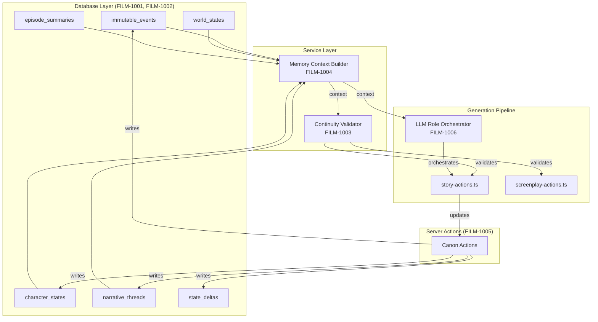
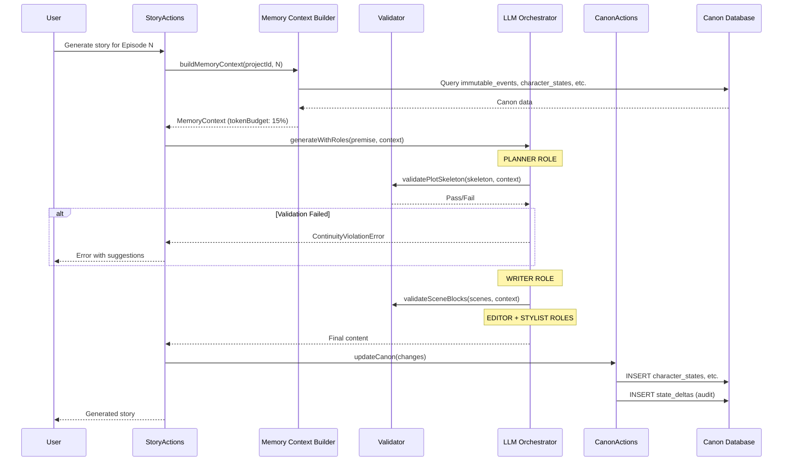

# Canon Management System - Architecture & Algorithms

> **Purpose**: Master technical reference for the Canon Management System (CMS). This document explains HOW each component works, WHY design decisions were made, and HOW components connect.

---

## Table of Contents

1. [System Overview](#system-overview)
2. [Design Philosophy](#design-philosophy)
3. [Component Architecture](#component-architecture)
4. [Data Flow](#data-flow)
5. [Algorithm Reference](#algorithm-reference)
6. [Problem-Solution Matrix](#problem-solution-matrix)
7. [Cross-Reference Matrix](#cross-reference-matrix)

---

## System Overview

The Canon Management System transforms narrative generation from **reactive** (detect issues after) to **preventive** (block violations before). It enforces narrative consistency through database-backed canon state and rule-based validation.

```
┌─────────────────────────────────────────────────────────────────────────────┐
│                      CANON MANAGEMENT SYSTEM (CMS)                          │
├─────────────────────────────────────────────────────────────────────────────┤
│                                                                             │
│  ┌──────────────┐    ┌──────────────────┐    ┌──────────────────────────┐  │
│  │  Canon DB    │    │  Memory Context  │    │   Continuity Validator   │  │
│  │  (6 tables)  │───▶│     Builder      │───▶│      (9 rules)           │  │
│  │              │    │  (token budget)  │    │                          │  │
│  └──────────────┘    └──────────────────┘    └────────────┬─────────────┘  │
│         │                                                  │                │
│         │ writes                                    validates               │
│         ▼                                                  ▼                │
│  ┌──────────────┐    ┌──────────────────┐    ┌──────────────────────────┐  │
│  │ Canon        │    │  LLM Role        │◀───│   Generation Pipeline    │  │
│  │ Actions      │    │  Orchestrator    │    │   (story, screenplay)    │  │
│  │ (CRUD)       │    │  (4 roles)       │    │                          │  │
│  └──────────────┘    └──────────────────┘    └──────────────────────────┘  │
│                                                                             │
└─────────────────────────────────────────────────────────────────────────────┘
```

---

## Design Philosophy

### Core Principle: "The CMS is the Author, the LLM is a Bounded Generator"

From `system-level-algo.md`:

> "LLMs do not 'write stories.' They generate text that may contain story-like patterns. The CMS imposes narrative structure; the LLM fills in the prose within those constraints."

### Three Laws of Canon Management

| Law | Statement | Enforcement |
|-----|-----------|-------------|
| **1. Immutability** | Once established, hard canon NEVER changes | Database constraint + validation block |
| **2. Forward-Only** | Character development moves forward, never backwards | State reversal detection algorithm |
| **3. Authorization** | Every change requires trigger, cost, and constraint | Validation rule CANON_004 |

### Canon Layers

```
┌─────────────────────────────────────────┐
│           IMMUTABLE LAYER               │  ← Never changes (deaths, world rules)
│  "John died in S1E5"                    │
├─────────────────────────────────────────┤
│             SOFT LAYER                  │  ← Changes with authorization
│  "Sarah is grieving → determined"       │
├─────────────────────────────────────────┤
│          EPHEMERAL LAYER                │  ← Per-scene, not persisted
│  "Coffee cup on table"                  │
└─────────────────────────────────────────┘
```

---

## Component Architecture

### Component Interaction Diagram



### Component Responsibilities

| Component | Responsibility | Inputs | Outputs |
|-----------|---------------|--------|---------|
| **Canon DB** | Persistent narrative state | SQL writes | Structured data |
| **Memory Context Builder** | Token-budgeted context assembly | Project ID, episode # | MemoryContext object |
| **Continuity Validator** | Rule-based content validation | Content, context | Pass/Fail + violations |
| **Canon Actions** | CRUD operations with audit | Action payloads | Database records |
| **LLM Role Orchestrator** | Multi-role generation pipeline | Premise, context | Final content |

---

## Data Flow

### Complete Generation Flow



### Token Budget Flow

```
Total Context Window: 40,000 tokens
                    │
    ┌───────────────┴───────────────┐
    │   Memory Budget (15%)         │
    │   = 6,000 tokens              │
    └───────────────┬───────────────┘
                    │
    ┌───────────────┼───────────────┐
    │               │               │
    ▼               ▼               ▼
┌─────────┐   ┌─────────┐   ┌─────────┐
│Immutable│   │Character│   │ Episode │
│ Events  │   │ States  │   │Summaries│
│  35%    │   │   25%   │   │   15%   │
│(2,100)  │   │ (1,500) │   │  (900)  │
└─────────┘   └─────────┘   └─────────┘
       │              │            │
       └──────────────┴────────────┘
                      │
                      ▼
            ┌─────────────────┐
            │ Formatted Prompt │
            │ (for LLM call)  │
            └─────────────────┘
```

---

## Algorithm Reference

### Quick Reference Table

| Algorithm | Spec | Purpose | Complexity | Latency Target |
|-----------|------|---------|------------|----------------|
| Event Key Generation | FILM-1001 | Unique identifiers for canon events | O(1) | <1ms |
| Conflict Detection | FILM-1001 | Find contradicting events | O(n) | <10ms |
| Token Estimation | FILM-1004 | Estimate token count from content | O(n) | <5ms |
| Budget Allocation | FILM-1004 | Distribute token budget by priority | O(1) | <1ms |
| CANON_001 (Immutable) | FILM-1003 | Detect hard canon violations | O(n×m) | <50ms |
| CANON_002 (Reversal) | FILM-1003 | Detect character regression | O(n) | <20ms |
| CANON_003 (Causality) | FILM-1003 | Validate cause-effect order | O(n²) | <30ms |
| CANON_004 (Auth) | FILM-1003 | Verify change authorization | O(1) | <1ms |
| CANON_005 (Threads) | FILM-1003 | Detect orphaned plot threads | O(n) | <20ms |
| Role Orchestration | FILM-1006 | Pipeline 4 LLM roles | O(1) | ~30s |

### Algorithm Details

See individual spec files for full pseudocode:
- [FILM-1003: Continuity Validator](lib/FILM-1003-continuity-validator.yaml) - All 9 validation rules
- [FILM-1004: Memory Context Builder](lib/FILM-1004-memory-context-builder.yaml) - Token budgeting
- [FILM-1006: LLM Role Separation](prompts/FILM-1006-llm-role-separation.yaml) - Orchestration

---

## Problem-Solution Matrix

This matrix maps common LLM storytelling failures to the CMS components that prevent them.

| Problem | Description | Cause | Solution Component | Algorithm |
|---------|-------------|-------|-------------------|-----------|
| **Resurrection** | Dead character appears alive | LLM has no memory | `immutable_events` + CANON_001 | Conflict detection |
| **Knowledge Leak** | Character knows things they shouldn't | Context bleed | `character_states.knowledge` + CANON_006 | Reference validation |
| **Character Regression** | Growth undone without justification | LLM prefers drama | `character_states` + CANON_002 | State reversal detection |
| **Orphaned Plots** | Setup without payoff | LLM forgets setups | `narrative_threads` + CANON_005 | Thread orphan detection |
| **Power Creep** | Stakes escalate unsustainably | LLM seeks engagement | CANON_008 | Escalation scoring |
| **Nostalgia Spam** | Over-referencing past events | Too much context | Memory Context Builder | Token budget (15% max) |
| **Accidental Retcon** | Contradicting established facts | No single source of truth | Canon DB + validation | All CANON_00X rules |
| **Canon Drift** | Gradual inconsistency | Cumulative small errors | State deltas + audit | Append-only logging |
| **Tone Whiplash** | Sudden genre shifts | LLM has no style memory | CANON_009 | Tone drift detection |
| **Exposition Dump** | Recapping excessively | LLM explaining context | Role separation (Stylist) | Output validation |

### Prevention Architecture

```
┌─────────────────────────────────────────────────────────────┐
│                    PREVENTION LAYERS                         │
├─────────────────────────────────────────────────────────────┤
│                                                             │
│  Layer 1: DATABASE CONSTRAINTS                              │
│  ────────────────────────────                               │
│  • Unique constraint on event_key prevents duplicates       │
│  • Foreign keys enforce referential integrity               │
│  • Append-only tables prevent history modification          │
│                                                             │
├─────────────────────────────────────────────────────────────┤
│                                                             │
│  Layer 2: VALIDATION RULES (Continuity Validator)           │
│  ─────────────────────────────────────────────              │
│  • CANON_001-009 run at 3 checkpoints                       │
│  • Block generation on critical/hard failures              │
│  • Log warnings for soft failures                           │
│                                                             │
├─────────────────────────────────────────────────────────────┤
│                                                             │
│  Layer 3: ROLE BOUNDARIES (LLM Orchestrator)                │
│  ───────────────────────────────────────────                │
│  • Each role has explicit permissions                       │
│  • Higher roles constrain lower roles                       │
│  • No role can violate canon independently                  │
│                                                             │
├─────────────────────────────────────────────────────────────┤
│                                                             │
│  Layer 4: AUDIT & RECOVERY (State Deltas)                   │
│  ────────────────────────────────────────                   │
│  • Every change logged immutably                            │
│  • Rollback possible via delta replay                       │
│  • Drift detection via delta analysis                       │
│                                                             │
└─────────────────────────────────────────────────────────────┘
```

---

## Cross-Reference Matrix

### Spec → Component Mapping

| Spec ID | Primary Component | Depends On | Depended By |
|---------|------------------|------------|-------------|
| FILM-1001 | Canon DB tables | FILM-101 (projects) | FILM-1002, FILM-1003, FILM-1004 |
| FILM-1002 | RLS policies | FILM-1001 | None |
| FILM-1003 | Continuity Validator | FILM-1001, FILM-1004 | FILM-1005, story-actions |
| FILM-1004 | Memory Context Builder | FILM-1001 | FILM-1003, FILM-1006 |
| FILM-1005 | Canon Server Actions | FILM-1001, FILM-1003, FILM-1004 | story-actions |
| FILM-1006 | LLM Role Separation | FILM-304 (prompts) | story-actions |

### Table → Service Usage

| Table | Used By Service | Operation |
|-------|-----------------|-----------|
| `immutable_events` | Memory Context Builder | SELECT for context |
| `immutable_events` | Continuity Validator | SELECT for validation |
| `immutable_events` | Canon Actions | INSERT on canon event |
| `character_states` | Memory Context Builder | SELECT latest per character |
| `character_states` | Continuity Validator | SELECT for reversal check |
| `character_states` | Canon Actions | INSERT on state change |
| `narrative_threads` | Memory Context Builder | SELECT active threads |
| `narrative_threads` | Continuity Validator | SELECT for orphan check |
| `narrative_threads` | Canon Actions | INSERT/UPDATE on thread change |
| `state_deltas` | Canon Actions | INSERT on any change (audit) |
| `episode_summaries` | Memory Context Builder | SELECT within horizon |

### Validation Rule → Violation Type Mapping

| Rule | Violation Type | Severity | Tables Queried |
|------|---------------|----------|----------------|
| CANON_001 | `immutable_violation` | CRITICAL | `immutable_events` |
| CANON_002 | `state_reversal` | HARD_FAIL | `character_states` |
| CANON_003 | `causality_break` | HARD_FAIL | (content analysis) |
| CANON_004 | `unauthorized_change` | SOFT_FAIL | (input validation) |
| CANON_005 | `thread_orphan` | SOFT_FAIL | `narrative_threads` |
| CANON_006 | `reference_violation` | HARD_FAIL | `immutable_events`, `episode_summaries` |
| CANON_007 | `connectivity_failure` | SOFT_FAIL | `episode_summaries` |
| CANON_008 | `escalation_overflow` | SOFT_FAIL | `narrative_threads` |
| CANON_009 | `tone_drift` | SOFT_FAIL | `episode_summaries` |

---

## Performance Budget

| Operation | Target | Measured By |
|-----------|--------|-------------|
| Memory context build | <200ms | `performance.now()` delta |
| Single validation checkpoint | <150ms | Per-checkpoint timing |
| Full validation (3 checkpoints) | <500ms | Sum of checkpoints |
| Canon action (single) | <50ms | Database round-trip |
| LLM role call (single) | <15s | Per-role timing |
| Full 4-role pipeline | <60s | Total pipeline duration |

---

## UX Integration Overview

The Canon Management System integrates at **two levels**: Project Settings and Episode Workflow.

### Project Settings Routes

```
/studio/[projectSlug]/settings/
├── canon/                    → Dashboard (series health overview)
├── canon/events              → Immutable Events CRUD
├── canon/threads             → Narrative Threads visualization
└── canon/characters          → Character state timeline
```

### Episode Workflow Touchpoints

```
┌─────────────────────────────────────────────────────────────────────────────┐
│  EPISODE GENERATION WORKFLOW                                                 │
├─────────────────────────────────────────────────────────────────────────────┤
│                                                                             │
│  IDEATION ────┬───► Memory Context Preview (shows what AI knows)           │
│               │     • Algorithm: FILM-1004 buildMemoryContext()             │
│               │     • UI: Collapsible panel with token budget display       │
│               │                                                             │
│  STORY ───────┼───► Canon Validation Badge + Inline Warnings               │
│               │     • Algorithm: FILM-1003 validatePlotSkeleton()           │
│               │     • UI: Episode header badge (✓/⚠️/✖️)                   │
│               │                                                             │
│  SCREENPLAY ──┼───► Continuity Sidebar                                     │
│               │     • Algorithm: FILM-1003 validateSceneBlocks()            │
│               │     • UI: Sidebar with active constraints                   │
│               │                                                             │
│  VISUAL ──────┼───► Character Visual Registry                              │
│               │     • Algorithm: FILM-1004 getCharacterVisualContext()      │
│               │     • UI: VEO prompt consistency markers                    │
│               │                                                             │
│  AUDIO ───────┼───► Voice Consistency                                      │
│               │     • Data: character_states.voice linkage                  │
│               │     • UI: Voice profile from character state                │
│               │                                                             │
│  PUBLISH ─────┴───► Episode Summary Generator                              │
│                     • Algorithm: FILM-1005 generateEpisodeSummaryAction()   │
│                     • UI: Modal to review/confirm canon changes             │
│                                                                             │
└─────────────────────────────────────────────────────────────────────────────┘
```

### Component-to-Algorithm Mapping

| UI Component | Route/Location | Algorithm Triggered | Spec Reference |
|--------------|----------------|---------------------|----------------|
| Canon Dashboard | `/settings/canon/` | `getCanonHealthMetrics()` | FILM-1005 |
| Memory Context Preview | `/ideation` | `buildMemoryContext()` | FILM-1004 |
| Canon Validation Badge | Episode Header | `validatePlotSkeleton()` | FILM-1003 |
| Inline Violation Warnings | `/story` | `CANON_001-009` rules | FILM-1003 |
| Continuity Sidebar | `/screenplay` | `validateSceneBlocks()` | FILM-1003 |
| Character Visual Registry | `/visual-studio` | `getCharacterVisualContext()` | FILM-1004 |
| Role Separation Toggle | `/settings/` | `setRoleSeparation()` | FILM-1006 |
| Episode Summary Generator | `/publish` | `extractCanonChanges()` | FILM-1005 |

### Project Settings Integration

Canon configuration is stored in `projects.metadata.canon`:

```typescript
interface CanonSettings {
  enabled: boolean;           // Master toggle
  roleSeparation: boolean;    // Planner/Writer/Editor/Stylist pipeline
  memoryHorizon: number;      // Episodes to include (default: 10)
  enforcement: 'flexible' | 'strict';  // Violation handling
  contentType: 'series' | 'movie' | 'factual' | 'news';
}
```

**See also**: [FILM-1007: Canon UI Components](ui/FILM-1007-canon-ui-components.yaml)

---

## Next Steps

1. Review individual spec files for detailed algorithm pseudocode
2. Implement database migration (FILM-1001)
3. Build services (FILM-1003, FILM-1004)
4. Integrate with generation pipeline
5. Add UI for canon management (FILM-1007)
