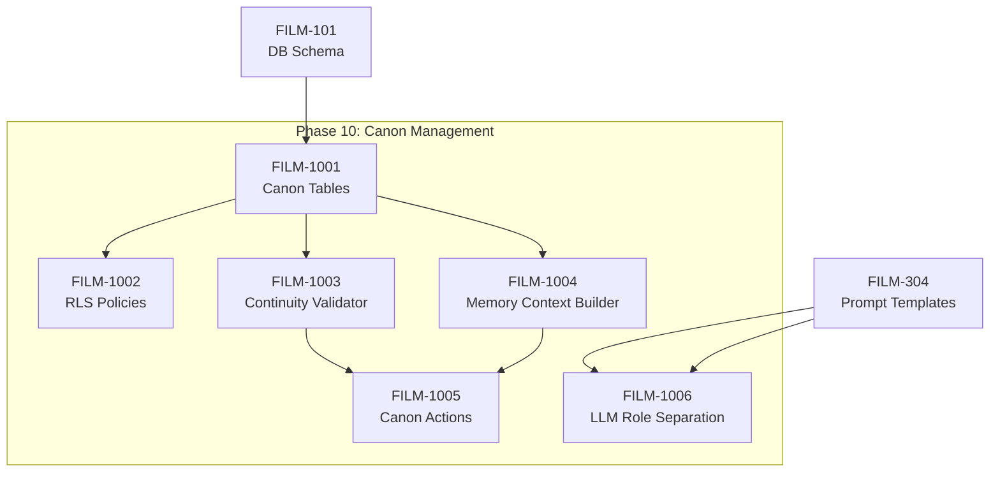

# Phase 10: Canon Management System

> **Status**: 🟡 PARTIAL (audit 2026-09-23; was ✅ Implemented) — built, but six of its specs have open criteria and FILM-1006 is retired. Two cross-tenant bugs sit in this phase: KB-17 and KB-27 in [FILM-CC-04](../cross-cutting/FILM-CC-04-known-bugs.md). Current statuses: [INDEX.md](../INDEX.md).

## Overview

This phase implements the AI-powered content management architecture from `system-level-algo.md` to enforce narrative continuity, prevent common LLM storytelling failures, and enable scalable content generation across episodes.

## Problem Statement

The current system has **reactive** continuity checking (detects issues after generation). This leads to:
- Dead characters accidentally resurrected
- Characters knowing things they shouldn't
- Plot threads abandoned without resolution
- Inconsistent world rules
- Expensive manual review cycles

## Solution

A **preventive** enforcement layer that validates content BEFORE generation:

```
┌───────────────────────────────────────────────────────────────┐
│                    Canon Management System                     │
├───────────────────────────────────────────────────────────────┤
│                                                               │
│  ┌─────────────┐    ┌─────────────────┐    ┌──────────────┐  │
│  │   Canon DB  │───▶│ Memory Context  │───▶│  Continuity  │  │
│  │  (6 tables) │    │    Builder      │    │   Validator  │  │
│  └─────────────┘    └─────────────────┘    └───────┬──────┘  │
│                                                    │         │
│                                              ┌─────▼─────┐   │
│                                              │ Generation │   │
│                                              │  Pipeline  │   │
│                                              └───────────┘   │
└───────────────────────────────────────────────────────────────┘
```

## Core Concepts

### 1. Canon Layers

| Layer | Description | Enforcement |
|-------|-------------|-------------|
| **Immutable** | Facts that NEVER change (deaths, world rules) | Hard block |
| **Soft** | Changeable with authorization (character states) | Validation required |
| **Ephemeral** | Per-scene details (not persisted) | No enforcement |

### 2. Authorization Triplet

Every state change requires:
- **Trigger**: What caused the change
- **Cost**: What was sacrificed
- **Constraints**: What this change prevents going forward

### 3. Memory Budget

Historical context injection is limited to **15%** of token budget to prevent:
- Nostalgia spam (over-referencing past)
- Context window exhaustion
- New content starvation

---

## Specifications

### Database Layer

| ID | Title | Status | Effort | File |
|----|-------|--------|--------|------|
| FILM-1001 | Canon Tables | 🟡 PARTIAL | L | [database/FILM-1001-canon-tables.md](database/FILM-1001-canon-tables.md) |
| FILM-1002 | RLS Policies | 🟡 PARTIAL | S | [database/FILM-1002-canon-rls.md](database/FILM-1002-canon-rls.md) |

**New Tables**:
- `immutable_events` - Hard canon facts
- `character_states` - Character evolution log (append-only)
- `world_states` - Environment tracking
- `narrative_threads` - Plot thread lifecycle
- `state_deltas` - Change audit log
- `episode_summaries` - Memory context cache

### Services Layer

| ID | Title | Status | Effort | File |
|----|-------|--------|--------|------|
| FILM-1003 | Continuity Validator | 🟡 PARTIAL | L | [lib/FILM-1003-continuity-validator.md](lib/FILM-1003-continuity-validator.md) |
| FILM-1004 | Memory Context Builder | 🟡 PARTIAL | M | [lib/FILM-1004-memory-context-builder.md](lib/FILM-1004-memory-context-builder.md) |

### Server Actions

| ID | Title | Status | Effort | File |
|----|-------|--------|--------|------|
| FILM-1005 | Canon Server Actions | 🟡 PARTIAL | M | [server/FILM-1005-canon-actions.md](server/FILM-1005-canon-actions.md) |

### Prompt Templates

| ID | Title | Status | Effort | File |
|----|-------|--------|--------|------|
| FILM-1006 | LLM Role Separation | 🗑️ RETIRED | M | [prompts/FILM-1006-llm-role-separation.md](prompts/FILM-1006-llm-role-separation.md) |

### UI Layer

| ID | Title | Status | Effort | File |
|----|-------|--------|--------|------|
| FILM-1007 | Canon UI Components | 🟡 PARTIAL | L | [ui/FILM-1007-canon-ui-components.md](ui/FILM-1007-canon-ui-components.md) |

---

## UX Integration Summary

Canon Management integrates at **two levels**:

### 1. Project Settings (`/settings/canon/`)

| Route | Purpose |
|-------|---------|
| `/settings/canon/` | Dashboard with series health metrics |
| `/settings/canon/events` | Immutable Events CRUD |
| `/settings/canon/threads` | Narrative Threads visualization |
| `/settings/canon/characters` | Character state timeline |

### 2. Episode Workflow

| Tab | Canon Enhancement |
|-----|-------------------|
| **Ideation** | Memory Context Preview panel |
| **Story** | Canon Validation badge + inline warnings |
| **Screenplay** | Continuity Sidebar |
| **Visual Studio** | Character Visual Registry |
| **Audio Studio** | Voice consistency from character states |
| **Publish** | Episode Summary Generator |

### Architecture Overview

See [ARCHITECTURE.md](ARCHITECTURE.md) for detailed component-algorithm mapping and [ROUTES.md](ROUTES.md) for route specifications.

## Validation Rules (9 Total)

| Rule | Type | Severity | Description |
|------|------|----------|-------------|
| CANON_001 | immutable_violation | CRITICAL | Contradicting hard canon |
| CANON_002 | state_reversal | HARD_FAIL | Character regression |
| CANON_003 | causality_break | HARD_FAIL | Effect before cause |
| CANON_004 | unauthorized_change | SOFT_FAIL | Missing trigger/cost/constraint |
| CANON_005 | thread_orphan | SOFT_FAIL | Abandoned promise |
| CANON_006 | reference_violation | HARD_FAIL | Citing non-existent events |
| CANON_007 | connectivity_failure | SOFT_FAIL | Insufficient callbacks |
| CANON_008 | escalation_overflow | SOFT_FAIL | Stakes ceiling breach |
| CANON_009 | tone_drift | SOFT_FAIL | Genre inconsistency |

---

## LLM Role Pipeline

```
Planner → [structure] → Validator → 
Writer  → [prose]     → Validator → 
Editor  → [refine]    → Validator → 
Stylist → [polish]    → Final Output
```

Each role has explicit permissions and constraints. Higher roles set boundaries for lower roles.

---

## Dependencies



---

## Estimated Effort

| Component | Effort | Duration |
|-----------|--------|----------|
| Database & migrations | L | 2 days |
| Continuity Validator | L | 3 days |
| Memory Context Builder | M | 1 day |
| Canon Server Actions | M | 1 day |
| LLM Role Templates | M | 1 day |
| Integration & Testing | L | 2 days |
| **Total** | **XL** | **8-10 days** |

> **Effort Legend**: S = Small (< 4 hours), M = Medium (1 day), L = Large (2-3 days), XL = Extra Large (1+ week)

---

## Implementation Order

1. **Database**: FILM-1001 → FILM-1002
2. **Services**: FILM-1003 + FILM-1004 (parallel)
3. **Actions**: FILM-1005
4. **Prompts**: FILM-1006
5. **Integration**: Connect to existing story generation pipeline
6. **Testing**: Unit tests, integration tests, manual validation

---

## Breaking Changes

> [!WARNING]
> This implementation will modify:

1. `continuity-actions.ts` - Refactored to use new validator
2. `story-actions.ts` - Memory context parameter required
3. `projects.metadata` - Extended with canon settings
4. Generation job payloads - Larger due to context

---

## Risk Assessment

| Risk | Likelihood | Impact | Mitigation |
|------|------------|--------|------------|
| Token budget too restrictive | Medium | Medium | Make configurable per project |
| False positive violations | Medium | High | Add "flexible" canon policy |
| Complex migration | Low | High | Extensive staging testing |
| LLM role separation overhead | Medium | Low | Make roles optional |

---

## Success Criteria

- [x] All 6 database tables created with RLS — *audit:* `apps/web/supabase/migrations/20260128225704_canon_management.sql:227`
- [ ] Continuity Validator blocks resurrection of dead characters — *audit: not met* — CANON_001 flags it (`packages/features/episodes/src/lib/canon/continuity-validator.ts:177`), but no checkpoint blocks: screenplay runs `flexible`, story's is an agent tool
- [ ] Memory context stays within 15% token budget — *audit: unverified* — category caps at `packages/features/episodes/src/lib/canon/memory-context-builder.ts:450`; no test builds a context
- [x] Generation pipeline integrates validation checkpoints — *audit:* `apps/web/lambda/llm-worker/handlers/screenplay-conversion.ts:253`, `packages/features/episodes/src/agent/story-orchestrator.ts:275`
- [ ] 80%+ test coverage on new services — *audit: not met* — no tests for the validator, context builder or canon actions; only memory strategies and content-type configs are tested
- [ ] < 500ms validation latency — *audit: unverified* — needs a timed run; no benchmark exists

---

## Next Steps

1. **User Review**: Approve scope and design decisions
2. **Database Migration**: Create and test new tables
3. **Service Implementation**: Build validator and context builder
4. **Integration**: Connect to generation pipeline
5. **Testing**: Comprehensive validation
