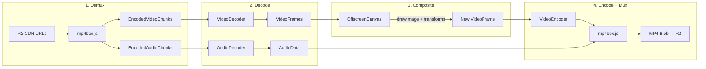
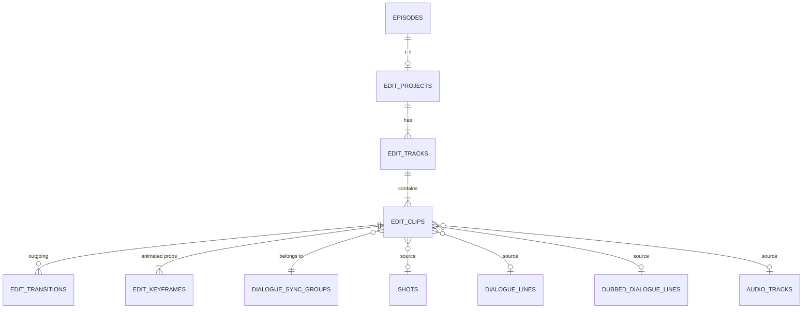

# Phase 14: Edit Suite v2 — Engineering Specification

> **Status:** 🟡 PARTIAL (audit 2026-09-23; was ✅ Done)  
> **Owner:** Engineering  
> **Supersedes:** Phase 6 (FILM-601–606) — old timeline editor  
> **Scope:** Per-episode, in-browser NLE with WebCodecs + Canvas rendering  
> **Dependencies:** Phase 3 (Episodes), Phase 4 (Video Gen), Phase 5 (Audio Gen)

---

## Table of Contents

1. [Overview](#1-overview)
2. [Architecture Decisions](#2-architecture-decisions)
3. [Rendering Pipeline](#3-rendering-pipeline)
4. [Database Schema](#4-database-schema)
5. [Keyframe Animation Engine](#5-keyframe-animation-engine)
6. [Media Bin](#6-media-bin)
7. [Client-Side Auto-Assembly](#7-client-side-auto-assembly)
8. [Undo/Redo System](#8-undoredo-system)
9. [Multilingual Sync Groups](#9-multilingual-sync-groups)
10. [Export Pipeline](#10-export-pipeline)
11. [UI Architecture](#11-ui-architecture)
12. [Package Structure](#12-package-structure)
13. [Task Breakdown](#13-task-breakdown)

---

## 1. Overview

The Edit Suite v2 is a complete rewrite of the timeline editor. It replaces the old Phase 6 components (FILM-601–606) with a professional-grade, in-browser non-linear editor (NLE) built on WebCodecs and Canvas.

### What It Does

- **Auto-assembles** a timeline from existing episode data (shots, dialogue, audio tracks)
- **Preview** via `<video>` elements composited onto Canvas at 30fps
- **Export** via Lambda FFmpeg (v1) or client-side WebCodecs (v2)
- **Keyframe animation** for volume curves, position, scale, rotation, opacity
- **Multilingual sync** — edit one dialogue clip, all language variants move together
- **Media Bin** — browse, search, drag-drop all episode assets + upload B-roll

### What It Does NOT Do (v1)

- Real-time collaboration (Phase 6 polish item)
- Text/title overlays (Phase 6 polish item)
- WebGPU-accelerated effects
- Cross-episode editing (each editor is per-episode)

---

## 2. Architecture Decisions

| Decision | Choice | Rationale |
|----------|--------|-----------|
| Rendering | WebCodecs + Canvas (Klippy-style) | Frame-level control, no vendor lock-in |
| Preview | Hidden `<video>` → `drawImage()` | Avoids full decode during editing, hits 30fps |
| Export (v1) | Lambda FFmpeg via SQS | Reuses existing infra, handles all codecs |
| Export (v2) | Client-side WebCodecs + mp4box.js | Zero server cost, future phase |
| DB Schema | 6 normalized tables | Queryable, indexable, no JSON blob |
| Timeline Persistence | Relational rows | Individual clips/tracks are first-class entities |
| Auto-Assembly | Client-side | No server round-trip, instant feel |
| Undo/Redo | In-memory Command pattern | Simple, 100-item stack, not persisted |
| Media Storage | R2 direct CDN | Zero egress cost, public URLs already resolved |
| Keyframe Animation | Yes — volume, position, scale, rotation, opacity | Pro-level feature, needed for polish |
| Media Bin | Yes — sidebar with drag-to-timeline | Full asset browser with search + upload |
| Scope | Per-episode only | Keeps complexity bounded |

---

## 3. Rendering Pipeline



### Two Modes

| | **Preview** | **Export** |
|---|---|---|
| Where | Browser main thread | Lambda FFmpeg (v1) / WebCodecs Worker (v2) |
| How | `<video>` elements → `ctx.drawImage(videoEl)` | Full frame-by-frame decode → composite → encode → mux |
| Audio | Web Audio API `GainNode` | Muxed into MP4 container |
| Target | 30fps real-time | Can be slower than real-time |

> **Preview shortcut**: Use hidden `<video>` elements per clip. On each `requestAnimationFrame`, seek active clips to `currentTimeMs`, draw onto preview canvas via `ctx.drawImage(videoEl)`.

---

## 4. Database Schema



### 4.1 `edit_projects`

One per episode. Stores canvas dimensions, fps, active language, render status.

```sql
create table if not exists public.edit_projects (
  id uuid primary key default extensions.uuid_generate_v4(),
  episode_id uuid not null references public.episodes(id) on delete cascade,
  width integer not null default 1920,
  height integer not null default 1080,
  fps integer not null default 30,
  active_language varchar(10) not null default 'en',
  render_status varchar(50) not null default 'none'
    check (render_status in ('none','queued','rendering','completed','failed')),
  render_url text,
  render_error text,
  render_started_at timestamptz,
  render_completed_at timestamptz,
  version integer not null default 1,
  created_at timestamptz not null default now(),
  updated_at timestamptz not null default now(),
  unique(episode_id)
);
```

### 4.2 `edit_tracks`

Layers: video, dialogue, music, sfx, ambient, title, upload.

```sql
create table if not exists public.edit_tracks (
  id uuid primary key default extensions.uuid_generate_v4(),
  edit_project_id uuid not null references public.edit_projects(id) on delete cascade,
  type varchar(50) not null
    check (type in ('video','dialogue','music','sfx','ambient','title','upload')),
  name varchar(255) not null,
  sort_order integer not null default 0,
  volume decimal(3,2) not null default 1.0 check (volume >= 0 and volume <= 2.0),
  is_muted boolean not null default false,
  is_solo boolean not null default false,
  is_locked boolean not null default false,
  height integer not null default 64,
  created_at timestamptz not null default now(),
  updated_at timestamptz not null default now()
);
```

### 4.3 `edit_clips`

Timeline items with polymorphic source (shot, dialogue, dubbed, audio track, or upload URL).

```sql
create table if not exists public.edit_clips (
  id uuid primary key default extensions.uuid_generate_v4(),
  track_id uuid not null references public.edit_tracks(id) on delete cascade,
  -- Source (polymorphic — exactly one non-null)
  source_shot_id uuid references public.shots(id) on delete set null,
  source_dialogue_id uuid references public.dialogue_lines(id) on delete set null,
  source_dubbed_dialogue_id uuid references public.dubbed_dialogue_lines(id) on delete set null,
  source_audio_track_id uuid references public.audio_tracks(id) on delete set null,
  source_upload_url text,
  -- Resolved URL (denormalized for fast access)
  media_url text,
  thumbnail_url text,
  -- Timeline position (milliseconds)
  start_ms integer not null default 0 check (start_ms >= 0),
  end_ms integer not null check (end_ms > start_ms),
  -- Source trim
  in_point_ms integer not null default 0,
  out_point_ms integer not null,
  -- Adjustments
  volume decimal(3,2) not null default 1.0 check (volume >= 0 and volume <= 2.0),
  speed decimal(3,2) not null default 1.0 check (speed >= 0.25 and speed <= 4.0),
  fade_in_ms integer not null default 0,
  fade_out_ms integer not null default 0,
  sort_order integer not null default 0,
  -- Multilingual sync
  sync_group_id uuid references public.dialogue_sync_groups(id) on delete set null,
  language varchar(10),
  is_active boolean not null default true,
  created_at timestamptz not null default now(),
  updated_at timestamptz not null default now()
);
```

### 4.4 `edit_transitions`

Between adjacent clips on the same track.

```sql
create table if not exists public.edit_transitions (
  id uuid primary key default extensions.uuid_generate_v4(),
  from_clip_id uuid not null references public.edit_clips(id) on delete cascade,
  to_clip_id uuid not null references public.edit_clips(id) on delete cascade,
  type varchar(50) not null default 'cut'
    check (type in ('cut','crossfade','fade_black','fade_white',
                     'wipe_left','wipe_right','dissolve')),
  duration_ms integer not null default 500 check (duration_ms >= 0 and duration_ms <= 5000),
  params jsonb not null default '{}',
  created_at timestamptz not null default now()
);
```

### 4.5 `edit_keyframes`

Per-clip property animation with easing and bezier support.

```sql
create table if not exists public.edit_keyframes (
  id uuid primary key default extensions.uuid_generate_v4(),
  clip_id uuid not null references public.edit_clips(id) on delete cascade,
  property varchar(50) not null
    check (property in ('volume','position_x','position_y','scale','rotation','opacity')),
  offset_ms integer not null check (offset_ms >= 0),  -- relative to clip start
  value decimal(10,4) not null,
  easing varchar(30) not null default 'linear'
    check (easing in ('linear','ease_in','ease_out','ease_in_out','hold','bezier')),
  bezier_cp1_x decimal(4,3),
  bezier_cp1_y decimal(4,3),
  bezier_cp2_x decimal(4,3),
  bezier_cp2_y decimal(4,3),
  created_at timestamptz not null default now()
);

create index idx_edit_keyframes_clip on edit_keyframes(clip_id);
create index idx_edit_keyframes_clip_property on edit_keyframes(clip_id, property, offset_ms);
```

### 4.6 `dialogue_sync_groups`

Links all language variants of a dialogue line for synchronized editing.

```sql
create table if not exists public.dialogue_sync_groups (
  id uuid primary key default extensions.uuid_generate_v4(),
  edit_project_id uuid not null references public.edit_projects(id) on delete cascade,
  anchor_dialogue_id uuid not null references public.dialogue_lines(id) on delete cascade,
  primary_clip_id uuid,
  created_at timestamptz not null default now(),
  unique(edit_project_id, anchor_dialogue_id)
);
```

### RLS Policy Pattern

All tables follow: `account_id` derived via `edit_projects → episodes → projects → account_id`. Use a helper function `get_edit_project_account_id(edit_project_id)` for RLS.

---

## 5. Keyframe Animation Engine

### Data Flow

```
User drags keyframe diamond → Update edit_keyframes row → Recalculate interpolated value
  → volume?     → Web Audio: gainNode.linearRampToValueAtTime()
  → position?   → Canvas: ctx.translate(x, y)
  → scale?      → Canvas: ctx.scale(s, s)
  → opacity?    → Canvas: ctx.globalAlpha = val
  → rotation?   → Canvas: ctx.rotate(rad)
```

### Interpolation

Given sorted keyframes for a property, find the two bounding keyframes at time `t`, compute progress `p = (t - from.time) / (to.time - from.time)`, then apply easing:

| Easing | Formula |
|--------|---------|
| `linear` | `p` |
| `ease_in` | `p²` |
| `ease_out` | `1 - (1 - p)²` |
| `ease_in_out` | `p < 0.5 ? 2p² : 1 - (-2p + 2)² / 2` |
| `hold` | `0` (stay at from value) |
| `bezier` | `cubicBezier(p, cp1x, cp1y, cp2x, cp2y)` |

### Volume → Web Audio API

```typescript
// For each keyframe in sorted order:
gainNode.gain.setValueAtTime(kf[0].value, startTime);
gainNode.gain.linearRampToValueAtTime(kf[1].value, startTime + kf[1].offsetMs / 1000);
```

### Visual → Canvas Transforms

```typescript
ctx.save();
ctx.globalAlpha = interpolate('opacity', offsetMs);
ctx.translate(interpolate('position_x', offsetMs), interpolate('position_y', offsetMs));
ctx.scale(interpolate('scale', offsetMs), interpolate('scale', offsetMs));
ctx.rotate(interpolate('rotation', offsetMs) * Math.PI / 180);
ctx.drawImage(videoElement, -w/2, -h/2);
ctx.restore();
```

### Curve Editor UI

Inline panel in Inspector: property selector dropdown, draggable ◆ diamonds (value × time), curve visualization, easing preset picker. Double-click to add keyframe, right-click to delete.

---

## 6. Media Bin

Left sidebar that browses all episode assets with drag-to-timeline.

### Sections

| Section | Source Table | Drag Target |
|---------|-------------|------------|
| 🎬 Shots | `shots` (where `video_url` is not null) | Video track |
| 🗣 Dialogue | `dialogue_lines` (where `audio_url` is not null) | Dialogue (en) track |
| 🌐 Dubbed | `dubbed_dialogue_lines` per language | Dialogue ({lang}) track |
| 🎵 Music | `audio_tracks` where type = 'music' | Music track |
| 🔊 SFX | `audio_tracks` where type = 'sfx' | SFX track |
| 📁 Uploads | R2 `uploads/{episodeId}/` | Upload track |

### Features

- **Already-used indicator**: ✅ on clips present in `edit_clips`
- **Upload**: B-roll/stock footage → R2 at `uploads/{episodeId}/`
- **Language filter**: switch dubbed section to any available language
- **Preview on hover**: inline audio/video player
- **Search**: filter by name/text across all sections

---

## 7. Client-Side Auto-Assembly

Runs in browser on first open when no `edit_project` exists.

```
Open Edit Suite → edit_project exists? → Yes → Load from DB
                                        → No  → Parallel fetch (shots, dialogue, dubbed, audio)
                                                → Build tracks array
                                                → Place video clips sequentially
                                                → Create dialogue sync groups
                                                → Place dialogue clips aligned to parent shots
                                                → Place music/SFX/ambient
                                                → Create default keyframes (volume: 1.0 at start)
                                                → Batch INSERT via single server action
```

Key behaviors:
- Shots placed end-to-end on video track
- Dialogue clips aligned to parent shot start + 500ms offset
- Sync groups created per `dialogue_line`, linking all dubbed variants
- Only primary language clips set `is_active = true`
- Default volume keyframe (1.0 at offset 0) added to every clip

---

## 8. Undo/Redo System

In-memory Command pattern. Not persisted to DB.

- Each edit creates an `EditCommand` with `execute()` and `undo()`
- 100-item stack (older items dropped)
- New action clears redo stack
- Sync group edits are atomic (move one clip → all variants move in single command)
- `Cmd+Z` / `Cmd+Shift+Z` keyboard shortcuts
- **Auto-save**: debounced 2s after last edit → batch-update changed rows to DB

---

## 9. Multilingual Sync Groups

### Edit Propagation

When user drags a dialogue clip:
1. Find `syncGroup` for this clip
2. Calculate `deltaMs = newStartMs - oldStartMs`
3. Apply same `deltaMs` to ALL variant clips in the group
4. Undo reverses all atomically

### Language Switching

- Set `is_active = false` for non-matching language clips
- Set `is_active = true` for matching language clips
- Preview swaps audio sources instantly

### Duration Mismatch

If dubbed variant is longer/shorter than original:
- Auto-set `speed` to fit the same time slot
- Show 🟡 yellow border as visual warning
- User can override with manual trim

---

## 10. Export Pipeline

### v1: Lambda FFmpeg (primary)

```
Client builds FFmpeg command from normalized DB
  → POST /api/render with editProjectId
  → Server action reads all clips, tracks, transitions, keyframes
  → Builds FFmpeg filter_complex string
  → Enqueues SQS job
  → Lambda pulls media from R2, runs FFmpeg
  → Uploads result to R2
  → Updates edit_projects.render_status = 'completed'
  → Updates edit_projects.render_url
```

### v2: Client-Side WebCodecs (future)

Full WebCodecs pipeline in a Web Worker: demux → decode → composite → encode → mux → R2 upload.

### Per-Language Export

Queue separate render jobs per language. Each job activates only the clips matching that language.

---

## 11. UI Architecture

### Layout

```
┌─────────────────────────────────────────────────────────────────┐
│ Toolbar: [Undo][Redo] | [Lang: EN ▾] | [Zoom +/-] | [Export]   │
├────────────┬──────────────────────────────┬─────────────────────┤
│ Media Bin  │     Preview Canvas           │  Inspector Panel    │
│ 📂 Shots   │     ┌──────────────┐         │  Clip Properties    │
│ 📂 Dialog  │     │   ▶ Preview  │         │  Keyframe Editor    │
│ 📂 Music   │     └──────────────┘         │  Transition Picker  │
│ 📂 Uploads │     [◄][▶][⏸][►] 00:12:05   │                     │
├────────────┴──────────────────────────────┴─────────────────────┤
│ Timeline                                                         │
│ │Video │ [Shot 1][Shot 2][Shot 3][Shot 4]                       │
│ │Dlg en│   ["Hello..."]["We need..."]                           │
│ │Music │ [═══════ Background Score ════════]                     │
│ │SFX   │         [💥]        [🔔]                               │
│         ▲ Playhead                                               │
└─────────────────────────────────────────────────────────────────┘
```

### Component Tree

```
EditSuitePage
├── EditSuiteProvider (context + useReducer + UndoManager)
│   ├── Toolbar
│   │   ├── UndoRedoButtons, LanguageSwitcher, ZoomControls, SnapToggle, ExportButton
│   ├── ThreePanelLayout (resizable)
│   │   ├── MediaBin (left)
│   │   │   ├── AssetGroup → AssetItem (draggable)
│   │   │   ├── UploadButton, SearchFilter
│   │   ├── PreviewPanel (center)
│   │   │   ├── PreviewCanvas, PlaybackControls, TimecodeDisplay
│   │   └── InspectorPanel (right)
│   │       ├── ClipProperties, KeyframeEditor, TransitionPicker
│   └── Timeline (bottom)
│       ├── TimelineRuler, Playhead, ScrollContainer
│       └── TrackList → TrackRow → TrackHeader + ClipLane
│           └── ClipBlock (draggable, resizable)
│               ├── Waveform / ThumbnailStrip, KeyframeDiamonds, TransitionHandle
```

### Keyboard Shortcuts

| Key | Action | Key | Action |
|-----|--------|-----|--------|
| `Space` | Play/Pause | `S` | Split at playhead |
| `J`/`K`/`L` | Rev/Pause/Fwd | `Delete` | Delete selected |
| `I`/`O` | Set in/out | `Cmd+Z`/`Cmd+Shift+Z` | Undo/Redo |
| `+`/`-` | Zoom | `N` | Add keyframe |
| `Cmd+S` | Force save | `Alt+Drag` | Duplicate clip |

---

## 12. Package Structure

```
packages/features/edit-suite/
├── package.json
├── src/
│   ├── components/
│   │   ├── edit-suite-provider.tsx      # Context + useReducer
│   │   ├── toolbar.tsx
│   │   ├── media-bin/                   # Media Bin sidebar
│   │   │   ├── media-bin.tsx, asset-group.tsx, asset-item.tsx, upload-handler.tsx
│   │   ├── preview/                     # Canvas preview
│   │   │   ├── preview-panel.tsx, preview-canvas.tsx, playback-controls.tsx
│   │   ├── timeline/                    # Track-based timeline
│   │   │   ├── timeline.tsx, timeline-ruler.tsx, playhead.tsx, track-row.tsx
│   │   │   ├── clip-block.tsx, transition-handle.tsx, waveform.tsx, thumbnail-strip.tsx
│   │   ├── inspector/                   # Properties + keyframes
│   │   │   ├── clip-inspector.tsx, keyframe-editor.tsx, transition-picker.tsx
│   │   └── language-switcher.tsx
│   ├── lib/
│   │   ├── auto-assemble.ts             # Client-side assembly
│   │   ├── sync-groups.ts               # Multilingual sync logic
│   │   ├── keyframe-engine.ts           # Interpolation engine
│   │   ├── playback-engine.ts           # rAF loop + <video> seek
│   │   ├── ffmpeg-builder.ts            # Build FFmpeg commands from DB
│   │   ├── media-cache.ts              # LRU cache for decoded frames
│   │   └── keyboard-shortcuts.ts
│   ├── hooks/
│   │   ├── use-clip-drag.ts, use-clip-resize.ts, use-playback.ts
│   │   ├── use-undo-redo.ts, use-media-bin.ts
│   ├── state/
│   │   ├── edit-reducer.ts, edit-commands.ts, types.ts
│   └── server/
│       ├── edit-project-actions.ts      # CRUD for edit_projects
│       ├── clip-actions.ts              # CRUD for edit_clips
│       ├── keyframe-actions.ts          # CRUD for edit_keyframes
│       ├── render-actions.ts            # Export/render jobs
│       └── auto-assemble-action.ts      # Batch insert action
```

Route: `apps/web/app/home/[account]/studio/[projectId]/episodes/[episodeId]/edit-suite/page.tsx`

---

## 13. Task Breakdown

### Build Phase 1: Foundation — Database + Skeleton ✅

#### 1.1 Database Migration ✅
- [x] Create schema file `apps/web/supabase/schemas/35-edit-suite.sql` — *audit:* the file is `apps/web/supabase/schemas/36-edit-suite.sql` (added 5d89563b)
- [x] Define `edit_projects` table with all columns + constraints
- [x] Define `edit_tracks` table with type enum + volume/mute/solo/lock
- [x] Define `edit_clips` table with polymorphic source FKs
- [x] Define `edit_transitions` table with type enum + duration
- [x] Define `edit_keyframes` table with property enum + easing + bezier
- [x] Define `dialogue_sync_groups` table with unique constraint
- [x] Create `get_edit_project_account_id()` helper function for RLS — *audit:* named `get_project_id_for_edit_project()`, `apps/web/supabase/migrations/20260219083555_edit-suite-v2.sql:288`
- [x] Add RLS policies for all 6 tables (select/insert/update/delete)
- [x] Add indexes: `edit_clips(track_id)`, `edit_clips(sync_group_id)`, keyframe composite index
- [x] Generate migration file with timestamp
- [x] Run `supabase gen types` against remote project
- [x] Verify generated types include all new tables

#### 1.2 Server Actions ✅
- [x] `createEditProjectAction` — create project + default tracks
- [x] `getEditProjectAction` — load project with all tracks, clips, keyframes, sync groups
- [x] `updateEditProjectAction` — update project settings (fps, dimensions, language)
- [x] `batchAssembleAction` — single action for auto-assembly (project + tracks + clips + sync groups + keyframes)
- [x] `createClipAction` / `updateClipAction` / `deleteClipAction` — clip CRUD
- [x] `splitClipAction` — split at playhead with keyframe distribution
- [x] `createTrackAction` / `updateTrackAction` / `deleteTrackAction` — track CRUD
- [x] `createKeyframeAction` / `updateKeyframeAction` / `deleteKeyframeAction` — keyframe CRUD
- [x] `createTransitionAction` / `updateTransitionAction` / `deleteTransitionAction` — transition CRUD
- [x] `batchSaveAction` — debounced save of all dirty clips/tracks/keyframes

#### 1.3 Package Scaffold ✅
- [x] Create `packages/features/edit-suite/package.json`
- [ ] Configure `tsconfig.json` with path aliases — *audit: no longer true* — never true: no `paths` in `packages/features/edit-suite/tsconfig.json` or `tooling/typescript/base.json`; imports are relative
- [x] Create `src/lib/types.ts` — all TypeScript interfaces + row mappers
- [x] Create `src/lib/schemas/index.ts` — Zod schemas for all entities
- [x] Create `src/state/edit-reducer.ts` — useReducer with all action types
- [x] Create `src/state/edit-commands.ts` — UndoManager + command classes
- [x] Create `src/state/types.ts` — EditSuiteState + EditAction union
- [x] Create `src/components/edit-suite-provider.tsx` — context provider with auto-save + keyboard shortcuts
- [x] Create `src/components/index.ts` — barrel exports
- [x] Add package to turbo pipeline

#### 1.4 Route + Layout Shell ✅
- [x] Create route `apps/web/app/home/[account]/studio/[projectSlug]/episodes/[episodeSlug]/edit-suite/page.tsx`
- [x] Implement `EditSuiteShell` with CSS Grid layout (toolbar + 3-col workspace + bottom timeline)
- [x] `Toolbar` — undo/redo, language, zoom, snap toggle, save status, export
- [x] `MediaBin` stub (left) — section placeholders for shots/dialogue/music/SFX/uploads
- [x] `PreviewPanel` stub (center) — canvas placeholder, playback controls, timecode
- [x] `InspectorPanel` stub (right) — context-aware (empty, single clip, multi-select)
- [x] `Timeline` stub (bottom) — color-coded track headers, clip lanes, ruler, red playhead
- [x] Add navigation link from episode page to Edit Suite

#### 1.5 Media Bin ✅
- [x] `useMediaBin` hook — fetch shots, dialogue, dubbed, audio tracks for episode
- [x] `MediaBin` component with collapsible `AssetGroup` sections
- [x] `AssetItem` component with thumbnail, name, duration badge
- [x] Drag source implementation using `onDragStart` with clip data in `dataTransfer`
- [x] Already-on-timeline indicator (✓) derived from edit_clips
- [x] `SearchFilter` component — text filter across all sections
- [x] Language filter for dubbed dialogue section

#### 1.6 Timeline Foundation ✅
- [x] `TrackRow` with `TrackHeader` (name, mute, solo, lock, volume slider)
- [x] `ClipBlock` — colored block with label, click/shift-click select
- [x] `TimelineRuler` — adaptive time markers synced with zoom level
- [x] `Playhead` — vertical red line with triangle handle, draggable for scrubbing
- [x] `ZoomControls` — zoom slider + buttons (10–500 px/s)
- [x] `ScrollContainer` — horizontal + vertical scroll with sync
- [x] Drop target on clip lane — receive drag from MediaBin, create clip
- [x] Snap toggle + track-type color coding

#### 1.7 Auto-Assembly ✅
- [x] `autoAssemble()` function in `lib/auto-assemble.ts`
- [x] Parallel fetch: shots, dialogue_lines, dubbed_versions, audio_tracks
- [x] Build tracks array (video + dialogue per language + music + sfx + ambient)
- [x] Place shots end-to-end on video track
- [x] Place dialogue aligned to parent shot start + 500ms offset
- [x] Create sync groups per dialogue_line
- [x] Place dubbed variants with `is_active = false` for non-primary
- [x] Place audio tracks (music, sfx, ambient) with original timeline positions
- [x] Create default volume keyframe (1.0 at offset 0) per clip
- [x] Call `batchCreateEditProjectAction` to persist — *audit:* the call is `batchAssembleAction`, `packages/features/edit-suite/src/lib/auto-assemble.ts:419`
- [x] Loading state with progress indicator during assembly

#### 1.8 Auto-Save ✅
- [x] Dirty state tracking — mark clips/tracks as dirty on edit
- [x] Debounced save (2s after last edit)
- [x] `batchSaveAction` — update only dirty rows
- [x] Save indicator in toolbar (✓ Saved / ● Saving...)
- [x] `Cmd+S` shortcut for force save
- [x] Error handling with retry on save failure

> **Build Phase 1 complete** (PR #194, #195). All foundation, data layer, layout, media bin, timeline, auto-assembly, and auto-save are implemented. During PR review, IDOR ownership checks (episode → project → account membership) were added to `batchAssembleAction` and `getEditProjectAction` for defense-in-depth.

---

### Build Phase 2: Playback + Core Editing ✅

#### 2.1 Preview Canvas ✅
- [x] `PreviewCanvas` — `<canvas>` element at project dimensions (1920×1080 scaled)
- [x] Hidden `<video>` elements pool — one per active clip on screen
- [x] `PlaybackEngine` class — `requestAnimationFrame` loop
- [x] Frame sync: on each rAF, seek each `<video>` to `clipOffsetMs`, `drawImage()` onto canvas
- [x] Layer compositing: draw clips in track sort order (bottom track first)
- [x] Aspect ratio handling for canvas scaling

#### 2.2 Audio Playback ✅
- [x] `AudioContext` creation + `GainNode` per audio clip
- [x] Track-level volume: master `GainNode` per track
- [x] Clip-level volume: per-clip `GainNode`
- [x] Mute/solo logic: muted tracks disconnect `GainNode`
- [x] Sync audio playback position with playhead
- [x] Start/stop audio sources on play/pause

#### 2.3 Playback Controls ✅
- [x] `PlaybackControls` — play/pause/stop buttons
- [x] `TimecodeDisplay` — MM:SS:FF format synced with playhead
- [x] `Space` to toggle play/pause
- [x] `J`/`K`/`L` shuttle: reverse / pause / forward (multi-tap = 2×, 4×)
- [x] `I`/`O` to set in/out points on selected clip
- [x] Frame-step with arrow keys (left/right = ±1 frame)

#### 2.4 Playhead ✅
- [x] Playhead line synced with playback position
- [x] Draggable for scrubbing (updates preview + audio position)
- [x] Click on ruler to jump playhead
- [x] Auto-scroll timeline when playhead reaches edge during playback

#### 2.5 Clip Editing ✅
- [x] Horizontal drag to reposition clips
- [x] Snap-to-edges: snap to adjacent clip boundaries
- [x] Snap-to-playhead: snap to current playhead position
- [x] Snap indicators (vertical guides when snapping)
- [x] Edge drag to trim (adjust `in_point_ms` or `out_point_ms`)
- [x] Minimum clip duration (100ms)
- [x] Split clip at playhead (`S` key) — creates two clips from one
- [x] Delete selected clip(s) (`Delete` key)
- [x] Multi-select (shift+click)
- [x] `Alt+Drag` to duplicate clip

#### 2.6 Waveform Rendering ✅
- [x] `Waveform` component — render audio waveform on clip block
- [x] Web Audio API `OfflineAudioContext` to decode audio buffer
- [x] Downsample to peaks array matching clip pixel width
- [x] Canvas-based waveform drawing (filled, semi-transparent)
- [x] Cache waveform data per clip URL

#### 2.7 Undo/Redo ✅
- [x] `EditCommand` interface with `execute()` and `undo()`
- [x] `MoveClipCommand`, `TrimClipCommand`, `SplitClipCommand`, `DeleteClipCommand`
- [x] `UndoManager` class — 100-item stacks
- [x] `useUndoRedo` hook exposing `undo()`, `redo()`, `canUndo`, `canRedo` — *audit:* exposed by `useEditCommands()`, `packages/features/edit-suite/src/components/edit-suite-provider.tsx:699`
- [x] `Cmd+Z` / `Cmd+Shift+Z` keyboard shortcuts
- [x] Undo/redo buttons in toolbar with disabled state

---

### Build Phase 3: Transitions + Effects ✅ (2–3 weeks)

#### 3.1 Transition UI
- [x] `TransitionHandle` — appears between adjacent clips on hover
- [ ] `TransitionPicker` in Inspector — grid of transition types with preview — *audit: no longer true* — the picker opens from the timeline handle (`packages/features/edit-suite/src/components/timeline/transition-handle.tsx:138`), icons only, no preview; the Inspector is placeholders
- [x] Click transition handle to open picker
- [ ] Transition duration slider (100ms–5000ms) — *audit: no longer true* — 100–3000 ms since added in a355c5ce (`packages/features/edit-suite/src/components/timeline/transition-picker.tsx:32`)
- [ ] Visual indicator: overlap region between clips shown as gradient — *audit: no longer true* — the handle is a small round icon (`packages/features/edit-suite/src/components/timeline/transition-handle.tsx:124`); no gradient over the overlap

#### 3.2 Transition Rendering
- [x] `crossfade` — alpha blend between outgoing and incoming frames
- [x] `fade_black` — fade out to black, fade in from black
- [x] `fade_white` — same with white
- [x] `dissolve` — pixel-level blend using `globalCompositeOperation`
- [x] `wipe_left` / `wipe_right` — clip-path based wipe
- [x] Server actions: `createTransitionAction`, `updateTransitionAction`, `deleteTransitionAction`

#### 3.3 Speed Control
- [ ] Speed slider in Inspector (0.25×–4×) — *audit: no longer true* — `SpeedControl` has been mounted nowhere since a355c5ce; the Inspector renders placeholders (`packages/features/edit-suite/src/components/inspector/inspector-panel.tsx:37`)
- [x] Clip duration recalculates on speed change
- [x] `<video>.playbackRate` updated during preview
- [x] Visual indicator on clip block (e.g., "2×" badge)

#### 3.4 Thumbnail Strip
- [x] `ThumbnailStrip` component on video clips
- [x] Extract frames at regular intervals using `<video>` + `<canvas>`
- [x] Render as strip of small thumbnails across clip width
- [x] Cache thumbnails per clip URL

#### 3.5 Snap System
- [ ] Snap-to-grid: quantize to nearest frame boundary — *audit: no longer true* — never wired: snapping targets only clip edges and the playhead, with no frame quantisation (`packages/features/edit-suite/src/components/timeline/clip-block.tsx:172`)
- [x] Snap-to-edges: adjacent clip start/end points
- [x] Snap-to-playhead
- [ ] `SnapToggle` in toolbar to enable/disable — *audit: no longer true* — never wired: the toggle flips `snapEnabled`, which `ClipBlock` never reads, so snapping is always on (`packages/features/edit-suite/src/components/timeline/clip-block.tsx:172`)
- [x] Visual snap guides (thin lines) during drag

---

### Build Phase 4: Keyframe Animation ✅ (3–4 weeks)

#### 4.1 Keyframe CRUD
- [x] `createKeyframeAction` — add keyframe for clip + property + offset
- [x] `updateKeyframeAction` — update value, easing, bezier control points
- [x] `deleteKeyframeAction` — remove keyframe
- [x] `batchUpdateKeyframesAction` — save all dirty keyframes — *audit:* done by `batchSaveAction` (`p_dirty_keyframes`), `packages/features/edit-suite/src/server/batch-actions.ts:147`

#### 4.2 Keyframe Engine
- [x] `interpolateKeyframes()` function in `lib/keyframe-engine.ts`
- [x] All 6 easing types implemented
- [x] `cubicBezier()` function for custom curves
- [x] `getInterpolatedValues()` — returns all property values at given offset

#### 4.3 Volume Keyframes
- [x] Apply volume keyframes via `gainNode.gain.linearRampToValueAtTime()`
- [x] Real-time preview: update gain scheduling on keyframe change
- [x] Handle `hold` easing with `setValueAtTime()`

#### 4.4 Visual Keyframes
- [x] Apply position_x/y via `ctx.translate()` during composite
- [x] Apply scale via `ctx.scale()` during composite
- [x] Apply rotation via `ctx.rotate()` during composite
- [x] Apply opacity via `ctx.globalAlpha` during composite
- [x] Transform origin at clip center

#### 4.5 Curve Editor UI
- [ ] `KeyframeEditor` component in Inspector — *audit: no longer true* — mounted nowhere since c1abd5fb; the Inspector renders "Coming soon" (`packages/features/edit-suite/src/components/inspector/inspector-panel.tsx:37`)
- [x] Property selector dropdown (volume, position_x, etc.)
- [x] SVG canvas for curve visualization
- [x] Draggable ◆ diamonds — horizontal (time) + vertical (value)
- [x] Curve line drawn between keyframes using easing function
- [x] Double-click to add keyframe at position
- [ ] Right-click context menu to delete / change easing — *audit: no longer true* — right-click deletes the keyframe directly; there is no menu (`packages/features/edit-suite/src/components/inspector/keyframe-editor.tsx:353`)
- [x] Easing preset buttons (linear, ease-in, ease-out, ease-in-out, hold)
- [ ] Bezier handle editing when easing = 'bezier' — *audit: no longer true* — no bezier-handle UI; the presets omit bezier and new keyframes get null control points (`packages/features/edit-suite/src/components/inspector/keyframe-editor.tsx:179`)

#### 4.6 Keyframe Diamonds on Clips
- [x] Small ◆ markers on clip blocks in timeline
- [x] Show on hover or when clip is selected
- [x] Color-coded by property
- [ ] Draggable horizontally to adjust offset within clip — *audit: no longer true* — clip diamonds are static SVG with no drag handler (`packages/features/edit-suite/src/components/timeline/clip-block.tsx:519`)

---

### Build Phase 5: Multilingual + Export ✅ (3–4 weeks)

#### 5.1 Language Switcher
- [x] `LanguageSwitcher` dropdown in toolbar
- [x] Populated from clip languages (with 12-language label map)
- [x] On switch: dispatch `SET_LANGUAGE` → update `activeLanguage`
- [x] Toggle `is_active` on all dialogue clips by language
- [x] Show inactive language clips as dimmed/semi-transparent (opacity-40 + border-dashed)

#### 5.2 Sync Group Logic
- [x] `syncGroupShift()` — propagate position changes across all variants
- [x] `SyncGroupMoveCommand` — atomic undo/redo for all variants
- [x] `detectDurationMismatches()` — detect >5% duration differences
- [x] `autoSpeedForSyncGroup()` — `speed = dubbedDuration / originalDuration`
- [x] 🟡 Yellow border indicator when speed ≠ 1.0 (border-amber-500)
- [x] Speed clamped to 0.25–4.0 range

#### 5.3 FFmpeg Command Builder
- [x] `buildFFmpegCommand()` in `lib/ffmpeg-builder.ts`
- [x] Read all clips, tracks, transitions from state
- [x] Generate `filter_complex` string for:
  - Video: trim + setpts + scale + xfade transitions
  - Audio: atrim + atempo + volume + adelay + amix
  - Per-clip speed adjustment (setpts/atempo with chaining)
- [x] Handle multiple audio tracks (dialogue + music + sfx)
- [x] Volume keyframe expressions via `between()` FFmpeg syntax
- [x] Export Dialog with FFmpeg command preview + copy button

#### 5.4 Lambda Render Pipeline ✅ *(implemented — deploy via `npx sst deploy`)*
- [x] `enqueueRenderAction` — create SQS message with editProjectId + language
- [x] Lambda handler: fetch project data, download media from R2, run FFmpeg
- [x] Real-time render status via WebSocket (replaces polling)
- [x] Upload result to R2, update `render_url`
- [x] Error handling with `render_error` field

#### 5.5 Per-Language Export ✅ *(implemented — deploy via `npx sst deploy`)*
- [x] "Export All Languages" button
- [x] Queue separate SQS jobs per language
- [x] Each job activates only matching language clips
- [x] Results stored with language suffix in R2 path
- [x] Master video asset creation via existing FILM-716 system ✅ *(render worker creates `assets` row + links episode `master_video_asset_id`)*

---

### Build Phase 6: Polish + Advanced (Ongoing)

#### 6.1 Client-Side WebCodecs Export ✅
- [x] Web Worker for encoding pipeline
- [x] mp4box.js demuxing of source clips ✅ *(full VideoDecoder frame-by-frame extraction)*
- [x] VideoDecoder → OffscreenCanvas composite → VideoEncoder
- [x] AudioDecoder → audio mixing in Worker ✅ *(multi-source mixing with volume control)*
- [x] mp4box.js muxing to MP4 blob ✅ *(proper MP4 container with video + audio tracks)*
- [x] Progress reporting via `postMessage`
- [x] Direct R2 upload from browser ✅ *(presigned-upload.ts + Upload to R2 button in export dialog)*

#### 6.2 Performance ✅
- [ ] LRU media cache for decoded frames — *audit: no longer true* — never used: `frameCache` (`packages/features/edit-suite/src/lib/lru-cache.ts:101`) is never read; the LRU backs waveform peaks only
- [x] Virtual scrolling for timeline (only render visible clips)
- [x] Debounced re-render on property changes
- [ ] OffscreenCanvas for waveform generation in Worker — *audit: no longer true* — the worker decodes and computes peaks without OffscreenCanvas; drawing is on the main thread (`packages/features/edit-suite/src/components/timeline/waveform.tsx:71`)

#### 6.3 Title/Text Overlays ✅
- [x] Title track type
- [x] Text clip with font, size, color, position, duration
- [x] Canvas text rendering with shadow/outline
- [x] Fade-in/out via keyframe animation

#### 6.4 Collaborative Editing ✅
- [x] WebSocket-based operational transforms ✅ *(OT engine with 8 op types, OperationBuffer, server-wins conflict resolution)*
- [x] Cursor presence indicators ✅ *(CursorPresence overlay + ActiveEditorsList component)*
- [x] Conflict resolution for simultaneous clip edits ✅ *(transformOperation() + WebSocket edit-operation/cursor-update handlers)*

## Remaining (audit 2026-09-23)

| Criterion | Why it is open | Closed by |
|---|---|---|
| Inspector: speed slider, keyframe curve editor, transition picker (§3.1, §3.3, §4.5) | `packages/features/edit-suite/src/components/inspector/inspector-panel.tsx:37` renders "Coming soon" placeholders; `SpeedControl` and `KeyframeEditor` have never been mounted, so clip speed, fades and keyframes cannot be edited in the UI | unassigned |
| Snap-to-grid and `SnapToggle` (§3.5) | No frame quantisation, and `snapEnabled` is never read by `ClipBlock` (`packages/features/edit-suite/src/components/timeline/clip-block.tsx:172`) | unassigned |
| Every edit is an undoable command (§8) | Keyframe, transition, media-bin drop, I/O trim, speed and track edits dispatch directly and bypass `UndoManager` (e.g. `packages/features/edit-suite/src/components/timeline/track-row.tsx:234`) | unassigned |
| Transition duration 100–5000 ms, overlap gradient (§3.1) | Slider stops at 3000 ms (`packages/features/edit-suite/src/components/timeline/transition-picker.tsx:32`); the handle is an icon, not a gradient | unassigned |
| Keyframe diamonds draggable on clips (§4.6); bezier handles and right-click menu (§4.5) | Clip diamonds are static (`packages/features/edit-suite/src/components/timeline/clip-block.tsx:519`); no bezier-handle UI; right-click deletes directly | unassigned |
| LRU frame cache, OffscreenCanvas waveform (§6.2) | `frameCache` is never read (`packages/features/edit-suite/src/lib/lru-cache.ts:101`); the waveform worker only computes peaks | unassigned |
| `tsconfig.json` path aliases (§1.3) | None configured in `packages/features/edit-suite/tsconfig.json` | unassigned |
