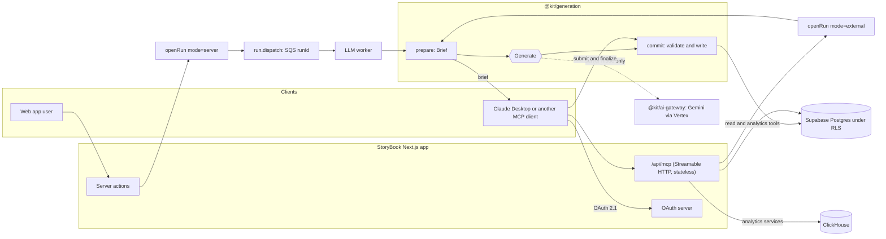
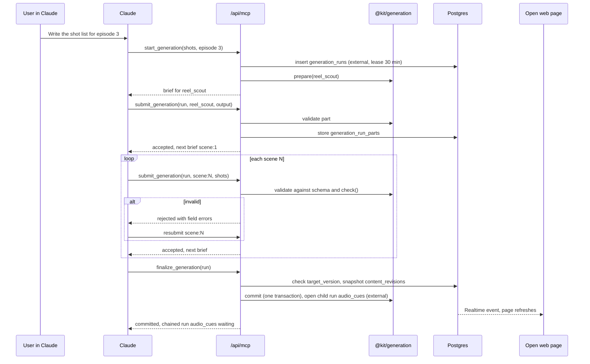
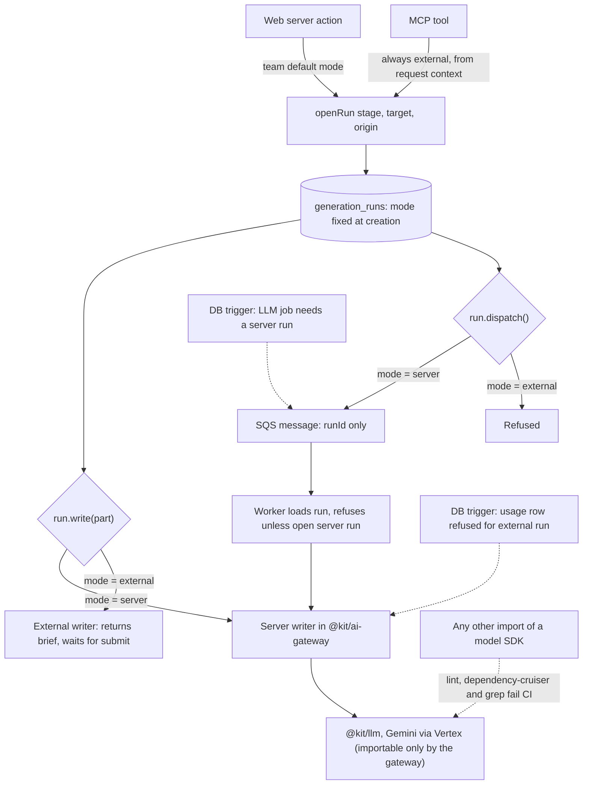
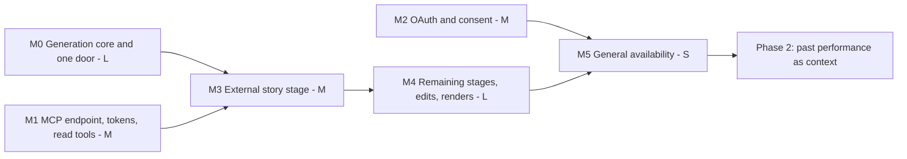

# EDD: Dual AI Architecture (Gemini in-app + MCP-driven Claude)

Oct 2, 2026 · Shauryadeep Chaudhuri

> Repository copy of the design doc
> (https://claude.ai/code/artifact/ecf5b05b-019e-4512-abfc-9d6523f0a242),
> exported 2026-10-02 with its diagrams redrawn in Mermaid. The specs in this
> folder (FILM-1901 to FILM-1912) are the source of truth for requirements;
> where they differ from this document, the spec wins.

## Overview

StoryBook gets a second way to be driven. The web app keeps generating with server-side Gemini on Vertex AI, exactly as today. In addition, the app exposes itself as a **remote MCP server** that Claude Desktop (or any MCP client) connects to as a custom connector. In that mode the external AI writes the ideas, story, screenplay, shots and dialogue, and StoryBook acts only as the system of record, validator and analyzer: it makes **no LLM call of its own** for that work.

The core move is to split every generation job into three parts: **prepare** (build context, render the prompt, name the output schema), **generate** (the LLM call), and **commit** (validate, persist, trigger downstream work). Today the three are fused inside each worker handler. Once split, the server runs all three for the web flow, and the MCP flow hands *prepare* to the external AI as a brief, lets it generate, and runs the very same *commit* on what it submits. Both flows share one set of prompts, schemas, tables and pipeline rules, so they cannot drift apart.

### Goals

1. A user can run the whole episode workflow (ideation, story, screenplay, shots, audio dialogue) from Claude Desktop, with nothing generated by StoryBook's own LLM.
2. The web app behaves exactly as today when used on its own, on Gemini via Vertex AI configured by env vars.
3. Output from either flow lands in the same tables, passes the same validation, and appears in the same web UI.
4. Every artifact records who generated it (server model, external agent, or human), so analytics and experiments can compare them.
5. The MCP surface also exposes the app's analytics and experiments read-only, so the external AI can inspect what exists.

### Non-goals (this EDD)

- Feeding past-episode performance into generation. That is Phase 2, sketched at the end, once the dual architecture works.
- Replacing media rendering. Voice, music and SFX are rendered by ElevenLabs, not written by an LLM, and Claude cannot produce them; in MCP mode they stay server-side vendor calls, started only when the agent or user asks. Video is not rendered in-app today and stays that way.
- Publishing to platforms from MCP. Publish stays a web action for now (an outward, hard-to-undo step).
- An in-app chat agent. The external client is the agent.

### Glossary

| Term | Meaning |
| --- | --- |
| Server mode | Generation runs in the LLM worker on the env-configured provider (Gemini/Vertex today). |
| External mode | Generation is done by an MCP client; StoryBook only prepares briefs and commits results. |
| Brief | What *prepare* returns: rendered instructions, context, output JSON Schema, constraints, a run id. |
| Generation run | One stage execution for one target (e.g. shots for scene 4), in either mode, tracked in a new table. |
| Commit | Validation plus persistence of a generation's output, shared by both modes. |
| Connector | Claude's name for a remote MCP server added by URL, authorised with OAuth. |

## Current state

Today every piece of creative text is written by Gemini inside an SQS-driven Lambda, and the code that decides *what to ask* is fused with the code that decides *what to save*. That fusion is the main thing this design has to undo. Facts below were read from `main` at `58bb9f8`.

### How a generation runs today

1. A server action (e.g. `generateShotListAction`, `packages/features/episodes/src/lib/server/mutations/shot-list-actions.ts:32`) authorises the target, inserts a `generation_jobs` row with status `queued`, and calls `queueLlmJob` (`prompt-engine/src/lib/server/sqs-helper.ts:75`).
2. The LLM worker (`apps/web/lambda/llm-worker/index.ts:166`) routes by `jobType` to one of 16 handlers. It runs with a service-role client, 15 min timeout and reserved concurrency 3 to avoid Gemini 429s (`sst.config.ts:649`).
3. Most stages run an **orchestrator** on `@kit/agent` (`packages/features/episodes/src/agent/*-orchestrator.ts`): a director skill writes, an evaluator skill scores, and the loop can retry. Skills call `executeLLM` with a prompt slug.
4. Prompts are JSON in `packages/features/prompt-engine/src/prompts/**`. Each carries `system_prompts`, a `user_prompt` template, `variables`, an `output.schema` and an `output.schema_for_llm`. All 30 pin `gemini` / `gemini-3.5-flash`; provider keys and `GEMINI_VERTEXAI`, `GOOGLE_CLOUD_PROJECT`, `GOOGLE_CLOUD_LOCATION` come from env.
5. The handler extracts JSON from the reply, post-processes it, and writes it: JSONB on `episodes` (`story_data`, `screenplay_data`, `shot_list`, `viral_quality`), plus rows in `shots`, `dialogue_lines`, `audio_cues`, `assets` and the canon tables. It may chain the next job (shots chains audio cues).
6. The result reaches the browser over the API Gateway WebSocket (`llm-result` / `llm-error`), with polling of `generation_jobs` as a fallback (`episodes/src/hooks/use-active-generation-job.ts`).

### Stages and where their output lands

| Stage | Job type | Orchestrator skills | Output written to |
| --- | --- | --- | --- |
| Season outline | `season-outline` | outliner, season-arc evaluator | returned to the client, saved by `batch-episode-actions.ts` |
| Ideation | `story-ideation` | ideation director, idea-quality evaluator | returned to the client, not stored |
| Story | `story-generation` | story director, viral analyst, continuity, (researcher, fact checker, act context) | `episodes.story_data`, `status='story'`, canon tables, auto-created character and location `assets` |
| Story refinement | `story-refinement` | none (direct) | `episodes.story_data`, `metadata.refinement_history` |
| Screenplay | `screenplay-conversion` | screenplay director, screenplay-quality evaluator | `episodes.screenplay_data`, `status='storyboard'`, rebuilt `dialogue_lines` |
| Screenplay refinement | `screenplay-refinement` | none (direct) | `episodes.screenplay_data`, rebuilt `dialogue_lines` |
| Shots | `shot-generation` | reel scout, shot director (per scene, batches of 5), shot quality | `shots` replaced, `episodes.shot_list`; deletes `audio_cues`/`audio_tracks`; chains audio cues |
| Audio cues | `audio-cue-generation` | audio cue director | `audio_cues` |
| Dialogue translation | `translate-dialogue` | translator, translation verifier | translated `dialogue_lines` |
| Asset descriptions | `asset-creation` | none (direct) | `assets` upserted |
| Facts, metadata, insights | `fact-extraction`, `batch-translate-metadata`, `analytics-insights`, `language-insights` | none (direct) | `verified_facts`, returned, `analytics_insights_cache`, returned |

Media is separate. Voice lines go through the voice worker to ElevenLabs (no LLM); music and SFX through ElevenLabs in `audio-file-generation`. **Video and images are not rendered in-app**: shot generation writes VEO prompts and frame descriptions, and users upload clips (`apps/web/app/api/projects/[projectId]/shots/[shotId]/upload/route.ts`).

### Gaps this design must close

- **Fused handlers.** Post-processing (canon commit, asset auto-create, `dialogue_lines` rebuild, cue chaining, status moves, job bookkeeping) lives inside the handlers, so nothing outside the worker can save a stage correctly.
- **Unenforced output schema.** The worker extracts JSON but does not validate it against `output.schema` (`llm-worker/prompt-registry.ts`); typed Zod output schemas exist in `prompt-engine/src/schemas/story-generation-schemas.ts` but are applied unevenly. An external writer needs a strict validator, and the server path benefits too.
- **LLM calls outside the worker.** Synchronous calls in `canon-actions.ts:1479` (canon at publish), `asset-link-actions.ts:83`, `agent-story-generation.ts:59` and the news services would silently call Gemini during external work.
- **No inbound API auth.** `enhanceRouteHandler` is cookie-only; there are no personal access tokens or OAuth server. The OAuth tables that exist are outbound (YouTube, Meta).
- **Name clash.** `packages/mcp-server` already exists, but it is a stdio dev tool (SQL, migrations, components) and must never be exposed. The product server gets its own package.

### Every path that reaches an AI model today

Audited on 2026-10-02 by searching `apps/` and `packages/` for every caller of `executeLLM`, `executeLLMForLambda`, `runAgent`, `createLLMClient`, the Gemini provider, and the embedding and transcription clients, then tracing each one back to the button or job that triggers it. There are **19 live paths**: 15 LLM calls inside worker jobs, 2 synchronous server actions, the story-canon step, and the Voyage embedder. A further 8 call sites have no caller in the app today. Every live path has an external-mode answer below; three were missing from the first draft (season analysis, fact extraction, the publish-page episode summary) and are now in the stage catalogue.

| # | Triggered by | Code path | Model call | External-mode treatment |
| --- | --- | --- | --- | --- |
| 1 | Season outline (batch episode creator) | worker `season-outline` → Season Orchestrator | outliner + season-arc evaluator | stage `season_outline` |
| 2 | Season analysis | worker `season-analysis` | `season-generation` prompt, direct | stage `season_analysis` (added) |
| 3 | Ideation page | worker `story-ideation` → Ideation Orchestrator | ideation director + idea-quality evaluator | stage `ideation` |
| 4 | Story page, bulk actions | worker `story-generation` → Story Orchestrator | story director, viral analyst, continuity; researcher and fact checker (documentary); act context (movie) | stage `story` |
| 5 | Story generation, after the story is written | `utils/commit-story-canon.ts:424` | `canon-extraction` prompt | canon facts arrive in the story submission; commit stores them |
| 6 | Story refine | worker `story-refinement` | direct | stage `story_refinement` |
| 7 | Screenplay page, bulk actions | worker `screenplay-conversion` → Screenplay Orchestrator | screenplay director + screenplay-quality evaluator | stage `screenplay` |
| 8 | Screenplay refine | worker `screenplay-refinement` | direct | stage `screenplay_refinement` |
| 9 | Visual studio, bulk actions | worker `shot-generation` → Shot Orchestrator | reel scout, shot director per scene, shot quality | stage `shots` |
| 10 | Chained after shots, audio studio | worker `audio-cue-generation` → Audio Cue Orchestrator | audio cue director | stage `audio_cues` |
| 11 | Audio studio, translate | worker `translate-dialogue` → Translation Orchestrator | translator + verifier | stage `dialogue_translation` |
| 12 | Asset creation job | worker `asset-creation` | `extract-asset-description`, direct | stage `asset_description` |
| 13 | Research upload (`app/api/research/upload/route.ts`) | worker `fact-extraction` | `fact-extraction`, direct | stage `fact_extraction` (added) |
| 14 | Publish screen, translate metadata | worker `batch-translate-metadata` | direct | stage `publish_metadata` |
| 15 | Analytics page, generate insights | worker `analytics-insights` | `insights-generation`, direct | not a stage: in external mode the agent analyses the raw data through the analyze tools; the web button stays server mode |
| 16 | Language analytics, insights | worker `language-insights` | `language-insights`, direct | same as 15 |
| 17 | Publish page, episode summary (`episode-summary-generator.tsx`) | `extractCanonChangesAction`, `canon-actions.ts:1479`, synchronous | `canon-extraction` | stage `episode_summary` (added): summary, sentiment and key events submitted by the agent |
| 18 | Episode sidebar, extract description and batch create | `asset-link-actions.ts:83`, synchronous | `extract-asset-description` | stage `asset_description` |
| 19 | Story and ideation context building | `llm-worker/utils/voyage-embedder.ts` via `context-builder.ts` | Voyage embeddings (not Gemini) | `prepare` uses stored `episode_embeddings` only; stale ones fall back to recency, as they already do with no Voyage key |

**No caller today** (exported but not reached from any page, route or job): `continuity-actions.ts` (the `ContinuityChecker` component is not mounted), `news-actions.ts` and the news services (anchor, producer, entity extractor, news story), `lib/canon/act-context-bridge.ts`, `server/agent-story-generation.ts`, `assets/src/lib/element-prompt/llm-generator.ts`, `audio-generation/src/lib/audio-embedding.ts` (OpenAI embeddings), `llm/src/transcription.ts` (OpenAI) and, found by FILM-1902's re-audit, `agent/orchestrator.ts` (`runContentOrchestrator`, exported as `@kit/episodes/agent/orchestrator`). Nine in all, deleted in M0 (LLD section 6, FILM-1902 part A), so the stage registry becomes the complete list of AI features.

**Not an LLM**: ElevenLabs voice, music and SFX (render tools), and `audio-file-generation`. **Dev only**: the vendor sandbox's fake Gemini and `LLM_FORCE_PROVIDER=local`.

## Functional requirements

IDs are referenced from the task list. MUST items are the Phase 1 scope; SHOULD items can slip to Phase 1.5.

### Connection and identity

| ID | Requirement | Priority |
| --- | --- | --- |
| FR-1 | StoryBook serves a remote MCP endpoint over Streamable HTTP at a stable public URL (e.g. `https://app.<domain>/api/mcp`). | MUST |
| FR-2 | A user adds it in Claude Desktop or claude.ai as a custom connector and signs in with their StoryBook account through OAuth 2.1 (authorization code + PKCE), with Dynamic Client Registration and Claude's published client identity both supported. | MUST |
| FR-3 | Every MCP call acts as that user, inside one team account they choose at consent time, with the same RLS and role checks as the web app. | MUST |
| FR-4 | Users see and revoke their connected clients from account settings; revocation takes effect on the next call. | MUST |
| FR-5 | A personal access token sent as a request header works as a fallback for clients without OAuth and for local testing. | SHOULD |

### Driving the workflow

| ID | Requirement | Priority |
| --- | --- | --- |
| FR-10 | The agent can list and read projects, series, seasons, episodes, characters, locations and their current stage, with the same data the web pages show. | MUST |
| FR-11 | The agent can create and update projects, episodes, characters and locations (the non-generated, user-authored inputs). | MUST |
| FR-12 | For each generation stage (ideation, story, story refinement, screenplay, screenplay refinement, shot list per scene, audio cues/dialogue, translation, metadata), the agent can request a **brief**: rendered instructions, full context, the output JSON Schema and the constraints. | MUST |
| FR-13 | The agent submits generated output for that brief; StoryBook validates it with the same schema and rules the server path uses, and either commits it or returns field-level errors the agent can fix and resubmit. | MUST |
| FR-14 | Large outputs are submitted in parts (shots scene by scene, dialogue scene by scene) and finalised once, so no single tool call has to carry a whole episode. | MUST |
| FR-15 | The agent can make targeted edits (one scene, one shot, one dialogue line) without regenerating a stage. | MUST |
| FR-16 | The agent can start voice, music and SFX renders (ElevenLabs) on committed content and poll their status, and fetch the VEO prompt manifest for external video generation. These are vendor renders, not LLM calls. | SHOULD |
| FR-17 | The web UI shows MCP-made content like any other, marked with its origin, and updates live while the agent works. | MUST |

### Mode and guarantees

| ID | Requirement | Priority |
| --- | --- | --- |
| FR-20 | In external mode, StoryBook makes **zero** LLM calls on behalf of that work, including hidden ones (quality evaluators, fact extraction, title or summary helpers). One model gateway, run-scoped writers and database locks enforce it by construction (LLD section 6), not by convention. | MUST |
| FR-21 | Server mode keeps working unchanged: same buttons, same Gemini on Vertex AI via env vars, same output. | MUST |
| FR-22 | Mode is decided per generation run, with a team default. A stage started from the web runs in server mode; a stage started over MCP runs in external mode. | MUST |
| FR-23 | While an external run is open for a target, the web blocks a competing server run on the same target and shows who holds it; either side can cancel a stale run. | MUST |
| FR-24 | Each committed artifact records its origin: server model and prompt version, or external client name and the model it reports, or a human edit. | MUST |
| FR-25 | A deployment with no LLM env vars at all still boots and works fully in external mode. | SHOULD |

### Analyze

| ID | Requirement | Priority |
| --- | --- | --- |
| FR-30 | The agent can read episode and channel analytics, experiments and their results through read-only tools, with the same figures and caveats the dashboards show. | MUST |
| FR-31 | The agent can read the generation history of an episode (runs, validation failures, origin) to explain or redo work. It can also write publish notes, assign tags, and create, conclude or abandon experiments. | SHOULD |
| FR-32 | Past-episode performance as generation context (Phase 2). | LATER |

## Non-functional requirements

| ID | Area | Requirement |
| --- | --- | --- |
| NFR-1 | Parity | Both modes go through one commit function per stage. A parity test feeds the same fixture output through both paths and asserts identical rows. |
| NFR-2 | Security | OAuth 2.1 with PKCE (S256), short-lived access tokens (1 hour), rotating refresh tokens, tokens stored hashed, audience bound to the MCP resource URL (RFC 8707). No service-role client on the MCP path: every query runs as the user under RLS. |
| NFR-3 | Least privilege | Scopes split read, write and render (`studio:read`, `studio:write`, `studio:render`), so a user can connect a read-only analyst. Render scope gates anything that costs vendor money. |
| NFR-4 | Latency | Read tools p95 under 800 ms; brief tools p95 under 2 s (context building is DB-bound); commit tools p95 under 3 s for one scene's shots. No tool call holds a request open for a long job; long work returns a run id to poll. |
| NFR-5 | Payload size | A brief stays under about 60 KB of text and a submission under about 100 KB, so it fits comfortably in one tool call. Anything larger is paged or split by scene. |
| NFR-6 | Idempotency | Every write tool takes an idempotency key (run id + part index). A retried submit returns the first result instead of writing twice. |
| NFR-7 | Concurrency | Optimistic locking on the target (a `version` it was briefed on). A submit against content that changed since the brief is refused with a clear conflict error. |
| NFR-8 | Cost | External mode adds no LLM spend. Vendor renders keep their existing budget checks; the MCP path cannot bypass them. |
| NFR-9 | Rate limiting | Per connection and per team limits (e.g. 120 calls/min, 20 writes/min) in the existing cache layer, returning a retry-after hint. |
| NFR-10 | Observability | Each tool call is logged with tool name, user, team, connection, duration, result and error code; generation runs are queryable by mode. Tool payloads are not logged in full. |
| NFR-11 | Hosting | Runs on the existing Next.js deploy (Vercel or Lambda via SST/OpenNext) with no long-lived connection required; stateless Streamable HTTP so any instance can serve any call. |
| NFR-12 | Vendor agnosticism | Auth for MCP does not depend on one provider's OAuth server feature; it works with `AUTH_PROVIDER=supabase` or `cognito`. |
| NFR-13 | Compatibility | Works with Claude Desktop, claude.ai and the Claude mobile apps via the connector, and with any MCP client implementing the 2025-06-18 spec or later. Uses tools as the primary surface, because client support for resources and prompts varies. |
| NFR-14 | Reversibility | Every commit keeps the previous version of what it replaced, so an agent's work can be rolled back from the web. |

## High-level design

The recommended shape is **one generation core with two entry points**. The web path is today's pipeline, restructured so its prepare and commit steps are callable on their own. The MCP path is new: a stateless endpoint inside the Next.js app that turns tool calls into prepare and commit calls, and never reaches the Generate step.



The dashed Generate box is the only thing that differs between modes. In server mode the worker runs prepare, generate and commit in one job. In external mode Claude calls *get brief* (prepare), writes the content itself, then calls *submit* (commit); the same validators and writers run, and a guard in `executeLLM` refuses any model call for that run. Read tools on both Postgres and ClickHouse go through the user's own session under RLS. Voice, music and SFX renders keep their existing ElevenLabs workers and are started by a render tool, not by commit.

### Components

| Component | New or changed | Responsibility |
| --- | --- | --- |
| `@kit/generation` (new package) | New | Per-stage `prepare`, `commit` and output schemas, extracted from the 16 handlers. No LLM import. |
| LLM worker | Changed | Becomes a thin runner: `prepare` → orchestrator/`executeLLM` → `commit`. Behaviour unchanged. |
| `@kit/studio-mcp` (new package) | New | Tool registry, input/output schemas, tool handlers calling `@kit/generation` and existing feature services. |
| `/api/mcp` route | New | Streamable HTTP transport (stateless, JSON responses), bearer-token auth, rate limiting, audit logging. |
| OAuth endpoints | New | `/.well-known/oauth-protected-resource`, `/.well-known/oauth-authorization-server`, `/oauth/register`, `/oauth/authorize` (consent page), `/oauth/token`, `/oauth/revoke`. |
| `generation_runs` | New table | One row per stage run in either mode, with lease, mode, origin, brief hash and result. |
| LLM guard | New | `@kit/ai-gateway`: the only package that may import a model SDK. Output comes from `run.write()`, whose writer is picked by the run's mode (LLD section 6). |
| Web studio pages | Changed | Show an "in progress in Claude" banner while an external run holds the lease, and an origin badge on content. |
| Settings → Connected apps | New page | List and revoke MCP connections and personal access tokens. |

### Key decisions

| Decision | Choice | Why | Alternative rejected |
| --- | --- | --- | --- |
| Where the external AI plugs in | Brief and submit tools per stage | Keeps all business rules server-side; the AI cannot write malformed rows | Generic CRUD tools over tables: the agent would have to re-implement canon, dialogue rebuild and cue chaining |
| MCP hosting | Route in the existing Next.js app | Reuses auth, Supabase clients and feature services; no new deployable | Separate Lambda: duplicates config and secrets |
| Transport | Streamable HTTP, stateless, no SSE stream | Fits Vercel and Lambda; any instance serves any call | Legacy SSE: needs long-lived connections |
| Long work | Never inside a tool call; return a run id and a `get_run` tool | Tool calls time out in clients; renders take minutes | Holding the request open |
| Server-side LLM sampling via MCP `sampling` | Not used | Client support is thin, and the agent already is the model | Asking the client to sample on our behalf |
| Auth | Own minimal OAuth 2.1 authorization server, sessions from the existing login, compatible with Supabase (decided 2026-10-02) | Works with any `AUTH_PROVIDER`; we control scopes and team binding; Supabase Auth stays the login and identity, and RLS applies | Supabase's OAuth server feature as the default: ties MCP to Supabase. It stays possible behind `McpTokenVerifier` (FILM-1907) |
| Validation | Zod output schemas in `@kit/generation`, exported as JSON Schema into the brief | One source for the server parser, the MCP validator and the instruction to the model | Separate schemas per mode |

## Low-level design

### 1. Generation core (`@kit/generation`)

Each stage becomes a `StageDefinition` with a pure-ish `prepare`, a strict `outputSchema`, and a `commit` that owns every side effect the handler performs today. The worker and the MCP tools both call these; neither keeps its own copy of the rules.

| Stage key | Target | Parts | Commit does (moved out of today's handler) |
| --- | --- | --- | --- |
| `season_outline` | project + season | 1 | create episode rows (FILM-1901 part B; `batch-episode-actions.ts` updates them with the preview's edits) |
| `season_analysis` | project | 1 | return the analysis; store it on the project (`projects.metadata.latestSeasonAnalysis`: no season row exists until the analysis is approved, FILM-1901 part B) |
| `ideation` | episode | 1 | store ideas on `episodes.metadata.ideas` for both modes (decided 2026-10-03, FILM-1901 part B) |
| `story` | episode | 1 | `story_data`, status `story`, canon tables (facts come in the submission), auto-create character/location `assets` |
| `story_refinement` | episode | 1 | `story_data`, `refinement_history` |
| `screenplay` | episode | 1 per scene, then finalize | `screenplay_data`, status `storyboard`, rebuild `dialogue_lines` |
| `screenplay_refinement` | episode or one scene | 1 | `screenplay_data`, rebuild that scene's `dialogue_lines` |
| `shots` | episode | 1 reel-scout part + 1 per scene, then finalize | replace `shots`, `episodes.shot_list`, clear stale cues, optionally queue `audio_cues` stage |
| `audio_cues` | episode | 1 per scene | insert `audio_cues` |
| `dialogue_translation` | episode + language | 1 per scene | insert translated `dialogue_lines` |
| `asset_description` | asset | 1 | update `assets.description/metadata` |
| `fact_extraction` | project + uploaded research | 1 | insert `verified_facts` |
| `episode_summary` | episode | 1 | SCORE fields (summary, sentiment, key events) and canon changes, returned for review as `extractCanonChangesAction` does today; `commitCanonChangesAction` writes them once the user approves, and external-mode persistence through finalize is FILM-1909's call (FILM-1901 part D) |
| `publish_metadata` | publish draft | 1 | return titles and descriptions per language to the publish draft (no draft row exists; tags are not translated today) |

**Brief contents.** `prepare` renders the stage's prompt JSON with the same `renderTemplate` the worker uses, but returns it as data rather than sending it to Gemini:

- `instructions`: the `system_prompts` layers concatenated, followed by the rendered `user_prompt`. The prompt files stay the single source of creative direction for both modes.
- `context`: the structured inputs (episode metadata, characters and locations as formatted for VEO, previous scene summary, scene content), also as JSON so the agent can reason over it.
- `output_schema`: JSON Schema generated from the Zod output schema (`zod-to-json-schema`), plus one example output from the prompt's `output.example_output`.
- `quality_rubric`: the matching `quality-evaluation/*.json` prompt (idea-quality, story-quality, screenplay-quality, shot-quality, translation-quality) rendered as a self-check checklist. In server mode an evaluator LLM scores against it; in external mode the agent is asked to self-check, and commit runs only the deterministic checks.
- `constraints`: deterministic limits the commit will enforce (e.g. shot duration 3 to 10 s from `SHOT_DURATION_LIMITS`, target scene and shot counts from `calculateContentScaling`, character names that must exist).
- `run_id`, `part`, `target_version` (null for a target with no version column, such as an asset), `expires_at`, and `prompt { slug, version, variables }` so a server executor that renders the prompt itself sends the same text an external agent reads in `instructions` (FILM-1901 part A).

**Deterministic checks in commit** (both modes): schema validity; referential checks (every character and location named exists or is flagged for auto-create); count and duration bounds; scene numbering contiguity; no empty dialogue; text length caps per column. Errors return as a list of `{path, code, message}` so the agent can fix and resubmit the same part.

**Server worker after the refactor.** A handler shrinks to roughly:

```ts
const brief = await stage.prepare(ctx, target);
const output = await runOrchestrator(stage, brief); // director + evaluator, Gemini
await stage.commit(ctx, run, stage.outputSchema.parse(output));
```

The orchestrators stay where they are; only their inputs and outputs move behind the core. Each handler is migrated behind a parity test before the MCP tool for that stage ships.

### 2. Generation runs and leases

Every stage execution, in either mode, is a row in `generation_runs`. It replaces nothing yet: `generation_jobs` keeps tracking SQS work and costs, and a server-mode run links to its job.

- **Open**: `start_generation` checks the caller can write the target, then inserts a run with `status='briefed'`, a lease (`lease_expires_at = now() + 30 min`) and `target_version` (the episode's `version`). A partial unique index on `(target_type, target_id, stage)` where status is open makes a second run on the same target fail fast with `RUN_IN_PROGRESS` and the holder's name.
- **Parts**: `submit_generation(run_id, part, output)` validates the part and stores it in `generation_run_parts` (not yet in the content tables). Resubmitting a part replaces it. Any call renews the lease.
- **Finalize**: `finalize_generation(run_id)` checks every required part is present, re-checks `target_version` (refuses with `TARGET_CHANGED` if the web edited the episode meanwhile), snapshots the replaced content into `content_revisions`, then calls `commit` in one transaction and bumps `episodes.version`.
- **Single-part stages** finalize on submit.
- **Expiry**: a cron marks runs past their lease `expired`, so a forgotten Claude conversation never locks an episode. Users can cancel any run from the web banner.

The web keeps its current behaviour: clicking Generate opens a server-mode run, which the worker completes. While an external run holds the lease, the stage page shows "Claude is working on this" with a cancel button, and refreshes on Supabase Realtime events from `generation_runs` (falling back to the existing polling hook).



Parts are validated as they arrive, so a bad scene is fixed in the loop rather than at the end; the content tables change only at finalize, in one transaction, and the open web page refreshes on the Realtime event that follows.

### 3. MCP tool catalogue

Tools are the primary surface because every client supports them. Names are verbs, inputs are flat, outputs carry both `structuredContent` and a short text summary. Lists are paged with `cursor` and `limit` (max 50), and descriptions say so, so the agent pages instead of over-fetching.

| Group | Tool | Scope | Purpose |
| --- | --- | --- | --- |
| Orientation | `whoami` | read | user, current team, scopes, mode defaults |
| Orientation | `get_workflow_guide` | read | the stage order, what each stage needs, and how brief/submit/finalize work (also offered as an MCP prompt) |
| Read | `list_projects`, `get_project` | read | projects with series settings and style |
| Read | `list_episodes`, `get_episode` | read | episode with stage status, story, screenplay summary, counts, origin badges |
| Read | `get_screenplay`, `get_shots`, `get_dialogue` | read | full stage content, paged by scene |
| Read | `list_assets` | read | characters and locations with descriptions |
| Author | `create_project`, `update_project` | write | user-authored inputs |
| Author | `create_episode`, `update_episode` | write | title, logline, target duration, content style |
| Author | `upsert_asset` | write | characters and locations |
| Generate | `start_generation` | write | open a run for a stage and return the first brief |
| Generate | `get_brief` | write | the brief for a given part (e.g. scene 4) |
| Generate | `submit_generation` | write | validate and store one part; returns errors or the next part to do |
| Generate | `finalize_generation` | write | commit all parts atomically |
| Generate | `get_run`, `cancel_generation` | write | inspect or release a run |
| Edit | `edit_scene`, `edit_shot`, `edit_dialogue_line` | write | targeted edits, each validated and versioned |
| Render | `start_voice_render`, `start_audio_render`, `get_render_status` | render | queue ElevenLabs voice, music and SFX; cost-checked |
| Render | `get_veo_manifest` | read | VEO prompts and frame descriptions ready for external video tools |
| Analyze | about 20 read tools, one per dashboard area | read | everything the analytics pages show, listed in section 3a |
| Analyze | `list_experiments`, `get_experiment` | read | experiments and their results |
| Analyze | `get_generation_history` | read | runs, origins and validation failures for an episode |

About 50 tools, 20 of them analytics. Each one is a thin adapter: parse input with Zod, call an existing feature service or `@kit/generation`, map errors. Tools are annotated (`readOnlyHint`, `destructiveHint`, `idempotentHint`) so clients can ask before writes.

**Error contract.** Tool failures return `isError: true` with `structuredContent: { code, message, retryable, details }`. Codes: `UNAUTHORIZED`, `FORBIDDEN`, `NOT_FOUND`, `VALIDATION_FAILED` (with `details.errors[]`), `RUN_IN_PROGRESS`, `TARGET_CHANGED`, `RUN_EXPIRED`, `RATE_LIMITED` (with `retry_after_s`), `INTERNAL`.

### 3a. Analytics exposed over MCP

Every analytics view a user can open in the web app gets a read tool, so the agent sees what the dashboards show and nothing they do not. The inventory below was taken from `packages/features/content-analytics/src/server/` and the analytics routes on 2026-10-02. To keep the catalogue small, related views share one tool with a `view` argument rather than one tool per server action.

| Area (web route) | MCP tool | Wraps today's server functions | Scope |
| --- | --- | --- | --- |
| Account home (`/home/[account]`) | `get_account_overview` | `getAccountDashboardData`: totals vs previous period, platform split, daily series, top content, production status | account |
| Project dashboard: overview, content, audience | `get_project_analytics` (`view`: overview, content, daily, audience) | `getProjectAnalyticsAction`, `getContentListAction`, `getProjectDailyMetricsAction`, `getProjectAudienceDataAction` | project, optional channel and platform |
| Project deep dive | `get_deep_dive` (`view`: median, rolling\_views, traffic, back\_catalog, cohorts, ypp\_progress, returning\_viewers, weekly\_diagnostics, subscribers) | `deep-dive-actions.ts`, `getWeeklyDiagnosticsAction`, `getSubscriberSeriesAction` | project or account, optional channel |
| Retention | `get_retention_curve` | `getRetentionCurveAction`, `getEpisodeRetentionPublishAction` | episode or publish |
| Video log | `get_video_log` | `getVideoLogAction`: views at age checkpoints, quality metrics, revenue, notes | project or account, optional channel |
| Language | `get_language_analytics` (`view`: performance, platform\_matrix, content\_type, shorts\_source, geography, trend, divergence) | `language-analytics.ts` actions | project |
| Episode analytics | `get_episode_analytics` | `getEpisodeAnalyticsAction`, `getSyncStatusAction` | episode |
| Video funnel (FILM-1719) | `get_video_funnel` | `getSignalSurfaceAction`: the six-stage strip, diagnosis and genome findings for one video | project and video |
| Revenue (`/studio/analytics`) | `get_revenue` (`view`: summary, timeseries, top\_content, projection, by\_currency) | `revenue-actions.ts`, `revenue-queries.ts`, `getProjectRevenueByCurrencyAction` | account; same revenue-access check as the web |
| Reach (`/studio/analytics/reach`) | `get_reach_overview` | `loadReachOverview` | account, per channel |
| Experiments | `list_experiments`, `get_experiment` (`due_for_review` filter) | `experiment-actions.ts`, `watched-metric-snapshot.ts` | account, optional project |
| Channel experiments | `list_channel_experiments`, `get_channel_experiment` | `channel-experiment-actions.ts` | account and channel |
| Tags and segments (`/studio/analytics/tags`) | `get_tag_performance` (`view`: tags, median\_by\_tag, segments) | `taxonomy-actions.ts`, `getSegmentPerformanceAction` | project or account, optional channel, content type, language |
| Genome (no web page yet) | `get_genome_findings` | `getGenomeFindingsAction`: findings, recommendations, hypotheses per funnel stage | account, channel, format, stage |
| Data coverage and channels | `get_data_coverage`, `list_channels` | `getCoverageMatrixAction`, `listChannelsAction` | project or account |
| Reports | `list_reports`, `get_report_download` | `listGeneratedReportsAction`, `getGeneratedReportDownloadAction` (signed URL), `getScheduledReportsAction` | account |
| Analytics settings | `get_analytics_settings` | `getAnalyticsSettingsAction` | account and channel |
| Saved Gemini insights | `get_saved_insights` | reads `analytics_insights_cache`; needs a member read policy (today service role only) | project |
| AI usage and cost | `get_ai_usage` | reads `llm_usage_analytics` (RLS policy exists, no UI reads it today) and job costs | account |

**How the tools reuse the actions.** The actions are `enhanceAction` wrappers bound to the cookie session, so each one is split into a thin wrapper and an exported service function `xxxService(client, input)` in a `*-service.ts` beside it (FILM-1906 part A). The web keeps calling the wrapper; the MCP tool calls the service function with the user-scoped client from `withMcpAuth`. Authorisation is unchanged because it lives in the service and runs on the client it was given: `assertScopeAccess(client, scope)`, `assertProjectAccess(client, …)` and `assertAccountAccess(client, …)` in `scope-access.ts` all take the caller's client (the scope check used to build its own cookie client), and RLS covers the actions that derive their IDs from RLS-filtered rows. That matters because ClickHouse has no RLS; the tools must never query `@kit/clickhouse` directly.

**Same figures, same caveats.** Each result carries the data-freshness and coverage notes the dashboards show. When ClickHouse is off (`CLICKHOUSE_ENABLED=false`, production's current state), the tools return the same "not available" state as the page, with the reason, rather than empty numbers the agent could misread as zero.

**Writes on analytics (SHOULD, `studio:write`).** Publish notes (`updatePublishNoteAction`), tag assignment, and experiment create, start, conclude and abandon. They let the agent record what it learned and set up the next test.

**Not exposed.** Ingest and sync routes (`/api/analytics/*`, report ingest, cron jobs), revenue manual entry and platform revenue sync, report schedule changes, and the super-admin dashboard (subscription counts, no content analytics).

### 4. Transport and endpoint

- `apps/web/app/api/mcp/route.ts` handles `POST` (and `GET`/`DELETE` returning 405) with `StreamableHTTPServerTransport` from `@modelcontextprotocol/sdk` in **stateless mode** (`sessionIdGenerator: undefined`, `enableJsonResponse: true`). A fresh `McpServer` is built per request from the tool registry; nothing lives in memory between calls, which suits Lambda via OpenNext and Vercel alike.
- The route sits outside `enhanceRouteHandler` (that wrapper is cookie-only) and uses a new `withMcpAuth` wrapper: bearer token → connection → user, team, scopes.
- Credentials never travel as tool arguments; they live only in the `Authorization` header, keeping the OAuth roles separate.
- CORS allows `https://claude.ai`; the endpoint is public internet, as connectors require.
- Local development and contract tests use **MCP Inspector** against `http://localhost:3000/api/mcp`.

### 5. Authentication and tenancy

Claude's connector supports OAuth with Claude's published client identity, automatic registration (DCR), or a client the server pre-registers, and also fixed request headers. We implement all of these with one small authorization server.

1. Claude calls `/api/mcp` without a token and gets `401` with `WWW-Authenticate: Bearer resource_metadata="https://app/.well-known/oauth-protected-resource"`.
2. Claude reads protected-resource metadata, then authorization-server metadata (`/.well-known/oauth-authorization-server`), and registers via `/oauth/register` (DCR) or presents its client metadata document URL.
3. Claude opens `/oauth/authorize` with PKCE. The user signs in with the normal StoryBook login (any `AUTH_PROVIDER`), picks a team, and approves scopes on a consent page.
4. `/oauth/token` exchanges the code for a 1-hour access token and a rotating 30-day refresh token, audience-bound to the MCP URL. Both are random opaque strings stored as SHA-256 hashes.
5. On every call `withMcpAuth` resolves the token to an `mcp_connections` row and mints a 5-minute Supabase JWT (`sub`=user, `role`=authenticated) signed with the project JWT secret, so every query runs under RLS as that user. No service-role client is reachable from MCP tools, except the existing worker queue helpers that already authorise their targets.
6. The team chosen at consent becomes the default `account_id`; tools accept an optional `account` slug, checked against membership on each call.

**Supabase compatibility** (owner, 2026-10-02). Supabase Auth is the identity provider, StoryBook is the authorization server, and `/api/mcp` is the resource server. With `AUTH_PROVIDER=supabase` the consent page reads the existing Supabase session (sign-in and MFA included); grants store `auth.users.id`; the RLS JWT is signed with either the legacy JWT secret or a private key imported into the project's signing keys; and `withMcpAuth` resolves tokens through an `McpTokenVerifier` interface, so Supabase Auth's own OAuth server can be swapped in later without changing a tool. FILM-1907 has the criteria.

Personal access tokens (`sbk_pat_…`, created in settings, sent as `Authorization: Bearer`) map to the same connection model, for MCP clients without OAuth and for scripted tests.

### 6. One door to AI models

A runtime guard alone would leave the system correct only if every developer remembers it. Instead, the design makes it **impossible to reach a model without going through a generation run**, and makes the run, not the caller, decide who writes. Forgetting the external path then does not create a hole: it fails the build, or the new feature works in both modes because it was registered once.



**The rule.** Code never asks for a model. It asks a run for output: `const out = await run.write(part)`. The run was opened with a mode, and resolves the writer from it. Business code cannot choose Gemini, cannot see `@kit/llm`, and does not know which writer it got.

**Five mechanisms, each closing one way in.**

1. **Single owner of model SDKs.** A new package `@kit/ai-gateway` holds the server writer and is the only package allowed to depend on `@kit/llm`, `@google/genai`, `openai`, `@anthropic-ai/sdk` or the Voyage client. `@kit/llm` stops exporting providers, `executeLLM` and `createLLMClient` from its public entry. An ESLint `no-restricted-imports` rule and a dependency-cruiser check in the 💅/ʦ fast lane fail any other import, and a CI grep fails on raw `fetch` to `generativelanguage`, `aiplatform`, `api.openai.com` or `api.voyageai.com` outside the gateway. The `@kit/agent` runner takes a `write` function from the run instead of calling Gemini itself.
2. **Runs are the only door, and mode is decided once.** `openRun(stage, target, origin)` is the only constructor. Web server actions get the team default (server unless the team chose otherwise); MCP tools always get `external`, hard-coded in the MCP request context, not passed as an argument; the worker never opens a run. The mode is stored on the row and never changes.
3. **Workers carry only a run id.** `queueLlmJob` becomes private to the gateway and is reachable only through `run.dispatch()`, which refuses unless `run.mode = 'server'`. The SQS message is `{ runId }`; the worker loads the run, and the server writer re-checks the mode and an open lease before its first model call. So even a mistaken enqueue from an MCP path, or a replayed message, cannot make Gemini write external work.
4. **Chained work inherits mode.** Commit returns the follow-on stages (shots chain audio cues; story chains canon and asset descriptions). The core opens each as a child run with `parent_run_id` and the parent's mode. An external shots run produces an external audio-cue run waiting for Claude, never a queued Gemini job.
5. **The registry makes both modes one piece of work.** Every AI feature is a `StageDefinition` in one registry, and the `StageKey` type comes from it, so `openRun` cannot be called for a stage that is not registered. The MCP generation tools are generic over the registry: registering a stage exposes it to Claude automatically. A matrix test runs every registered stage in both modes against fixtures, so a stage that only works in one mode fails CI.

**Database locks** (defence in depth, see Database changes): `generation_jobs.run_id` is required for LLM job types, and an insert trigger refuses it when the run is not server mode; `llm_usage_analytics.run_id` is required and a trigger refuses a usage row for an external run; `generation_runs` has a CHECK that a run opened by an MCP connection is external.

**Knowing who wrote what.** Every model call logs its run id, every commit stamps `generation_origin`, and every run records its mode. "Was this Gemini or Claude?" is one query, for any artifact.

**No dangling entry points.** The nine call sites with no caller today are deleted in M0: `continuity-actions.ts` and the unmounted `ContinuityChecker`, `news-actions.ts` with the anchor, producer, entity-extractor and news-story services, `act-context-bridge.ts`, `agent-story-generation.ts`, `agent/orchestrator.ts`, the element-prompt `llm-generator.ts`, `audio-embedding.ts` and `transcription.ts`. They stay in git history; reviving one means registering it as a stage, which gives it both modes. After M0 the gateway's call sites equal the registry, and a test asserts it.

### 7. Origin and provenance

Every commit stamps `generation_origin` on what it writes: `{ kind: 'server' | 'external' | 'human', run_id, model, prompt_slug, prompt_version, client_name }`. For external runs `model` is what the client reports in MCP `clientInfo` or in an optional `model` argument on submit; it is self-reported and labelled so. The web shows a small badge ("Gemini", "Claude via MCP", "Edited"), and analytics can split performance by origin once Phase 2 begins.

## Database changes

Nine new tables and a few additive columns, all in hand-written migrations under `apps/web/supabase/migrations/` (no `db diff`, per CLAUDE.md), with types regenerated and RLS covered by pgTAP tests. Nothing existing is dropped or renamed, so server mode is untouched until handlers move onto the core.

| Table | Purpose | Key columns | RLS |
| --- | --- | --- | --- |
| `generation_runs` | one stage execution, either mode | `id, account_id, project_id, target_type, target_id, stage, mode, status, lease_expires_at, target_version, brief_hash, prompt_slug, prompt_version, origin jsonb, connection_id, job_id, error jsonb, created_by, created_at, finalized_at` | members read; writes through `security definer` functions that check write permission |
| `generation_run_parts` | submitted parts before finalize | `run_id, part_key, output jsonb, validation jsonb, submitted_at` (pk `run_id, part_key`) | via the run's account |
| `content_revisions` | snapshot of what a commit replaced, for rollback | `id, account_id, target_type, target_id, stage, run_id, snapshot jsonb, created_at` | members read; rollback via function |
| `account_ai_settings` | team-level mode policy | `account_id pk, server_generation_enabled, external_generation_enabled, default_mode` | owners write, members read |
| `mcp_oauth_clients` | registered clients (DCR, metadata documents, pre-registered) | `client_id, client_name, redirect_uris text[], metadata_url, created_at` | none (authorization server only, service role) |
| `mcp_authorization_codes` | short-lived codes | `code_hash, client_id, user_id, account_id, scopes, code_challenge, redirect_uri, expires_at, used_at` | none (service role) |
| `mcp_connections` | one per consent or personal access token | `id, user_id, account_id, client_id, kind ('oauth','pat'), name, scopes text[], last_used_at, revoked_at, created_at` | user reads and revokes their own |
| `mcp_tokens` | access and refresh tokens | `token_hash pk, connection_id, kind ('access','refresh'), expires_at, rotated_from, revoked_at` | none (service role) |
| `mcp_tool_calls` | audit and rate limiting history | `id, connection_id, user_id, account_id, tool, run_id, status, error_code, duration_ms, created_at` | team owners read; 90-day retention |

**Additive columns**

- `generation_origin jsonb` on `shots`, `dialogue_lines`, `audio_cues` and `assets`.
- `episodes.generation_origin jsonb`, keyed by stage (`{ "story": {...}, "screenplay": {...} }`), because story and screenplay live in JSONB columns on `episodes`.
- `generation_jobs.run_id uuid references generation_runs(id)`, required for LLM job types, so no Gemini job exists without a server run.

* `generation_runs.parent_run_id`, so chained stages inherit their parent's mode.
* `llm_usage_analytics.run_id`, required, so every model call is attributable to a run.

**Constraints in the house style** (TEXT with CHECK rather than Postgres enums, matching `generation_jobs`):

```sql
create table public.generation_runs (
  id uuid primary key default gen_random_uuid(),
  account_id uuid not null references public.accounts(id) on delete cascade,
  project_id uuid not null references public.projects(id) on delete cascade,
  target_type text not null check (target_type in ('episode','scene','asset','season','publish')),
  target_id uuid not null,
  stage text not null check (stage in ('season_outline','ideation','story','story_refinement',
    'screenplay','screenplay_refinement','shots','audio_cues','dialogue_translation',
    'asset_description','publish_metadata','season_analysis','fact_extraction','episode_summary')),
  mode text not null check (mode in ('server','external')),
  status text not null default 'briefed'
    check (status in ('briefed','in_progress','committed','failed','cancelled','expired')),
  lease_expires_at timestamptz,
  target_version integer,
  brief_hash text,
  prompt_slug text,
  prompt_version integer,
  origin jsonb not null default '{}',
  connection_id uuid references public.mcp_connections(id),
  job_id uuid references public.generation_jobs(id),
  error jsonb,
  created_by uuid not null references auth.users(id),
  created_at timestamptz not null default now(),
  finalized_at timestamptz
);

-- one open run per target and stage, whichever mode holds it
create unique index generation_runs_one_open
  on public.generation_runs (target_type, target_id, stage)
  where status in ('briefed','in_progress');
```

**Realtime.** Add `generation_runs` to the `supabase_realtime` publication so the studio pages can show the lease banner and refresh on commit.

**Locks that keep Gemini out of external work.** These hold even if application code is wrong:

```sql
-- a run opened from an MCP connection is always external
alter table public.generation_runs add constraint mcp_runs_are_external
  check (connection_id is null or mode = 'external');

-- an LLM job can only exist for an open server-mode run
create function public.assert_server_run() returns trigger language plpgsql as $$
begin
  if not exists (select 1 from public.generation_runs r
                 where r.id = new.run_id and r.mode = 'server'
                   and r.status in ('briefed','in_progress')) then
    raise exception 'LLM job % refused: run % is not an open server-mode run', new.id, new.run_id;
  end if;
  return new;
end $$;

create trigger generation_jobs_server_run_only
  before insert on public.generation_jobs
  for each row when (new.job_type in ('story','screenplay','shot_list','story-refinement',
    'screenplay-refinement','translate-dialogue','audio_cue_generation'))
  execute function public.assert_server_run();

-- the same trigger function guards llm_usage_analytics, so a model call logged
-- against an external run fails loudly instead of passing unnoticed
```

Each lock gets a pgTAP test that proves it refuses the bad insert.

**Cron.** One scheduled job (existing cron route pattern with `CRON_SECRET`) expires runs past their lease, deletes used or expired authorization codes and tokens, and trims `mcp_tool_calls` older than 90 days.

## Models and contracts

### AI models per mode

| Mode | Who writes | Model | Configured by |
| --- | --- | --- | --- |
| Server | LLM worker and in-app actions | `gemini-3.5-flash` for prompts, `gemini-3.1-flash-lite` for the agent loop (as pinned today) | prompt JSON `llm` block plus `GEMINI_VERTEXAI`, `GOOGLE_CLOUD_PROJECT`, `GOOGLE_CLOUD_LOCATION` |
| External | the MCP client | whatever the user runs in Claude (or another client) | the user, in their client; StoryBook records what the client reports |

One cleanup rides along: provider choice moves from each prompt file to env (`LLM_PROVIDER`, `LLM_MODEL`) with the prompt's `llm` block as an override, so swapping Gemini for another server model stays a config change.

### Core types (`@kit/generation`)

```ts
export const GenerationModeSchema = z.enum(['server', 'external']);

export const StageKeySchema = z.enum([
  'season_outline', 'ideation', 'story', 'story_refinement',
  'screenplay', 'screenplay_refinement', 'shots', 'audio_cues',
  'dialogue_translation', 'asset_description', 'publish_metadata',
  'season_analysis', 'fact_extraction', 'episode_summary',
]);

export const GenerationOriginSchema = z.object({
  kind: z.enum(['server', 'external', 'human']),
  runId: z.string().uuid().optional(),
  model: z.string().optional(),          // self-reported when external
  promptSlug: z.string().optional(),
  promptVersion: z.number().int().optional(),
  clientName: z.string().optional(),     // e.g. MCP clientInfo.name
  at: z.string().datetime(),
});

export interface Brief {
  runId: string;
  stage: StageKey;
  part: { key: string; index: number; total: number; label: string };
  instructions: string;                  // system layers + rendered user prompt
  context: Record<string, unknown>;      // structured inputs
  outputSchema: JsonSchema;              // from the Zod output schema
  example?: unknown;
  qualityRubric?: string;                // self-check in external mode
  constraints: Record<string, unknown>;  // what commit will enforce
  targetVersion: number;
  expiresAt: string;
}

export interface StageDefinition<TOut> {
  key: StageKey;
  targetType: 'episode' | 'scene' | 'asset' | 'season' | 'publish';
  parts(ctx: Ctx, target: Target): Promise<PartSpec[]>;
  prepare(ctx: Ctx, target: Target, part: PartSpec): Promise<Brief>;
  outputSchema: z.ZodType<TOut>;         // per part
  check(ctx: Ctx, target: Target, out: TOut): Promise<CheckError[]>;
  commit(ctx: Ctx, run: GenerationRun, parts: TOut[]): Promise<CommitResult>;
}

export type CheckError = { path: string; code: string; message: string };
```

`Ctx` carries the Supabase client for the caller (user-scoped JWT in MCP, service role plus an authorised target in the worker), the account, and the `runContext` mode the LLM guard reads.

### MCP tool contracts (examples)

```ts
export const StartGenerationInput = z.object({
  stage: StageKeySchema,
  episodeId: z.string().uuid().optional(),
  projectId: z.string().uuid().optional(),
  sceneNumber: z.number().int().positive().optional(),
  options: z.record(z.unknown()).optional(), // e.g. refinement instruction, language
});

export const SubmitGenerationInput = z.object({
  runId: z.string().uuid(),
  partKey: z.string(),          // 'reel_scout', 'scene:4'
  output: z.unknown(),          // validated against the brief's outputSchema
  model: z.string().max(100).optional(),
});

export const SubmitGenerationResult = z.discriminatedUnion('status', [
  z.object({ status: z.literal('accepted'), next: BriefRef.nullable(), remaining: z.number() }),
  z.object({ status: z.literal('rejected'), errors: z.array(CheckErrorSchema) }),
]);
```

### Auth model

```ts
export const McpScopeSchema = z.enum(['studio:read', 'studio:write', 'studio:render']);

export interface McpPrincipal {
  userId: string;
  accountId: string;          // team chosen at consent
  connectionId: string;
  scopes: McpScope[];
  clientName: string;
  supabase: SupabaseClient;   // RLS-scoped, from a 5-minute minted JWT
}
```

## Security, observability and rollout

### Threats and mitigations

| Threat | Mitigation |
| --- | --- |
| Stolen token used against another team | Token bound to one user and one team; membership re-checked per call; RLS enforces it again in Postgres |
| Agent writes outside the user's rights | No service-role client in tool handlers; user-scoped JWT; write tools gated by `studio:write` |
| Prompt injection from stored content (a malicious episode description tells Claude to delete things) | No delete tools in Phase 1; destructive tools annotated so clients ask; every commit snapshotted to `content_revisions` for rollback |
| Surprise vendor spend | Render tools need `studio:render`, reuse existing budget checks, and are rate limited separately |
| Token leakage in logs | Only token hashes stored; `Authorization` headers and tool payloads never logged in full |
| Exposing the dev MCP by mistake | `packages/mcp-server` (SQL execution) stays stdio-only; a test asserts no route imports it |
| Open redirect in OAuth | Exact redirect URI match; PKCE S256 required; codes single-use, 60 s |

### Observability

- `mcp_tool_calls` row per call plus a structured log line (tool, status, duration, error code).
- Dashboard panels in the existing monitoring: calls per tool, error rate by code, p95 by tool, runs by mode and status, expired leases per day.
- An alert when an external-mode run ever records an LLM usage row (`llm_usage_analytics` joined on run id), which would mean the guard failed.

### Rollout

1. **Dark.** Core refactor ships behind parity tests; server mode only. No visible change.
2. **Read-only connector.** `/api/mcp` with PATs and read and analyze tools, behind a feature flag for the owner's team. Validated with MCP Inspector and Claude Desktop.
3. **OAuth.** Connector added by URL in Claude with sign-in and consent.
4. **External generation, stage by stage.** Story first (single part), then screenplay, then shots (multi-part), then audio cues and translation.
5. **General availability.** Team setting to allow or disallow each mode; docs page with the connector URL.

Each step is reversible by its flag; the schema changes are additive.

## Task list

Six milestones. M0, M1 and M2 can run in parallel; the first stage driven from Claude (M3) needs the core refactor and the endpoint, while OAuth only gates general availability because personal access tokens cover testing. Sizes follow the specs' S/M/L convention; each milestone would become one FILM spec after review.



### M0 Generation core (L)

- [x] Create `packages/features/generation` with `StageDefinition`, `Brief`, `CheckError`, origin types (FR-12, NFR-1) — FILM-1901 part A, with `story_refinement` and `asset_description` as the first two stages behind parity tests
- [ ] Move typed output Zod schemas from `prompt-engine/src/schemas` into the core; generate JSON Schema from them
- [ ] Extract `prepare` and `commit` for story, story refinement, screenplay, screenplay refinement, shots, audio cues, translation, asset description, season outline, ideation, publish metadata — story refinement and asset description (part A), story, ideation, season outline and season analysis (part B) done
- [ ] Rewrite each worker handler as prepare, orchestrator, commit; keep behaviour identical
- [ ] Parity test per stage: fixture output through the old handler and the new commit, same rows (NFR-1)
- [ ] Enforce output schema validation in the worker (closes today's unvalidated `output.schema` gap)
- [ ] Add `content_revisions` snapshot on every commit (NFR-14)

* [ ] Create `@kit/ai-gateway` with the server writer; make it the only importer of `@kit/llm` and model SDKs; stop exporting providers, `executeLLM` and `createLLMClient` publicly
* [ ] ESLint `no-restricted-imports`, dependency-cruiser rule and raw-endpoint grep in the fast lane; prove each fails on a planted import
* [ ] `openRun` as the only run constructor; `run.write()` and `run.dispatch()`; `@kit/agent` takes its writer from the run
* [ ] SQS message becomes `{ runId }`; worker loads the run and refuses anything but an open server run
* [ ] Chained stages open child runs with the parent's mode
* [ ] Stage registry as the source of `StageKey`; matrix test of every stage in both modes; test that gateway call sites equal the registry
* [ ] Database locks (MCP runs external, LLM jobs need a server run, usage rows need a run id) with pgTAP tests
* [ ] Delete the uncalled call sites: continuity checker, news actions and services, act-context bridge, agent story generation, element-prompt generator, OpenAI audio embedding, transcription

### M1 MCP endpoint, tokens and read tools (M)

- [ ] New package `@kit/studio-mcp`: tool registry, error mapping, annotations
- [ ] `apps/web/app/api/mcp/route.ts`: stateless Streamable HTTP, JSON responses (FR-1, NFR-11)
- [ ] `withMcpAuth`: PAT lookup, minted user JWT, RLS-scoped Supabase client (FR-3, FR-5, NFR-2)
- [ ] `mcp_connections`, `mcp_tokens`, `mcp_tool_calls` migrations, types, pgTAP tests
- [ ] `runContext` and the LLM guard in `executeLLM`, `executeLLMForLambda`, `@kit/agent` runner, `createLLMClient` (FR-20)
- [ ] Read tools: `whoami`, projects, episodes, screenplay, shots, dialogue, assets (FR-10)
- [ ] Split each analytics action into wrapper + service function taking a client; the 20 analyze tools in section 3a (FR-30)
- [ ] Rate limits in the cache layer (NFR-9); MCP Inspector contract test in CI

### M2 OAuth and consent (M)

- [ ] Protected-resource and authorization-server metadata endpoints
- [ ] `/oauth/register` (DCR) and client metadata document support; `mcp_oauth_clients`
- [ ] `/oauth/authorize` consent page: sign in, pick team, approve scopes (FR-2)
- [ ] `/oauth/token` with PKCE, refresh rotation, audience binding; `/oauth/revoke`
- [ ] Settings → Connected apps: list, rename, revoke connections and PATs (FR-4)
- [ ] Playwright spec for the consent page; screenshots in the PR

### M3 External story stage (M)

- [ ] `generation_runs`, `generation_run_parts`, lease index, Realtime publication, expiry cron
- [ ] Tools: `start_generation`, `get_brief`, `submit_generation`, `finalize_generation`, `get_run`, `cancel_generation` (FR-12 to FR-14)
- [ ] Story commit in external mode takes canon facts from the submission instead of calling canon extraction
- [ ] Lease banner and cancel on the story page; web Generate blocked while held (FR-23)
- [ ] Origin stamping and badge on story (FR-24)
- [ ] End-to-end test: a scripted MCP client drives story for a seeded episode; asserts zero `llm_usage_analytics` rows for the run

### M4 Remaining stages, edits and renders (L)

- [ ] Ideation, screenplay (per scene), screenplay refinement, shots (reel scout plus per scene), audio cues, translation, publish metadata
- [ ] `edit_scene`, `edit_shot`, `edit_dialogue_line` (FR-15)
- [ ] `start_voice_render`, `start_audio_render`, `get_render_status`, `get_veo_manifest` (FR-16)
- [ ] Replace the in-app LLM side calls (`asset-link-actions.ts`, `agent-story-generation.ts`, canon at publish) with guard-aware paths
- [ ] Lease banners and origin badges on screenplay, visual studio and audio studio pages

### M5 General availability (S)

- [ ] `account_ai_settings` and the team settings page (FR-22, FR-25)
- [ ] `get_workflow_guide` tool and MCP prompt; docs page with the connector URL
- [ ] Dashboards and the guard-failure alert
- [ ] Boot test: app with no LLM env vars serves external mode fully (FR-25)

## Phase 2: past performance as context

Once both modes are stable, briefs gain an optional `performance_context` block built from the analytics StoryBook already computes, so Claude (and Gemini, through the same `prepare`) can lean on what worked.

- **What goes in:** for the same project or channel, the top and bottom episodes by retention and velocity, their hooks, scene counts, shot pacing and dialogue density, plus relevant genome findings (`getGenomeFindingsAction`, FILM-1717) and concluded experiments (FILM-1610, FILM-1722).
- **How:** a `buildPerformanceContext(projectId, stage)` in `@kit/generation` that reads ClickHouse through `@kit/clickhouse/server` and Supabase, capped at a few KB and labelled with sample size and freshness so the model does not over-read thin data.
- **Both modes:** the context is part of the brief, so the web flow benefits too. In external mode the agent can also explore further with the analyze tools.
- **Closing the loop:** `generation_origin` on content lets analytics compare server-written and agent-written episodes, which is itself an experiment worth running.
- **Dependency:** the Phase 17 rate denominators (FILM-1732) should land first, so the context uses honest rates.

## Open questions

1. ~~**Authorization server.**~~ Decided 2026-10-02: our own small OAuth 2.1 server, compatible with Supabase (see section 5 and FILM-1907).
2. **Self-check in external mode.** Is the agent's self-check against the quality rubric enough, or should commit refuse below some deterministic score (e.g. shots without a hook in the first 3 seconds)?
3. **Ideation storage.** Ideas are returned and not stored today. Store them on `episodes.metadata.ideas` for both modes (recommended), or keep external ideation conversational in Claude?
4. **Team policy.** Should a team be able to turn server generation off entirely (Claude-only teams), or only turn external generation on?
5. **Hosting the endpoint.** Inside the Next.js app (recommended) or as its own Lambda for independent scaling and timeouts?
6. **Other clients.** Is ChatGPT's connector support in scope for GA, or Claude first and others as they come?
