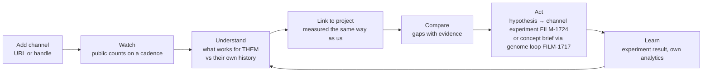
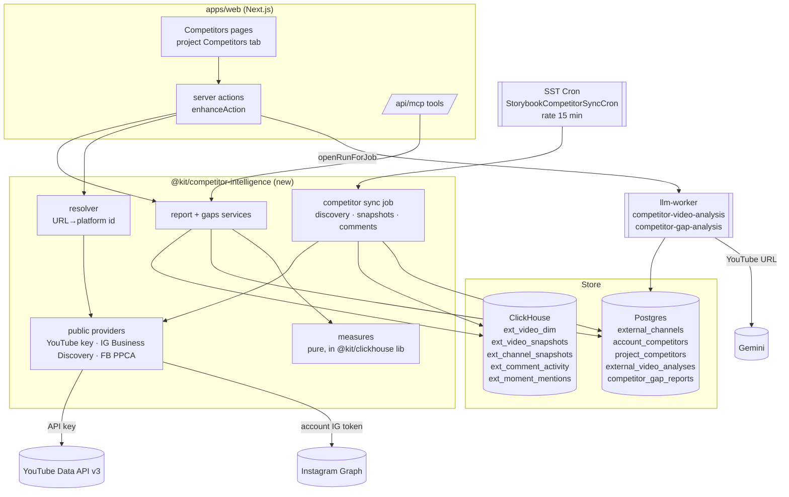

# Competitor Intelligence: PRD and EDD

| | |
|---|---|
| Phase | 21, Competitor Intelligence |
| Specs | FILM-2101 to FILM-2111 (task breakdown in [README.md](./README.md)) |
| Status | **Design: awaiting owner approval. No code has been changed.** |
| Base | `main` @ `ff3e56b` |
| Date | 2026-10-06 |

Evidence notation: `file:line` refers to `main` @ `ff3e56b`. Every claim about
what a platform API returns for a channel the user does not own is a
**design input to be verified by FILM-2101** before any provider code is
written. The repository's FILM-1721 rule applies: a field name enters code
only once `docs/platform-capability-reference.md` documents it with a
citation.

**What this document is.** Part 1 is the product: who it is for, the journeys,
requirements R-01 to R-58, and what it will not do. Part 2 is the data
reality: what can be known about someone else's channel without their
YouTube Studio, and how the rest is estimated. Part 3 is the engineering
design. Part 4 covers rollout, risk, alternatives and open questions.

---

# Part 1: Product requirements

## 1. Product statement

A creator adds any YouTube channel, Instagram professional account or
Facebook Page by URL or handle. Storybook starts watching it. Within minutes
the creator sees which of that channel's videos are working and which are
not, judged against the channel's own history. Within days they also see
when its audience shows up, how fast each new upload takes off, and what the
winners have in common.

In the second stage the creator links watched channels to a project.
Storybook then compares the project's own channel with them, measured the
same way on both sides. It names the gaps, such as cadence, format mix,
length, hooks, titles and publish timing. Each gap becomes a hypothesis the
creator can test with an experiment.

## 2. The problem, in one table

Measured on `main` @ `ff3e56b`:

| | Today | Consequence |
|---|---|---|
| Which channels analytics covers | Only channels connected by OAuth (`platform_connections`, `apps/web/supabase/schemas/32-platform-connections.sql:6`) | A creator cannot look at any channel they do not own |
| What the sync iterates | Publishes made through Storybook (`fetchPublishesForSync`, `packages/features/content-analytics/src/server/analytics-sync-cron.ts:348`) | Even a creator's own videos uploaded elsewhere are seen only as the YouTube residual (FILM-1504) |
| YouTube client auth | Always an OAuth token. No Data API key exists anywhere (`providers/youtube/youtube-analytics.ts:124`) | No code path reads public data |
| Benchmarks | FILM-1715 benchmarks a video only against its own channel's cohort. `BenchmarkCohortScope` requires `connectionId`, and a test forbids relaxing it | The only baseline anyone has is their own history |
| Time-of-day viewing | Not implemented. No hour or weekday dimension exists. `components/charts/heatmap-grid.tsx` exists but nothing imports it | "When is my audience watching?" cannot be answered even for owned channels |
| Product intent | PRD.md:471 "Competitor Analysis — Compare to similar channels — P2"; FILM-808:102 "Competitor Benchmarking (when available)" | Asked for twice and never designed |

## 3. Users and jobs

| User | Job to be done |
|---|---|
| **Creator / channel owner** (primary) | "Show me what is working for channels like mine, so I can stop guessing." |
| **Strategist on a team account** | "Before we start a series, show me the five channels doing it best and what their winners share." |
| **Claude over MCP** (Phase 19) | "Pull a competitor report and a gap analysis, and draft next week's concepts from them." |

## 4. The closed loop



## 5. User journeys

| # | User action | System response | What the user sees | Next |
|---|---|---|---|---|
| J1 | Opens **Studio → Competitors** and pastes `youtube.com/@somechannel` | Resolves the URL to a channel id, then the channel is registered (or reused from the global registry) and tracked for this account | A channel card in "Importing" state | Wait about 1 minute |
| J2 | Waits | Back-catalogue import runs: up to 500 most recent uploads with lifetime public counts, durations and publish times | **"What's working" is ready on day 0.** Ranking is age-normalised, with no velocity yet | Open the channel |
| J3 | Opens the channel report | Reads ClickHouse and Postgres for this account's tracked channel | Overview, What's working / What's not, Upload cadence, Format mix, Video table. Heatmaps say "Collecting — ready in about 7 days" | Read |
| J4 | Comes back after 7 days | Hourly and 6-hourly snapshots have built velocity curves and hour-of-week deltas | Takeoff curves for new uploads, a views-arrival heatmap, a comment-activity heatmap, and a "moments mentioned" strip per video | Read |
| J5 | Clicks **Analyse content** on a top video (or it runs automatically for the top and bottom 5) | Gemini watches the public video by URL and returns a structured breakdown | Hook, pacing, structure, title and thumbnail pattern, each labelled as an AI reading | Compare winners against losers |
| J6 | In a project, opens **Analytics → Competitors** and links three watched channels | The project's own channel is enrolled in the same public pipeline | A side-by-side on identical measures, same platform only | Read the gaps |
| J7 | Opens **Gaps** | Gap cards are computed. The LLM phrases each one, and only from figures it is given | e.g. "They post 3×/week, you post 1×; their 8–10 min videos outperform their own median 1.6× (n=24, established)" | "Test this" |
| J8 | Clicks **Test this** on a gap | Pre-fills a channel experiment (FILM-1724) or a concept brief (FILM-1717 genome loop) | Experiment draft | Run it |
| J9 | Removes a channel | `account_competitors.archived_at` is set. The registry keeps polling only while some account still tracks the channel | The card is gone | — |
| J10 | The channel goes private, is deleted or is renamed | The resolver marks it `unavailable`. Snapshots stop. Data ages out by TTL | A banner: "No longer public since <date>" | Remove it |

**Failure the user must never see:** a figure presented as something it is
not. That means a views-arrival heatmap labelled "watch time", an estimate
shown as a measurement, a comparison across platforms, or a recommendation
with no evidence behind it.

## 6. Functional requirements

### Track (FILM-2102, FILM-2103)
- **R-01** Add a channel by URL, handle (`@name`), channel id, Instagram username or Facebook Page URL. Resolve it to a stable platform id, and refuse with a message saying why when it cannot be resolved.
- **R-02** One global registry row per `(platform, platform_channel_id)`. Tracking is per account. Two accounts tracking one channel cost one poll, not two.
- **R-03** Per-account limit on tracked channels (default 10 per platform, `COMPETITOR_MAX_CHANNELS`). Over the limit, adding is refused with the limit stated.
- **R-04** Owners and admins add and remove channels. Every account member can read.
- **R-05** Detect renamed, private, deleted and handle-changed channels, and show it.
- **R-06** Instagram requires the account to have a connected Instagram professional account (Business Discovery runs as that account). Without one, adding an Instagram channel is refused and the user is pointed to Settings → Platforms.
- **R-07** Facebook Pages are gated behind Meta's Page Public Content Access review and stay DEFERRED until it is granted.

### Observe (FILM-2104)
- **R-10** Back-catalogue import on add: the newest 500 uploads (configurable), with lifetime counts, duration, publish time, title, thumbnail and format family.
- **R-11** Discovery of new uploads within an hour.
- **R-12** Age-tiered snapshot cadence per video: hourly for 0–72 h, every 6 h to day 7, daily to day 90, then weekly. Channel totals hourly.
- **R-13** Comment activity for videos in their first 7 days: comment `publishedAt` bucketed by hour, plus timestamp mentions (`2:34`) parsed from comment text. Aggregates only, never comment text or authors.
- **R-14** All public statistics have a retention TTL. It is 30 days until YouTube accepts our derived-metrics use, then up to 36 months (§11).
- **R-15** A quota budget per vendor per day, with a degradation order when it runs short (§14.4).

### Understand (FILM-2105, FILM-2106, FILM-2107)
- **R-20** **Age-normalised performance**: each video's views at a fixed age (24 h, 7 d, 30 d), from snapshots where we have them and estimated from the channel's typical curve where we do not. Estimates are labelled.
- **R-21** **Outlier score**: the video's views at age *t* divided by the channel's median at age *t*, same format family, shrunk by cohort size (FILM-1715's `1 + (lift−1)·n/(n+15)`).
- **R-22** **What's working / What's not**: the top and bottom videos by outlier score, with band (below / typical / above the interquartile range), n and confidence (FILM-1606 thresholds 5/15).
- **R-23** Engagement: likes per 1,000 views and comments per 1,000 views, at the same age.
- **R-24** Upload cadence (videos per week, gaps), format mix, duration distribution, and publish weekday × hour, each against outcome.
- **R-25** **Takeoff curve** for each video observed from birth: views against hours since publish, overlaid on the channel's typical band.
- **R-26** **Views-arrival heatmap** (hour-of-week × views counted), from hourly deltas in the hot window, in a selectable time zone.
- **R-27** **Comment-activity heatmap** (hour-of-week × comments posted).
- **R-28** **Moments-mentioned strip** per video: where in the video viewers' timestamp mentions cluster. It is shown as the closest public proxy to "Most Replayed", and labelled as such.
- **R-29** **Content breakdown** by Gemini for a public video: hook (first 15 s), pacing, structure beats, on-screen text, title pattern, thumbnail pattern and topic. Each field is labelled "AI reading".
- **R-30** **Winners vs losers**: attribute prevalence gaps between the channel's top and bottom quartiles (FILM-1717's ≥ 0.2 prevalence-gap rule), over content-breakdown attributes and metadata.

### Compare (FILM-2109, FILM-2110)
- **R-40** Link watched channels to a project, each with a role: `peer` or `aspiration`.
- **R-41** **Symmetric measurement.** The project's own channel on that platform is enrolled in the same public pipeline. Every compared figure is the same measure computed by the same code on both sides.
- **R-42** Same platform only. A YouTube channel is never compared with an Instagram account.
- **R-43** Gap dimensions: cadence, format mix, duration, outlier rate (share of videos above their own channel's p75), engagement per 1,000 views, takeoff speed (median views at 24 h ÷ views at 30 d), publish timing, and content-breakdown attribute prevalence.
- **R-44** Each gap carries evidence: both values, n on each side, confidence, and the videos behind it.
- **R-45** The LLM phrases gaps and suggests hypotheses. It may use only figures it was given, and a suggestion that cannot name its evidence does not construct (Phase 17's locked rule).
- **R-46** "Test this" pre-fills a FILM-1724 channel experiment or a FILM-1717 concept brief.
- **R-47** Your Studio-only figures (retention, CTR, traffic) can be shown beside the comparison, labelled "Only visible for your channel". They are never compared with a competitor's public proxy.

### Surface (FILM-2108, FILM-2111)
- **R-50** Pages: `/home/[account]/studio/competitors`, `/home/[account]/studio/competitors/[competitorId]`, and a Competitors tab on the project analytics dashboard.
- **R-51** Every card shows provenance in the FILM-1705 visual language: measured, derived or AI reading, plus access `public`.
- **R-52** Empty, collecting, quota-limited, unavailable and error states for every card.
- **R-53** MCP tools: `list_competitors`, `get_competitor_report`, `get_competitor_gaps`, read-only, scoped by the token's account.
- **R-54** CSV export of the video table.

### Operate (all)
- **R-55** Feature flag `account_ai_settings.competitor_intelligence_enabled`, default off.
- **R-56** An admin panel showing quota used per vendor per day, channels tracked, snapshot lag and Gemini spend.
- **R-57** Deleting an account deletes its tracking. Registry rows nobody tracks stop polling and age out.
- **R-58** No scraping, headless browser, `yt-dlp`, unofficial endpoints or purchased third-party scrapes.

## 7. Non-functional requirements

| | Target |
|---|---|
| Time to first insight | ≤ 2 min from add to "What's working" for a channel with ≤ 500 uploads |
| New-upload detection | ≤ 60 min |
| Hot-window snapshot lag | p95 ≤ 75 min |
| Report page | p95 server render ≤ 1.5 s at 20 tracked channels |
| YouTube quota | ≤ 120 units per channel per day at steady state; ≥ 50 channels per GCP project before an increase |
| Gemini cost | ≤ 10 analyses per channel per week by default; per-account weekly cap |
| Correctness | Every measure has a hand-computed fixture test, and every query is checked against ClickHouse 24.8 (`verify-queries.ts`) |

## 8. Success metrics

- 40% of accounts with the flag on track ≥ 3 channels within 14 days.
- 25% of accounts that link competitors to a project open Gaps weekly.
- 15% of gap cards lead to "Test this".
- Zero support tickets about a mislabelled figure (the failure in §5).

## 9. Non-goals

- **Competitors' retention curves, watch time, CTR, impressions, traffic sources or demographics.** No official API exposes them for a channel you do not own (§10).
- YouTube's "Most Replayed" in-video graph. It is not in any official API (§10.3).
- TikTok and X competitors in v1. TikTok's Research API is academic-only (`docs/platform-capability-reference.md:246`); X is owner-only by our reference (:766).
- Discovering competitors automatically. `search.list` costs 100 units; this is a v2 "suggest channels" (open question Q5).
- Comparing figures across platforms.
- Storing comment text or commenter identities.

---

# Part 2: The data reality — doing this without their YouTube Studio

## 10. What can be known about a channel you do not own

### 10.1 The three tiers

| Tier | What it is | Where it comes from | How it is labelled |
|---|---|---|---|
| **Public: measured** | Counts the platform shows anyone: views, likes, comments, subscribers (rounded), uploads, durations, publish times, titles, thumbnails | YouTube Data API v3 with an **API key**; Instagram Business Discovery as the account's own IG professional account; Facebook Page Public Content Access (gated) | `native`, access `public` |
| **Public: derived by observation** | What we work out by reading those counts repeatedly: views at age *t*, takeoff curves, views-arrival time, outlier scores, cadence, engagement rates | Our own snapshots over time | `derived`, with a method naming how (§10.4) |
| **AI reading** | What the video *is*: hook, pacing, structure, on-screen text, thumbnail and title pattern | Gemini given the public video URL; thumbnails as images | AI reading, model and prompt version recorded; never a "metric" |

**Owner-only data, never obtainable:** retention curves, average view
duration, watch time, impressions, CTR, traffic sources, demographics,
geography, device, subscriber gained/lost, revenue. The YouTube Analytics
API answers only `ids=channel==MINE` (`providers/youtube/youtube-analytics.ts:305`).
Instagram media insights need the media owner's token
(`instagram_manage_insights`). Facebook `video_insights` needs a Page token
with ANALYZE (`docs/platform-capability-reference.md:398`).

### 10.2 Per platform

| | YouTube | Instagram | Facebook |
|---|---|---|---|
| Access path | Data API v3, API key, separate GCP project | Graph API `/{our-ig-user-id}?fields=business_discovery.username(<handle>){…}`, with the account's own IG token | Page Public Content Access (app review and business verification) |
| Channel/account | `channels.list` `statistics` (`viewCount`, `subscriberCount` rounded to 3 significant figures, `videoCount`), `snippet`, `contentDetails.relatedPlaylists.uploads` | `followers_count`, `media_count`, `username`, `name`, `profile_picture_url` (to verify) | Page `followers_count`, `fan_count` (to verify) |
| Video list | `playlistItems.list` on the uploads playlist, 50 per page, 1 unit | `business_discovery{media{…}}`, paged | `/{page}/posts`, `/{page}/videos` (to verify) |
| Per-video counts | `videos.list` `statistics` (`viewCount`, `likeCount`, `commentCount`), `contentDetails.duration`, 50 ids per call, 1 unit | `like_count`, `comments_count`, `timestamp`, `media_type`, `media_product_type`, `permalink`, `caption`. **A public view count for Reels is to be verified** (FILM-2101) | Reactions, comments and shares summaries; video views to verify |
| Comments | `commentThreads.list` by `videoId`, 100 per page, 1 unit | Not available for others' media | To verify |
| Content | Gemini accepts a public YouTube URL as video input | Media URL for images; video download is not permitted, so caption and thumbnail analysis only | Same as Instagram |
| Who qualifies | Any public channel | Business or Creator accounts only; personal accounts cannot be read | Public Pages only |
| Quota | 10,000 units/day per GCP project by default (FILM-701:44) | Counts against the account's own IG token budget; the BUC limit is shared with its own analytics sync (`server/rate-limiter.ts:23`) | Meta app-level |
| v1 status | **Ships** | **Ships** if FILM-2101 confirms the fields; likes and comments only if there is no view count | **DEFERRED** until review is granted |

### 10.3 "When are people watching?" — the heatmap question

The user asked for a heatmap of viewing. There are two different heatmaps,
and the honest answer differs for each.

**(a) When across the week the audience shows up.** We cannot see
"views by hour" for someone else's video. We can see the view counter, and
we can read it every hour. The difference between two hourly readings is the
views counted in that hour. Summed over every hot-window video of the
channel for 30 days, then laid onto an hour-of-week grid in a chosen time
zone, that gives the **views-arrival heatmap** (R-26). It is a real
measurement of *when views were counted*. It is not watch time, and the label
says so. The **comment-activity heatmap** (R-27) is a second, independent
reading of the same question: comment `publishedAt` is exact to the second.
When the two agree, the card says so.

Known distortions, all shown on the card:
- YouTube can batch counter updates, so an hour can read 0 and the next
  double. Mitigation: a delta spanning *k* hours with zeros on either side
  is spread evenly across them and the cell is marked `interpolated`
  (FILM-1714's `SignalComposition`).
- Only videos in their first 72 hours are read hourly, so the heatmap
  describes launch-window audiences. The card says "first 72 hours of each
  upload".
- A cell with fewer than 5 contributing videos is greyed, not coloured.

**(b) Where in the video people watch (in-video retention).** That is
YouTube's "Most Replayed" graph and the Analytics API's
`audienceWatchRatio`. Neither is available for a video you do not own.
"Most Replayed" appears on the watch page but **not in any official API**.
Reading it means scraping, which YouTube's Developer Policies prohibit, and
it would put our own API access at risk. We will not build it (R-58).

What we offer instead, with no pretence:
1. **Moments mentioned** (R-28). Viewers write timestamps in comments
   ("3:12 got me"). We parse `m:ss` and `h:mm:ss` mentions that fall within
   the video's duration and bin them into 2% buckets. It shows where people
   *talk about*, not where they rewatch, and it needs ≥ 20 mentions to show.
2. **Structure from the content breakdown** (R-29). Where the hook ends,
   where the beats change, where the call to action sits.
3. **Your own retention beside theirs, never against it** (R-47). On your
   channel the real curve is available, labelled "Only visible for your
   channel".

### 10.4 Provenance vocabulary

Phase 17 locks four support levels (`native`, `derived`, `not_ingested`,
`unsupported`) and forbids a fifth (phase-17 README). This phase stays inside
them:

- **New `AccessState` value `public`** (`packages/clickhouse/src/lib/data-provenance.ts:194`).
  This is an access axis value, not a support level. It means "read without
  the owner's authorisation; the platform shows it to anyone".
- **New derived methods**: `public_snapshot_delta` (the difference between
  two public readings), `public_age_interpolated` (views at age *t* from
  bracketing snapshots), `public_curve_estimated` (views at age *t* for a
  video first seen past *t*, from the channel's typical curve),
  `comment_timestamp_parse`.
- **AI readings are not metrics.** They live in Postgres with a model and
  prompt version, and are labelled "AI reading". They never enter a
  ClickHouse measure.

## 11. Policy and compliance — launch gates

| Rule (to be confirmed verbatim by FILM-2101) | Design response |
|---|---|
| YouTube: statistics retrieved as non-authorised data may not be stored for more than 30 days ([Developer Policies](https://developers.google.com/youtube/terms/developer-policies); [guide](https://developers.google.com/youtube/terms/developer-policies-guide)) | ClickHouse `TTL … + INTERVAL 30 DAY` on every `ext_*` statistics table. Metadata is refreshed at least every 7 days. |
| YouTube: no independently calculated or derived metrics, unless accepted under the [derived-metrics policy](https://developers.google.com/youtube/terms/derived-metrics-policy), which also allows statistics storage up to 36 months | **Launch gate G1.** Until accepted, the feature runs only for internal workspaces (flag). The owner files the application with this document's measure list (§13). On acceptance, a migration extends the TTL. |
| YouTube: API compliance audit for a quota increase | **Gate G2**, only needed past about 50 channels per GCP project. Filed together with G1. |
| YouTube: no scraping | R-58, enforced by a dependency guard: CI fails if `yt-dlp`, `ytdl`, `puppeteer`, `playwright` (outside e2e) or `cheerio` appear in `packages/features/competitor-intelligence`. |
| Meta: Business Discovery is available to apps with `instagram_basic` + `instagram_manage_insights` or the Instagram-login equivalents; the data must be used under Platform Terms | Uses the account's existing IG connection; **gate G3** confirms the scope set in FILM-2101. |
| Meta: Page Public Content Access needs app review | **Gate G4**; Facebook stays DEFERRED until it passes. |
| Gemini: public YouTube URLs are accepted as video input; the free tier caps at 8 h of video/day, paid has no length cap ([docs](https://ai.google.dev/gemini-api/docs/generate-content/video-understanding)) | Paid tier only; a per-account weekly cap (R-29); the result is stored, not the video. |
| Privacy | Comment text and author ids are never stored, only hourly counts and timestamp-mention bins. Removing a tracked channel removes its account link. |

---

# Part 3: Engineering design

## 12. Architecture



**Why a new package.** `@kit/content-analytics` is keyed throughout by
`publishes.id` (`dim-sync.ts:171`) and gated by `assertScopeAccess` on owned
scopes. Competitor data has a different key, a different access rule
(public, account-tracked) and a different retention rule. Mixing them would
weaken guards like `WRITER_CALL_SITES` (FILM-1703). The pure maths is shared:
new measures go in `packages/clickhouse/src/lib/`, next to
`self-benchmark.ts`, and reuse `bandFor` and `shrinkLift`.

## 13. Measures (FILM-2105)

All of them are pure functions in `packages/clickhouse/src/lib/public-measures.ts`,
each with a hand-computed fixture.

| Measure | Definition | Method label |
|---|---|---|
| `viewsAtAge(video, t)` | If snapshots bracket *t*, linear interpolation between them (log-linear when they are more than 24 h apart). If the first snapshot is after *t*, `curveEstimate`. | `public_age_interpolated` / `public_curve_estimated` |
| `channelTypicalCurve(channel, family)` | For each age bucket (1, 3, 6, 12, 24, 48, 72 h, 7, 14, 30 d): p25, median and p75 of `viewsAtAge` over the channel's observed-from-birth videos in that format family, last 90 days of uploads | `derived` |
| `curveEstimate(video, t)` | `lifetimeViews(now) × (median_t ÷ median_age(now))` from the typical curve. Back-catalogue only; needs n ≥ 5 observed-from-birth videos, otherwise `not_judgable` | `public_curve_estimated` |
| `outlierScore(video, t)` | `shrinkLift(viewsAtAge(v,t) ÷ median_t, n)`, using FILM-1715's `bandFor` for the band | `derived` |
| `engagementPerK(video, t)` | `1000 × likes ÷ views` and `1000 × comments ÷ views`, both read from the same snapshot | `derived` (ratio) |
| `takeoff(video)` | `viewsAtAge(24h) ÷ viewsAtAge(30d)`; null until 30 d | `derived` |
| `cadence(channel, window)` | Uploads per week, median gap, longest gap; split by format family | `native` counts |
| `durationProfile` | Duration bands × median outlier score | `derived` |
| `publishTiming` | Publish weekday × hour (in the chosen time zone) × median outlier score; cells with n < 3 are greyed | `derived` |
| `viewsArrival(channel, tz)` | Σ hourly `public_snapshot_delta` across hot-window videos per hour-of-week cell, normalised to the share of the week | `public_snapshot_delta` (+`interpolated` cells) |
| `commentActivity(channel, tz)` | Σ comments by `publishedAt` hour-of-week, first 7 days of each upload | `native` |
| `momentsMentioned(video)` | Timestamp-mention histogram in 2% bins of duration; shown only at ≥ 20 mentions | `comment_timestamp_parse` |

**Judging "working" for them reuses the existing rule.** A competitor's
video is judged against **that competitor's own history**: same channel, same
format family, same age. That is exactly FILM-1715's rule, applied to another
channel, so the Phase 17 locked decision "the only defensible benchmark is
your own history" holds for every verdict on this page.

## 14. Ingestion (FILM-2103, FILM-2104)

### 14.1 Flow

```mermaid
sequenceDiagram
  participant U as User
  participant SA as addCompetitorAction
  participant R as resolver
  participant YT as YouTube Data API (key)
  participant PG as Postgres
  participant Q as competitor sync (cron 15 min)
  participant CH as ClickHouse
  U->>SA: "youtube.com/@chan"
  SA->>R: resolve(url)
  R->>YT: channels.list(forHandle=@chan, part=id,snippet,statistics,contentDetails)
  YT-->>R: UC… , uploads playlist UU…
  R-->>SA: {platform, platformChannelId, title, …}
  SA->>PG: upsert external_channels; insert account_competitors (limit, role check)
  SA->>PG: external_channels.import_state = 'pending'
  Note over Q: next tick (or immediate kick via route)
  Q->>PG: claim channels due (FOR UPDATE SKIP LOCKED)
  Q->>YT: playlistItems.list(UU…) × ⌈500/50⌉
  Q->>YT: videos.list(ids×50, statistics,contentDetails,snippet)
  Q->>CH: insert ext_video_dim, ext_video_snapshots, ext_channel_snapshots
  Q->>PG: import_state='ready', next_* timestamps
  loop every tick
    Q->>YT: playlistItems.list page 1 (new uploads)
    Q->>YT: videos.list (videos whose tier is due)
    Q->>YT: commentThreads.list (hot videos, ≤ 3 pages)
    Q->>CH: snapshots, comment buckets, mention bins
  end
```

### 14.2 Cadence

The schedule mirrors `server/schedule.ts` (own videos), but is per
*external video* and denser at the start, because launch velocity is the
signal:

| Video age | Snapshot every | Comments |
|---|---|---|
| 0–72 h | 1 h | every 3 h, up to 3 pages |
| 72 h–7 d | 6 h | every 12 h, 1 page |
| 7–90 d | 24 h | — |
| > 90 d | 7 d (keeps metadata within the 30-day refresh rule) | — |

Channel totals: hourly. New-upload discovery: every 15-minute tick reads
page 1 of the uploads playlist, but only once per hour per channel.

The tick is a 15-minute SST Cron (`sst.config.ts`, alongside
`StorybookAnalyticsSyncCron` at :1198) → `apps/web/lambda/competitor-sync`
→ `POST /api/competitors/sync` with `CRON_SECRET`, the same pattern as the
analytics sync. The 15-minute tick spreads hourly work across the hour so
each run stays well inside the 5-minute Lambda timeout.

### 14.3 Quota arithmetic (YouTube, per channel per day, steady state)

| Call | Units | Times/day | Units/day |
|---|---|---|---|
| `channels.list` (totals) | 1 | 24 | 24 |
| `playlistItems.list` page 1 (discovery) | 1 | 24 | 24 |
| `videos.list`, hot (≤ 50 ids → 1 call) | 1 | 24 | 24 |
| `videos.list`, 6-hourly tier | 1 | 4 | 4 |
| `videos.list`, daily tier (≤ 500 videos → 10 calls) | 1 | 10 | 10 |
| `commentThreads.list`, hot videos (≈2 videos × 3 pages × 8) | 1 | 48 | 48 |
| **Total** | | | **≈134** |

One-off import: about 20 units for 500 videos. At ≈134 units, a 10,000-unit
project carries about 70 channels with a 5% margin. The competitor key lives
in its **own GCP project** (`YOUTUBE_PUBLIC_API_KEY`), so it can never starve
publishing uploads (1,600 units each, FILM-701:44).

### 14.4 Budget and degradation

A Postgres-backed daily ledger (`vendor_quota_usage(vendor, day, units)`, the
same idea as X's DB-backed read budget, `lib/x-read-budget.ts`) is debited
before each call. When the day's remaining budget falls below the next tier's
need, work is shed in this order:
1. comment pages beyond the first;
2. weekly back-catalogue refresh (deferred to tomorrow);
3. daily-tier snapshots (deferred; the gap is visible as interpolation);
4. never shed: hot-window snapshots and discovery.

A shed tier writes a `quota_limited` marker that the UI shows on the
affected card. A YouTube `quotaExceeded` 403 stops the vendor for the rest
of the Pacific-time day.

### 14.5 Instagram leg

Business Discovery is called as the account's connected IG professional
account (`platform_connections` where `platform = 'instagram'`). Each call
counts against **that account's** Meta budget, which its own analytics sync
also uses. So the competitor leg takes at most 20% of the per-sync Instagram
budget in `server/rate-limiter.ts:23`, and reads `meta-usage.ts` headers to
back off. Cadence is halved against the YouTube table above. Field names
come only from the reference doc (FILM-2101). In particular `impressions`,
`plays` and `video_views` are forbidden names for Instagram
(`docs/platform-capability-reference.md:1653`).

## 15. Data model

### 15.1 Postgres (hand-written migration, FILM-2102)

```sql
-- the global, de-duplicated registry of public channels
create table public.external_channels (
  id uuid primary key default gen_random_uuid(),
  platform text not null check (platform in ('youtube','instagram','facebook')),
  platform_channel_id text not null,           -- UC…, IG user id, Page id
  handle text,                                  -- @name / username
  title text,
  avatar_url text,
  country text,
  uploads_ref text,                             -- YouTube uploads playlist id
  status text not null default 'active'
    check (status in ('active','unavailable','private','deleted')),
  import_state text not null default 'pending'
    check (import_state in ('pending','importing','ready','failed')),
  via_connection_id uuid references public.platform_connections(id) on delete set null, -- IG: whose token reads it
  last_resolved_at timestamptz,
  next_channel_poll_at timestamptz not null default now(),
  next_discovery_at timestamptz not null default now(),
  created_at timestamptz not null default now(),
  unique (platform, platform_channel_id)
);

-- which accounts track which channels
create table public.account_competitors (
  id uuid primary key default gen_random_uuid(),
  account_id uuid not null references public.accounts(id) on delete cascade,
  external_channel_id uuid not null references public.external_channels(id) on delete cascade,
  label text,
  is_self boolean not null default false,       -- the account's own channel, enrolled for symmetric comparison (R-41)
  added_by uuid references auth.users(id) on delete set null,
  created_at timestamptz not null default now(),
  archived_at timestamptz,
  unique (account_id, external_channel_id)
);

-- phase B: which watched channels a project compares against
create table public.project_competitors (
  project_id uuid not null references public.projects(id) on delete cascade,
  account_competitor_id uuid not null references public.account_competitors(id) on delete cascade,
  role text not null default 'peer' check (role in ('peer','aspiration','self')),
  created_at timestamptz not null default now(),
  primary key (project_id, account_competitor_id)
);

-- AI readings of public videos (shared across accounts; the reading is about the video)
create table public.external_video_analyses (
  id uuid primary key default gen_random_uuid(),
  external_channel_id uuid not null references public.external_channels(id) on delete cascade,
  platform_video_id text not null,
  prompt_slug text not null,
  prompt_version int not null,
  model text not null,
  analysis jsonb not null,                      -- zod: CompetitorVideoAnalysisSchema
  requested_by_account uuid references public.accounts(id) on delete set null,
  created_at timestamptz not null default now(),
  unique (external_channel_id, platform_video_id, prompt_slug, prompt_version)
);

-- phase B: cached gap reports
create table public.competitor_gap_reports (
  id uuid primary key default gen_random_uuid(),
  project_id uuid not null references public.projects(id) on delete cascade,
  platform text not null,
  input_hash text not null,
  gaps jsonb not null,                          -- computed, evidence-bearing (R-44)
  narrative jsonb,                              -- LLM phrasing (R-45)
  created_at timestamptz not null default now(),
  unique (project_id, platform, input_hash)
);

create table public.vendor_quota_usage (
  vendor text not null,
  day date not null,                            -- vendor's reset day (YouTube: Pacific)
  units integer not null default 0,
  primary key (vendor, day)
);

alter table public.account_ai_settings
  add column competitor_intelligence_enabled boolean not null default false;
```

**RLS** (pgTAP in `apps/web/supabase/tests/database/competitor-intelligence.test.sql`):

| Table | SELECT | INSERT/UPDATE/DELETE |
|---|---|---|
| `external_channels` | `exists (account_competitors ac where ac.external_channel_id = id and ac.archived_at is null and has_role_on_account(ac.account_id))` | service role only |
| `account_competitors` | `has_role_on_account(account_id)` | through `add_competitor()` / `archive_competitor()` (SECURITY DEFINER), which check owner/admin and the per-account limit |
| `project_competitors` | member of the project's account | owner/admin of the project's account |
| `external_video_analyses` | as for `external_channels` | service role (llm-worker) |
| `competitor_gap_reports` | member of the project's account | service role |
| `vendor_quota_usage` | super admin at aal2 | service role |

`add_competitor()` takes an advisory lock on the account while it counts
against the limit, so two concurrent adds cannot both pass (R-03).

### 15.2 ClickHouse (FILM-2104; migrations `025_`–`027_` in `packages/clickhouse/src/migrations/`, appended to `run.ts`)

```sql
-- 025_ext_video_dim
CREATE TABLE ext_video_dim (
  external_channel_id UUID,
  platform Enum8('youtube'=1,'tiktok'=2,'instagram'=3,'facebook'=4,'twitter'=5),
  platform_video_id String,
  title String,
  published_at DateTime64(3,'UTC'),
  duration_seconds Nullable(UInt32),
  media_type LowCardinality(String),            -- video / short / reel / image / carousel
  format_family LowCardinality(String),         -- resolveFormatFamily (FILM-1716)
  thumbnail_url String,
  first_seen_at DateTime64(3,'UTC'),            -- observed-from-birth iff first_seen_at - published_at < 2h
  refreshed_at DateTime64(3,'UTC')
) ENGINE = ReplacingMergeTree(refreshed_at)
ORDER BY (external_channel_id, platform_video_id)
TTL toDateTime(refreshed_at) + INTERVAL 30 DAY;

-- 026_ext_snapshots
CREATE TABLE ext_video_snapshots (
  external_channel_id UUID,
  platform_video_id String,
  snapshot_at DateTime('UTC'),
  views Nullable(UInt64),                        -- NULL = not reported (e.g. IG without a public view count), never 0
  likes Nullable(UInt64),
  comments Nullable(UInt64),
  source LowCardinality(String)                  -- 'youtube_data_api_key' | 'ig_business_discovery' | 'fb_ppca'
) ENGINE = ReplacingMergeTree
ORDER BY (external_channel_id, platform_video_id, snapshot_at)
TTL snapshot_at + INTERVAL 30 DAY;

CREATE TABLE ext_channel_snapshots (
  external_channel_id UUID,
  snapshot_at DateTime('UTC'),
  subscribers Nullable(UInt64),                 -- YouTube rounds to 3 s.f.; flagged in UI
  total_views Nullable(UInt64),
  video_count Nullable(UInt32),
  hidden_subscribers UInt8
) ENGINE = ReplacingMergeTree
ORDER BY (external_channel_id, snapshot_at)
TTL snapshot_at + INTERVAL 30 DAY;

-- 027_ext_comment_activity
CREATE TABLE ext_comment_activity (
  external_channel_id UUID,
  platform_video_id String,
  hour DateTime('UTC'),                          -- comment publishedAt, truncated to hour
  comments UInt32,
  read_at DateTime('UTC')
) ENGINE = ReplacingMergeTree(read_at)
ORDER BY (external_channel_id, platform_video_id, hour)
TTL hour + INTERVAL 30 DAY;

CREATE TABLE ext_moment_mentions (
  external_channel_id UUID,
  platform_video_id String,
  bin UInt8,                                     -- 0..49, 2% of duration
  mentions UInt32,
  read_at DateTime('UTC')
) ENGINE = ReplacingMergeTree(read_at)
ORDER BY (external_channel_id, platform_video_id, bin)
TTL read_at + INTERVAL 30 DAY;
```

Comment counting is idempotent. Each read pages comments newest-first back
to the previous `read_at` and rewrites the affected hour buckets in full,
so re-reading the same hour replaces it rather than adding to it.

**Scoping.** ClickHouse is outside RLS, so every read goes through
`assertCompetitorAccess(client, {accountId, externalChannelId})`. That
function reads `account_competitors` through the user's RLS client, the same
pattern as `server/scope-access.ts`. It is guarded by a test that lists every
`ext_*` query function and asserts that each caller passes through it (the
FILM-1711 pattern).

**TTL change on acceptance (gate G1).** Migration `0NN_ext_ttl_36_months`
runs `ALTER TABLE … MODIFY TTL … + INTERVAL 36 MONTH` on all five tables.
It ships only once acceptance is recorded in FILM-2101.

## 16. Content breakdown (FILM-2107)

- **Gateway change.** `packages/llm` / `packages/ai-gateway` gains a media
  part for Gemini (`file_data { file_uri: 'https://www.youtube.com/watch?v=…' }`).
  None exists today (grep for `fileData`/`file_uri` returns nothing). The
  part accepts only a `youtube.com/watch?v=<id>` URL the server builds from a
  `platform_video_id` already in `ext_video_dim`. Free-form URLs from users
  are refused, so the worker cannot be pointed at arbitrary URLs.
- **Prompt** `packages/features/prompt-engine/src/prompts/analytics/competitor-video-analysis.json`
  (Gemini, JSON output, temperature 0.2). Output schema
  `CompetitorVideoAnalysisSchema`:
  `hook{seconds, technique, onScreenText, firstLine}`,
  `pacing{estimatedCutsPerMinute, band}`, `structure[{startPct, beat}]`,
  `callToAction{present, atPct}`, `titlePattern`, `thumbnailPattern`,
  `topic`, `tone`, `formatFamilyGuess`. Enum-valued wherever possible, so
  attributes can be counted (R-30).
- **Job** `competitor-video-analysis`. Payload registered in
  `prompt-engine/src/lib/llm-job-payloads.ts`, with a handler in
  `apps/web/lambda/llm-worker/handlers/`. It is dispatched through
  `openRunForJob`, like `analytics-insights` (`insights-actions.ts:158`).
- **Budget.** Automatic runs cover the top 5 and bottom 5 videos per channel
  per week; manual runs cover any video. The per-account weekly cap
  (`COMPETITOR_ANALYSES_PER_WEEK`, default 30) is counted from
  `external_video_analyses.requested_by_account`. Results are shared: a video
  analysed once for one account is not analysed again for another (same
  prompt version).
- **Instagram.** Caption plus image or thumbnail only; no video input.

## 17. Comparison and gaps (FILM-2109, FILM-2110)

**Self enrolment.** Linking competitors on a platform enrols the project's
own connected channel on that platform as an `external_channels` row with
`account_competitors.is_self = true`, and `project_competitors.role = 'self'`.
It is then measured by the same pipeline and the same code. That is the whole
fairness argument (R-41). If the project publishes to more than one channel
on that platform (`project_publishing_configs`), the user picks one.

**Gap computation** (`packages/clickhouse/src/lib/competitor-gaps.ts`, pure):

```ts
type Gap = {
  dimension: 'cadence' | 'format_mix' | 'duration' | 'outlier_rate'
           | 'engagement_per_k' | 'takeoff' | 'publish_timing' | 'attribute';
  self: { value: number | null; n: number };
  peers: { channelId: string; value: number | null; n: number }[];
  peerMedian: number | null;
  direction: 'self_below' | 'self_above' | 'similar';
  confidence: 'observation' | 'directional' | 'established'; // FILM-1606/1717 vocabulary
  evidenceVideoIds: string[];
  composition: 'measured' | 'ratio' | 'interpolated';
};
```

Rules:
- A gap is emitted only when both sides have n ≥ 5 on that dimension.
- `similar` means within the peers' own interquartile range.
- `outlier_rate` compares the *share of each channel's videos above that
  channel's own p75*. Each channel is judged against itself first, and only
  then are the shares compared. That is what makes channels of different
  sizes comparable.
- `attribute` gaps come from content-breakdown prevalence in the peers'
  top quartile versus the project's own top quartile, using FILM-1717's
  ≥ 0.2 rule. They only appear once both sides have ≥ 5 analysed videos.

**Narrative.** Prompt `competitor-gap-analysis.json` receives only the
`Gap[]` and titles. It returns `{gapId, headline, hypothesis, testIdea}[]`.
The handler drops any item whose `gapId` was not supplied, the same defence
as `analytics-insights` (`handlers/analytics-insights.ts:68`). A
`Recommendation` type cannot be constructed without a `Gap` (R-45).

**Act.** "Test this" maps a gap to a FILM-1724 channel experiment draft
(hypothesis, metric = the gap's measure on *your* channel, window) or a
FILM-1717 genome-loop concept brief (attribute gaps).

## 18. Server actions, routes and MCP

| Name | Kind | Schema | Auth |
|---|---|---|---|
| `addCompetitorAction` | enhanceAction | `AddCompetitorSchema {accountId, input}` | owner/admin; flag on |
| `archiveCompetitorAction` | enhanceAction | `{accountId, competitorId}` | owner/admin |
| `getCompetitorReportAction` | enhanceAction (read) | `{accountId, competitorId, tz, window}` | member |
| `requestVideoAnalysisAction` | enhanceAction | `{accountId, competitorId, platformVideoId}` | member; weekly cap |
| `linkProjectCompetitorsAction` | enhanceAction | `{projectId, competitorIds[], selfConnectionId}` | owner/admin |
| `getCompetitorGapsAction` | enhanceAction | `{projectId, platform}` | member |
| `POST /api/competitors/sync` | enhanceRouteHandler | — | `CRON_SECRET` |
| MCP `list_competitors`, `get_competitor_report`, `get_competitor_gaps` | `/api/mcp` tools (FILM-1904 pattern) | zod | token's account; read-only |

## 19. UI (FILM-2108)

- **`/home/[account]/studio/competitors`** shows a grid of tracked channels:
  avatar, title, platform, subscribers (with "rounded by YouTube"), uploads
  per week, the share of last-30-day uploads that beat the channel's own
  median, and state (Importing / Ready / Unavailable / Quota-limited). It has
  an "Add channel" dialog (`react-hook-form` + `@kit/ui/form`, schema shared
  with the action) and shows the limit counter.
- **`/home/[account]/studio/competitors/[competitorId]`** has tabs:
  1. **Overview**: totals, cadence, format mix, duration profile.
  2. **What's working**: top and bottom 10 by outlier score at 7 d (toggle 24 h / 30 d). Each row shows thumbnail, title, age, views at age, band chip, lift, n, the "estimated" badge where `public_curve_estimated`, and a link to the breakdown.
  3. **Timing**: views-arrival heatmap and comment-activity heatmap side by side (reusing the unused `components/charts/heatmap-grid.tsx`), time-zone select, and the publish-timing grid.
  4. **Takeoff**: curves for videos observed from birth, over the typical p25–p75 band.
  5. **Videos**: a sortable table with CSV export, and a drawer holding the content breakdown and moments-mentioned strip.
- **Project analytics → Competitors tab** (added to
  `components/analytics-dashboard.tsx:357`). It has a link picker, a
  per-platform side-by-side, Gap cards with evidence chips and
  "Test this", and a "Your Studio-only view" panel (R-47).
- Provenance chips use FILM-1705's colour rule (colour encodes support
  level, never platform brand), with a new `public` access chip.
- `data-test` on every interactive element.

## 20. Failure and error handling

| Failure | Behaviour |
|---|---|
| URL cannot be resolved | The action returns `{ok:false, reason:'not_found' \| 'not_public' \| 'unsupported_platform' \| 'ig_personal_account' \| 'no_ig_connection'}`; the dialog shows the reason |
| Channel goes private or deleted | The next poll returns no item. After 3 consecutive misses `status = unavailable` and polling stops; data ages out |
| `quotaExceeded` | The vendor stops for the day, a `quota_limited` marker is written, and the admin panel and logs are tagged `competitor.alert.quota` |
| IG token expired or revoked | The IG leg for that account pauses with the "Reconnect Instagram" state; other accounts tracking the same channel keep it alive through their own `via_connection_id` (failover picks another tracker's connection) |
| Gemini refusal or failure | The analysis row is not written; the UI shows "Couldn't analyse this video" with a retry; the run is recorded by `openRunForJob` |
| Lambda timeout mid-tick | Work is claimed per channel with `FOR UPDATE SKIP LOCKED`, and `next_*_at` advances only after a channel's writes, so the next tick resumes |
| Counter frozen or decreasing (spam purge) | A negative delta is stored as 0 for arrival and flagged; snapshots are kept raw |

## 21. Security

- The `YOUTUBE_PUBLIC_API_KEY` is server-only and restricted in GCP to the
  YouTube Data API and the deployment's egress IPs.
- No user-supplied URL is ever fetched. The resolver parses it, extracts a
  handle or id, and calls the vendor API only. This rules out SSRF.
- The Gemini media part is built server-side from a stored id (§16).
- RLS plus the `assertCompetitorAccess` guard (§15.2); pgTAP proves a
  member of account A cannot read account B's tracking, and that
  `external_channels` rows nobody in your accounts tracks are invisible.
- Comment text never leaves the sync function.

## 22. Observability

- Log tags: `competitor.sync.tick` (channels claimed, units spent, shed
  tiers), `competitor.alert.quota`, `competitor.alert.lag` (hot-window p95
  > 75 min).
- Admin panel `/admin/competitors`: units per vendor per day, tracked
  channels, snapshot lag histogram, Gemini analyses and spend this week.
- `pnpm --filter @kit/clickhouse verify` gains `competitorSteps` with
  hand-computed rows for every `ext_*` query.

## 23. Testing

| Layer | What |
|---|---|
| Unit (pure) | Every measure in §13 against hand-computed fixtures, including interpolation across a batched counter and `curveEstimate` refusing at n < 5; gap rules; URL parser (30+ URL shapes); mention parser (`1:02:03`, `0:59`, out-of-range ignored) |
| Unit (providers) | Recorded vendor responses via `apps/vendor-sandbox/src/social/vendors/google/` (add `channels.list?forHandle`, `playlistItems.list`, `commentThreads.list`), plus a new IG Business Discovery fake |
| Quota | The ledger debits before the call; shed order under a simulated 90%-spent day |
| pgTAP | RLS for all six tables; `add_competitor` limit under concurrency; role checks |
| ClickHouse local stack | Snapshots → `viewsArrival` heatmap equals a hand-computed grid (`./scripts/local-env.sh up`), TTL present on every `ext_*` table |
| Guards | No scraping dependencies in the package; every `ext_*` query caller passes `assertCompetitorAccess`; red-before-green for each |
| Playwright | Add a channel (vendor sandbox) → Importing → What's working rows; remove it; add over the limit → refusal; a member cannot see the Add button; the Gaps tab with seeded snapshots for self and two peers shows a cadence gap with evidence; "Test this" opens a pre-filled experiment. **Evidence spec** (`CAPTURE_EVIDENCE=1`) for every tab, plus a measurements table read from the DOM |

---

# Part 4: Delivery

## 24. Milestones

| Milestone | Specs | Exit |
|---|---|---|
| **M0 Ground truth** (1 wk) | FILM-2101 | Reference doc documents every field used, with citations; G1/G2 applications filed; IG view-count question answered |
| **M1 Watch** | FILM-2102, FILM-2103 (YouTube), FILM-2104 | An internal workspace tracks 10 YouTube channels for 7 days; quota ≤ 134 units/channel/day measured |
| **M2 Understand** | FILM-2105, FILM-2106, FILM-2108 | Report pages ship behind the flag; evidence screenshots; heatmaps hand-verified on local ClickHouse |
| **M3 Read the content** | FILM-2107 | Breakdowns for the top and bottom 5; winners-vs-losers attributes |
| **M4 Compare** | FILM-2109, FILM-2110 | Gaps and "Test this" for one project with 3 peers |
| **M5 Reach** | FILM-2103 (Instagram), FILM-2111 | IG competitors; MCP tools |
| **GA** | — | G1 accepted → TTL migration; flag default on |

## 25. Rollout

1. Flag on for one internal workspace (M1–M2). Data stays within the 30-day TTL.
2. After **G1 acceptance**: TTL to 36 months, flag opt-in from workspace settings.
3. Default on once the success metrics reach 80% of target.
4. Facebook only after G4.

## 26. Alternatives considered

| Alternative | Why not |
|---|---|
| Scrape watch pages for "Most Replayed" and per-hour views | Violates YouTube's Developer Policies; it would put the project's publishing and analytics API access at risk; brittle |
| Buy third-party competitor data (Social Blade-style) | The provenance of their numbers is unknown, which contradicts Phase 17's "no fabricated level"; licence terms usually forbid redisplay; cost. Revisit only for TikTok (Q4) |
| Ask competitors to grant OAuth access | Not a competitor product; a separate "collaborator channels" feature if ever wanted |
| Put competitor rows in `video_metrics` / `video_dim` | Keyed by `publishes.id` and project; different retention and access rules; would weaken FILM-1703's writer guards |
| Compare our Studio retention against their public counts | Not the same measure. Violates R-41 and the Phase 17 "same measure" rule |
| `search.list`-based auto-discovery in v1 | 100 units per call would eat the per-channel budget; v2 |

## 27. Risk register

| Risk | Likelihood | Impact | Mitigation |
|---|---|---|---|
| G1 is refused or slow | M | H: 30-day window only | The product works within 30 days of history (day-0 back catalogue uses lifetime counts, which are re-read, not stored history); keep internal until resolved |
| IG Business Discovery has no public view count | M | M: IG ranks on likes and comments only | Label it; rank by likes per follower; R-23 still works |
| Counter batching makes the hourly heatmap noisy | M | M | Interpolation, n ≥ 5 cell rule, agreement check against the comment heatmap |
| Quota exhaustion when a big account tracks many channels | M | M | Per-account limit; shared registry; own GCP project; shedding |
| Users read an AI reading as fact | M | M | "AI reading" label; enum fields; the model and prompt version shown |
| Gemini YouTube-URL input changes or is withdrawn | L | M | Content breakdown degrades to title, thumbnail and description; measures are unaffected |

## 28. Open questions

| # | Question | Owner |
|---|---|---|
| Q1 | File the YouTube derived-metrics and audit applications now, before M1 code? | owner |
| Q2 | Does Business Discovery return a public view count for Reels in the pinned Graph version? | FILM-2101 |
| Q3 | Should the per-account channel limit depend on the billing plan? | owner |
| Q4 | TikTok competitors: wait for a lawful API, or never? | owner |
| Q5 | v2 "suggest similar channels" via `search.list`, or LLM suggestions from the project's topic? | owner |
| Q6 | Default heatmap time zone: the viewer's, or the competitor channel's country? (Design: viewer's, with a switch) | owner |

## 29. Requirement traceability

| Requirements | Spec |
|---|---|
| R-14, R-58, §10, §11 | FILM-2101 |
| R-01–R-07, R-55, R-57 | FILM-2102 |
| R-01 (resolve), R-06, R-07, R-15 | FILM-2103 |
| R-10–R-15 | FILM-2104 |
| R-20–R-25 | FILM-2105 |
| R-26–R-28 | FILM-2106 |
| R-29, R-30 | FILM-2107 |
| R-50–R-52, R-54, R-56 | FILM-2108 |
| R-40–R-44, R-47 | FILM-2109 |
| R-45, R-46 | FILM-2110 |
| R-53 | FILM-2111 |
